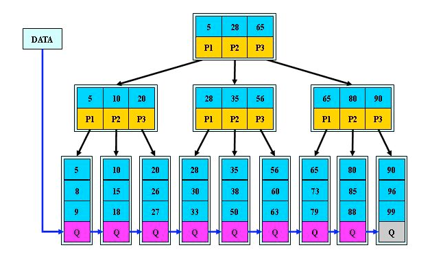

### 什么是索引

- 1.索引就好比一本书的目录，它能让你更快的找到自己想要的内容。
- 2.让获取的数据更有目的性，从而提高数据库检索数据的性能。

### 索引的种类

- 1.BTREE: B+树索引（Btree，B+tree，B*tree） 
- 2.HASH：HASH索引（memery存储引擎支持） 
- 3.FULLTEXT：全文索引（myisam存储引擎支持） 
- 4.RTREE：R树索引




### 索引根据算法分类
```bash
1）主键索引（聚集索引）
#创建表的时候创建主键索引
mysql> create table test(id int not null auto_increment primary key comment '学号');
Query OK, 0 rows affected (0.04 sec)
mysql> create table test1(id int not null auto_increment,primary key(id));
Query OK, 0 rows affected (0.04 sec)
#查看索引命令
mysql> show index from test;
#已经有表时添加主键索引
mysql> alter table student add primary key pri_id(id);
 
2）唯一键索引
#创建表的时候创建唯一键索引
mysql> create table test2(id int not null auto_increment unique key comment '学号');
Query OK, 0 rows affected (0.04 sec)
#已经有表时添加唯一键索引
mysql> alter table student add unique key uni_key(name);
#注意：创建唯一建索引或主键索引的列不能有重复数据
判断一列能否做唯一建索引
1.查询数据总量
mysql> select count(name) from city;
2.去重查看该列数据总量
mysql> select count(distinct(name)) from city;
#以上两个值相等则可以设置唯一建索引
 
例：
#1.查看列的总数据量
mysql> select count(name) from country;
+-------------+
| count(name) |
+-------------+
|         239 |
+-------------+
1 row in set (0.00 sec)
#2.查看去重后数据量
mysql> select count(distinct(name)) from country;
+-----------------------+
| count(distinct(name)) |
+-----------------------+
|                   239 |
+-----------------------+
1 row in set (0.00 sec)
#3.创建唯一建索引
mysql> alter table country add unique key uni_key(name);
Query OK, 0 rows affected (0.09 sec)
Records: 0  Duplicates: 0  Warnings: 0
 
3）普通索引（辅助索引）
mysql> alter table city add index inx_name(name);
Query OK, 0 rows affected (0.14 sec)
Records: 0  Duplicates: 0  Warnings: 0
mysql> create index index_District on city(District);
Query OK, 0 rows affected (0.06 sec)
Records: 0  Duplicates: 0  Warnings: 0
 
4）全文索引
mysql> create table txt(id int,bookname varchar(12),wenzhang text,fulltext(wenzhang));
Query OK, 0 rows affected (0.20 sec)
mysql> select * from txt where match(wenzhang) against('查询的内容');
#实例
mysql> create table text(id int,bookname varchar(12) charset utf8,wenzhang text charset utf8,fulltext(wenzhang));
Query OK, 0 rows affected (0.21 sec)
mysql> insert into text values(1,'红楼梦','上回书说到张飞长坂坡三打白骨精救出宋江');
Query OK, 1 row affected (0.01 sec)
mysql> select * from text;
+------+-----------+-----------------------------------------------------------+
| id   | bookname  | wenzhang                                                  |
+------+-----------+-----------------------------------------------------------+
|    1 | 红楼梦    | 上回书说到张飞长坂坡三打白骨精救出宋江                    |
+------+-----------+-----------------------------------------------------------+
1 row in set (0.00 sec)
mysql> select * from text where match(wenzhang) against('上回书说到张飞长坂坡三打白骨精救出宋江');
+------+-----------+-----------------------------------------------------------+
| id   | bookname  | wenzhang                                                  |
+------+-----------+-----------------------------------------------------------+
|    1 | 红楼梦    | 上回书说到张飞长坂坡三打白骨精救出宋江                    |
+------+-----------+-----------------------------------------------------------+
1 row in set (0.00 sec)
 
5）查看索引
#方式一：
mysql> show index from city;
#方式二：
mysql> desc city;
+-----+
| Key |
+-----+
| PRI |		#主键索引
| MUL |		#普通索引
| UNI |		#唯一键索引
| MUL |
+-----+
 
6）删除索引
mysql> alter table city drop index index_District;
Query OK, 0 rows affected (0.03 sec)
Records: 0  Duplicates: 0  Warnings: 0
```

### 根据配置方法分类
```bash
注意事项
1.创建索引时会将数据重新进行排序
2.创建索引会占用磁盘空间，所以索引不是越多越好
3.在同一列上避免创建多种索引
4.避免在数据很长的字段上创建索引，如果要创建就创建前缀索引
前缀索引
#根据前四个字符创建前缀索引
mysql> alter table test add index index_key(name(4));
联合索引
mysql> create database xiangqing;
mysql> create table xiangqin(id int,name varchar(20),gender enum('m','f'),age tinyint,money int,height int,weight int,looks tinyint);
mysql> insert xiangqin values(1,'qiudao','m',38,-200000,120,130,'10'),(2,'dilireba','f',18,400000,180,100,'60'),(3,'cxk','m',28,100000,170,120,'440'),(4,'fbb','f',18,1000000,165,85,'90');
#创建联合索引
mysql> alter table xiangqin add index lh_key(money,gender,age,looks);
#联合索引使用三种情况
1.部分走索引		money,gender,age
2.全部走索引		money,gender,age,looks
3.不走索引		 gender,age
```
### explain的使用
```bash
explain语法
explain + DQL语句
 
mysql> explain select * from city where countrycode ='CHN' or countrycode ='USA';
 
#查询中国和美国的数据
mysql> select * from city where countrycode ='CHN' or countrycode ='USA';
mysql> select * from city where countrycode in ('CHN','USA');
mysql> select * from city where countrycode = 'CHN' union all select * from city where countrycode = 'USA';
 
Extra（扩展）
	Using temporary 使用group by大概率出现
	Using filesort 使用了order by大概率出现
	Using join buffer 使用join on大概率出现
```

### 扩展group by

```bash
#一般与聚合索引一起使用
 
#建表
mysql> create table jixiao(id int,name varchar(20) charset utf8,jixiao int,product varchar(10) charset utf8);                                    
Query OK, 0 rows affected (0.03 sec)
#插入数据
mysql> insert jixiao values(1,'qiudao','1000000','房地产'),(2,'niulei','10000','房地产'),(3,'lijianpeng','100000','汽车'),(4,'qiandao','200000',' 汽车');
#查询不同行业绩效最高的人
mysql> select name,sum(jixiao),product from jixiao group by product;
+------------+-------------+-----------+
| name       | sum(jixiao) | product   |
+------------+-------------+-----------+
| qiudao     |     1010000 | 房地产    |
| lijianpeng |      300000 | 汽车      |
+------------+-------------+-----------+
2 rows in set (0.00 sec)
#查询房地产行业绩效最高的人
mysql> select name,sum(jixiao),product from jixiao group by product having product='房地产';
+--------+-------------+-----------+
| name   | sum(jixiao) | product   |
+--------+-------------+-----------+
| qiudao |     1010000 | 房地产    |
+--------+-------------+-----------+
1 row in set (0.00 sec)
```

### 查询数据的方式
```bash
1.全表扫描
#1.什么是全表扫描
查询数据时type类型为ALL
 
#2.什么情况全表扫描
1）查询数据库所有数据
	mysql> explain select * from country
2）没有走索引
	没设置索引
	索引损坏
 
2.索引扫描
	1.index			#全索引扫描
		mysql> explain select Name from city;
	
	2.range			#范围查询
		mysql> explain select * from city where countrycode ='CHN' or countrycode ='USA';
		#有限制查询到的数据在总数据的20%以内，超过则走全文扫描，所以在查询是可以使用limit限制
		mysql> explain select * from city where countrycode != 'CHN' limit 500;
	
	3.ref			#精确查询
		mysql> explain select * from city where countrycode ='CHN';
	
	4.eq_ref		#使用join on时偶尔会出现
	
	5.const			#查询条件是唯一索引或主键索引
		mysql> explain select * from city where id=1;
	
	6.system		#查询级别与const一样，当数据很少时为该级别
	
	7.null			#不需要读取数据，只需要获取最大值或者最小值
		mysql> explain select max(population) from city;
```

### 索引的建立
```bash
索引的建立原则
1.能创建唯一索引就创建唯一索引
 
2.为经常需要排序、分组和联合操作的字段建立索引
 
3.为常作为查询条件的字段建立索引
	如果某个字段经常用来做查询条件，那么该字段的查询速度会影响整个表的查询速度。
	因此，为这样的字段建立索引，可以提高整个表的查询速度。
	
4.尽量使用前缀来索引
	如果索引字段的值很长，最好使用值的前缀来索引。
		例如，TEXT和BLOG类型的字段，进行全文检索，会很浪费时间。如果只检索字段的前面的若干个字符，这样可以提高检索速度。
		
5.限制索引的数目
	索引的数目不是越多越好。每个索引都需要占用磁盘空间，索引越多，需要的磁盘空间就越大。
	修改表时，对索引的重构和更新很麻烦。越多的索引，会使更新表变得很浪费时间。
 
6.删除不再使用或者很少使用的索引
	表中的数据被大量更新，或者数据的使用方式被改变后，原有的一些索引可能不再需要。数据库管理员应当定期找出这些索引，将它们删除，从而减少索引对更新操作的影响。
```
### 什么时候不走索引
```bash
1.没有查询条件，或者查询条件没有索引
#没有查询条件
mysql> explain select * from city;
+----+-------------+-------+------+---------------+------+---------+------+------+-------+
| id | select_type | table | type | possible_keys | key  | key_len | ref  | rows | Extra |
+----+-------------+-------+------+---------------+------+---------+------+------+-------+
|  1 | SIMPLE      | city  | ALL  | NULL          | NULL | NULL    | NULL | 4188 | NULL  |
+----+-------------+-------+------+---------------+------+---------+------+------+-------+
1 row in set (0.00 sec)
 
#查询条件没有索引
mysql> explain select District from city;
+----+-------------+-------+------+---------------+------+---------+------+------+-------+
| id | select_type | table | type | possible_keys | key  | key_len | ref  | rows | Extra |
+----+-------------+-------+------+---------------+------+---------+------+------+-------+
|  1 | SIMPLE      | city  | ALL  | NULL          | NULL | NULL    | NULL | 4188 | NULL  |
+----+-------------+-------+------+---------------+------+---------+------+------+-------+
1 row in set (0.00 sec)
 
2.查询的结果占总数据的20%左右
#占总数据的18%，没走索引
mysql> explain select * from city where population > 400000;
 
#占总数据的15%，走了索引
mysql> explain select * from city where population > 450000;
 
#如果数据量查询就是表中大部分数据，可以用limit做限制
mysql> explain select * from city where population > 400000 limit 100;
 
3.索引损坏
 
4.查询条件带了特使符号(+，-)
#在=号左侧有特殊符号，不走索引
mysql> explain select * from city where id-1=1;
 
#在=号右侧有特殊符号，走索引
mysql> explain select * from city where id=3-1;
 
5.隐式转换
#建表
mysql> create table test (id int ,name varchar(20),telnum varchar(10));
Query OK, 0 rows affected (0.04 sec)
#插入数据
mysql> insert into test values(1,'zs','110'),(2,'l4',120),(3,'w5',119),(4,'z4',112);
Query OK, 4 rows affected (0.00 sec)
Records: 4  Duplicates: 0  Warnings: 0
#建立索引
mysql> desc phonenum;
+-------+-------------+------+-----+---------+-------+
| Field | Type        | Null | Key | Default | Extra |
+-------+-------------+------+-----+---------+-------+
| id    | int(11)     | YES  |     | NULL    |       |
| name  | varchar(10) | YES  |     | NULL    |       |
| phone | varchar(10) | YES  | UNI | NULL    |       |
+-------+-------------+------+-----+---------+-------+
3 rows in set (0.00 sec)
#查询语句级别全文扫描
mysql> explain select * from phonenum where phone=6666666;
+----+-------------+----------+------+---------------+------+---------+------+------+-------------+
| id | select_type | table    | type | possible_keys | key  | key_len | ref  | rows | Extra       |
+----+-------------+----------+------+---------------+------+---------+------+------+-------------+
|  1 | SIMPLE      | phonenum | ALL  | uni_key       | NULL | NULL    | NULL |    3 | Using where |
+----+-------------+----------+------+---------------+------+---------+------+------+-------------+
1 row in set (0.00 sec)
#当给字符加上引号，查询为索引扫描
mysql> explain select * from phonenum where phone='6666666';
+----+-------------+----------+-------+---------------+---------+---------+-------+------+-------+
| id | select_type | table    | type  | possible_keys | key     | key_len | ref   | rows | Extra |
+----+-------------+----------+-------+---------------+---------+---------+-------+------+-------+
|  1 | SIMPLE      | phonenum | const | uni_key       | uni_key | 13      | const |    1 | NULL  |
+----+-------------+----------+-------+---------------+---------+---------+-------+------+-------+
1 row in set (0.00 sec)
 
6.like "%_" 百分号在最前面不走
 
7.联合索引查询不按照顺序有可能不走索引

```