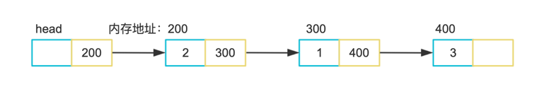
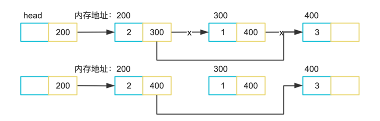

# Link list

*栈和队列是特殊的链表，链表还是树的基础，而树是一种特殊的图*

在`go`中我们使用指针来实现

首先我们定义一个单链表节点结构体，这个结构体有两个域：当前节点值、指向下一个节点的指针

```go
type node struct {
	Element  int
	Position *node
}
// Newnode 初始化一个node
func newNode() *node {
    return &node{Position: nil}
}
```

然后我们增加一个方法，用来插入节点

```go
func (r *node) Add(n int) {
    temp := newNode()
    temp.Element = n
    
    if r != nil {
    temp.Position = r.Position
    r.Position = temp
    }
}
```

我们构建一个链表

```go
func main() {
    head := newNode()
    head.Add(3)
    head.Add(1)
    head.Add(2)
}
```

它的构成如下图：



```go
// IsEmpty 判断node是否为空
func (r *node) IsEmpty() bool {
	return r.Position == nil
}

```

使用for循环从头节点一直遍历到指定节点

```go
// Find 查找到node并返回node指针˜
func (r *node) Find(n int) *node {
	temp := r.Position

	for temp.Position != nil && temp.Element != n {
		temp = temp.Position
	}
	if temp.Element == n {
		return temp
	}
	return nil
}
```


```go
// FindPrevious 查找到node 返回前一个node指针
func (r *node) FindPrevious(n int) *node {
	temp := r

	for temp.Position != nil && temp.Position.Element != n {
		temp = temp.Position
	}

	if temp.Position != nil && temp.Position.Element == n {
		return temp
	}
	return nil
}
```

删除节点需要找到被删除节点的前序节点，将前序节点的指针指向被删除节点的后序节点，如图：


```go
// Delete 删除节点
func (r *node) Delete(n int) {
	temp := r.FindPrevious(n)
	if temp != nil {
		temp.Position = temp.Position.Position
	} else {
		println("Not in list")
	}
}
```

```go
// ListNode 遍历节点值
func (r *node) ListNode() {
	temp := r.Position
	for temp.Position != nil {
		fmt.Printf("%d", temp.Element)
		temp = temp.Position
	}
	println(temp.Element)
}
```

```go
// Insert 将元素添加至给定元素后
func (r *node) Insert(n int, p *node) {
	temp := newNode()
	temp.Element = n

	if p != nil {
		temp.Position = p.Position
		p.Position = temp
	}
}
```

### 链表类型
1. 单链表，就是链表是单向的，像我们上面这个结构一样，可以一直往下找到下一个数据节点，它只有一个方向，它不能往回找。
2. 双链表，每个节点既可以找到它之前的节点，也可以找到之后的节点，是双向的。
3. 循环链表，就是它一直往下找数据节点，最后回到了自己那个节点，形成了一个回路。循环单链表和循环双链表的区别就是，一个只能一个方向走，一个两个方向都可以走。

### 循环链表的实现

*参考 Golang 标准库 container/ring*


定义一个循环链表

```go
// 循环链表
type Ring struct {
    next, prev *Ring       // 前驱和后驱节点
    Value      interface{} // 数据
}
```

初始化方法

```go
// 初始化空的循环链表，前驱和后驱都指向自己，因为是循环的
func (r *Ring) init() *Ring {
    r.next = r
    r.prev = r
    return r
}
```

创建一个指定大小 N 的循环链表，值全为空：

```go
// 创建N个节点的循环链表
func New(n int) *Ring {
    if n <= 0 {
        return nil
    }
    r := new(Ring)
    p := r
    for i := 1; i < n; i++ {
        p.next = &Ring{prev: p}
        p = p.next
    }
    p.next = r
    r.prev = p
    return r
}
```

获取上一个节点或下一个节点:

```go
// 获取下一个节点
func (r *Ring) Next() *Ring {
    if r.next == nil { // r must not be empty.
        return r.init()
    }
    return r.next
}

// 获取上一个节点
func (r *Ring) Prev() *Ring {
    if r.next == nil { // r must not be empty.
        return r.init()
    }
    return r.prev
}
```

移动第n个节点，因为链表是循环的，当 n 为负数，表示从前面往前遍历，否则往后面遍历:

```go
func (r *Ring) Move(n int) *Ring {
    if r.next == nil {
        return r.init()
    }
    switch {
    case n < 0: // 确定移动方向
        for ; n < 0; n++ { // 使用 n 来计数确定移动距离
            r = r.prev
        }
    case n > 0:
        for ; n > 0; n-- {
            r = r.next
        }
    }
    return r
}
```

添加节点:

```go
// 往节点A，链接一个节点，并且返回之前节点A的后驱节点
func (r *Ring) Link(s *Ring) *Ring {
    n := r.Next()
    if s != nil {
        p := s.Prev()
        r.next = s
        s.prev = r
        n.prev = p
        p.next = n
    }
    return n
}

// 这里有两种情况，画图理解：
// 1.s为独立节点，这种情况Prev()会进行Init()，这时候p=s，前后链接就完成了。
// 2.s为ring，这种情况Prev()拿到s的前序节点，这时候r会接上s，而p会接上n，两个ring合二为一。
```

删除节点:

```go
// 删除节点后面的 n 个节点
func (r *Ring) Unlink(n int) *Ring {
    if n < 0 {
        return nil
    }
    return r.Link(r.Move(n + 1))
}
```

检查链表长度:
```go
// 查看循环链表长度，循环一整圈
func (r *Ring) Len() int {
    n := 0
    if r != nil {
        n = 1
        for p := r.Next(); p != r; p = p.next {
            n++
        }
    }
    return n
}
```