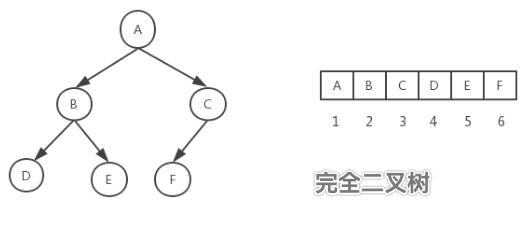

# Tree

树的定义:

1. 有节点间的层次关系，分为父节点和子节点。 
2. 有唯一一个根节点，该根节点没有父节点。 
3. 除了根节点，每个节点有且只有一个父节点。 
4. 每一个节点本身以及它的后代也是一棵树，是一个递归的结构。 
5. 没有后代的节点称为叶子节点，没有节点的树称为空树。

树根据儿子节点的多寡，有二叉树，三叉树，四叉树等，我们这里主要介绍二叉树。


# Binary tree
特殊的树，二叉树:

- 二叉树：每个节点最多只有两个儿子节点的树。
- 满二叉树：叶子节点与叶子节点之间的高度差为 0 的二叉树，即整棵树是满的，树呈满三角形结构。 在国外的定义，非叶子节点儿子都是满的树就是满二叉树。我们以国内为准。
- 完全二叉树：完全二叉树是由满二叉树而引出来的，设二叉树的深度为 k，除第 k 层外，其他各层的节点数都达到最大值，且第 k 层所有的节点都连续集中在最左边。

### 二叉树的数学特征:

1. 高度为 h≥0 的二叉树至少有 h+1 个结点，比如最不平衡的二叉树就是退化的线性链表结构，所有的节点都只有左儿子节点，或者所有的节点都只有右儿子节点。
2. 高度为 h≥0 的二叉树至多有 2^h+1 个节点，比如这棵树是满二叉树。 
3. 含有 n≥1 个结点的二叉树的高度至多为 n-1，由 1 退化的线性链表可以反推。 
4. 含有 n≥1 个结点的二叉树的高度至少为 logn，由 2 满二叉树可以反推。 
5. 在二叉树的第 i 层，至多有 2^(i-1) 个节点，比如该层是满的。

### 二叉树的定义:
```go
// Node 定义二叉树的节点
type Node struct {
	data  int
	left  *Node
	right *Node
}
```

当然，数组也可以用来表示二叉树，一般用来表示完全二叉树。

对于一棵有 n 个节点的完全二叉树，从上到下，从左到右进行序号编号，对于任一个节点，编号 i=0 表示树根节点，编号 i 的节点的左右儿子节点编号分别为：2i+1,2i+2，父亲节点编号为：i/2，整除操作去掉小数。




在对树进行操作时，使用了大量的递归操作，这让代码变得优雅，但逻辑变得复杂，需要大量的画图才能理解。

### 插入节点

```go
// 生成一个节点并返回它的地址
func getNewNode(n int) *Node {
	return &Node{data: n}
}

// Insert 在二叉树中插入一个节点
func (r *Node) Insert(n int) *Node {
	if r == nil {
		r = getNewNode(n)
	} else if n > r.data {
		r.right = r.right.Insert(n)
	} else {
		r.left = r.left.Insert(n)
	}
	return r
}
```

### 查找节点
```go
// FindMini 查找树中的最小值
func (r *Node) FindMini() int {
	if r == nil {
		return -1
	} else if r.left == nil {
		return r.data
	}
	return r.left.FindMini()
}

func (r *Node) Find(n int) *Node {
	if r == nil {
		return r
	}
	if r.data == n {
		return r
	} else if r.data < n {
		return r.right.Find(n)
	} else {
		return r.left.Find(n)
	}
}

// FindMax 查找树中的最大值
func (r *Node) FindMax() int {
	if r == nil {
		return -1
	} else if r.right == nil {
		return r.data
	}
	return r.right.FindMax()
}
```

### 查找二叉树的高度
```go
// FindHeight 查找二叉树的高度
func (r *Node) FindHeight() int {
	// height 指当前节点到最远叶子节点的边数量，叶子节点高度为0
	// depth 指从根节点到当前节点的边数，根节点深度为0
	if r == nil {
		return -1
	}
	// 画图理解
	return max(r.left.FindHeight(), r.right.FindHeight()) + 1
}
```

### 遍历二叉树
构建一棵树后，我们希望遍历它，有四种遍历方法：

1. 先序遍历：先访问根节点，再访问左子树，最后访问右子树。 
2. 后序遍历：先访问左子树，再访问右子树，最后访问根节点。 
3. 中序遍历：先访问左子树，再访问根节点，最后访问右子树。 
4. 层次遍历：每一层从左到右访问每一个节点。

在计算机进行加减乘除等数学运算时，常常会使用数据结构来存储数值和符号，
而后采用对应的遍历方式进行逐一计算，遍历出的计算顺序与实际的表达式顺序完全一致。

前序中序后序:
```go
//L: left 左
//D: data 数据
//R: right 右


// Preorder 前序遍历 DLR
func (r *Node) Preorder() {
	if r == nil {
		return
	}
	println(r.data)
	r.left.Preorder()
	r.right.Preorder()
}

// Inorder 中序遍历 LDR
func (r *Node) Inorder() {
	if r == nil {
		return
	}
	r.left.Inorder()
	println(r.data)
	r.right.Inorder()
}

// Postorder 后续遍历 LRD
func (r *Node) Postorder() {
	if r == nil {
		return
	}
	r.left.Postorder()
	r.right.Postorder()
	println(r.data)
}
```

层级遍历:

又叫广度遍历，需要借助`Queue`配合使用

1. 先将树的根节点放入队列。 
2. 从队列里面 remove 出节点，先打印节点值，如果该节点有左子树节点，左子树入栈，如果有右子树节点，右子树入栈。 
3. 重复2，直到队列里面没有元素。

```go
// LevelOrder 层级遍历
func (r *Node) LevelOrder() {
	if r == nil {
		return
	}

	Queue := queue{} // 创建队列
	Queue.push(r) // 节点入栈

	for Queue.Size != 0 {
		v := Queue.pop() // 节点出栈

		println(v.data) // 打印节点值
		if v.left != nil {
			Queue.push(v.left) // 左子节点入栈
		}
		if v.right != nil {
			Queue.push(v.right) // 右子节点入栈
		}
	}
}
```

### 判断是否为二叉搜索树

1. 完全递归方式，每个节点递归判断一次，代价为O( $n^2$ )不推荐:
```go
// IsSubtreeLesser 将当前节点值、所有子节点值与调用者传入的父节点值比较，如果任意节点大于父节点则返回 false
func (r *Node) IsSubtreeLesser(n int) bool {
	if r == nil {
		return true
	}
	if r.data < n &&
		r.left.IsSubtreeLesser(n) &&
		r.right.IsSubtreeLesser(n) {
		return true
	} else {
		return false
	}
}

// IsSubtreeGreater 将当前节点值、所有子节点值与调用者传入的父节点值比较，如果任意节点小于父节点则返回 false
func (r *Node) IsSubtreeGreater(n int) bool {
	if r == nil {
		return true
	}
	if r.data > n &&
		r.left.IsSubtreeGreater(n) &&
		r.right.IsSubtreeGreater(n) {
		return true
	} else {
		return false
	}
}

// IsBinarySearchTree 确定当前是否为二叉搜索树
func (r *Node) IsBinarySearchTree() bool {
	if r == nil {
		return true
	}
	if r.left.IsSubtreeLesser(r.data) &&
		r.right.IsSubtreeGreater(r.data) &&
		r.left.IsBinarySearchTree() &&
		r.right.IsBinarySearchTree() {
		return true
	} else {
		return false
	}
}
```

2. 上下限比较法:
```go
// IsBinarySearchTreeUtil 确定当前是否为二叉搜索树
func (r *Node) IsBinarySearchTreeUtil(miniValue, maxValue int) bool {
	// 这种方式给每个节点设置一个上下限，初始值为无穷，由于每种数据类型都是有长度的，所以这里取当前类型的极限值
	if r == nil {
		return true
	}
	if r.data < maxValue &&
		r.data > miniValue &&
		// 将最大值和最小值传递给下面的节点进行判断
		r.left.IsBinarySearchTreeUtil(miniValue, r.data) &&
		r.right.IsBinarySearchTreeUtil(r.data, maxValue) {
		return true
	} else {
		return false
	}
}

func (r *Node) IsBinarySearchTree() bool {
	return r.IsBinarySearchTreeUtil(math.MinInt, math.MaxInt)
}

```

### 删除节点

```go
func (r *Node) Delete(n int) *Node {
	// 空树直接返回
	if r == nil {
		return r
		// 如果n在左边
	} else if r.data > n {
		r.left = r.left.Delete(n)
		// 如果n在右边
	} else if r.data < n {
		r.right = r.right.Delete(n)
		// 如果n在当前节点
	} else {
		// 如果当前节点没有子节点 直接置空
		if r.left == nil && r.right == nil {
			return nil
			// 如果当前节点没有左节点 返回右节点 即将当前节点替换为当前节点的右子节点
		} else if r.left == nil {
			return r.right
			// 如果当前节点没有右节点 返回左节点 即将当前节点替换为当前节点的左子节点
		} else if r.right == nil {
			return r.left
			// 如果两个子节点都有 则查找出最小的右子节点值 将当前节点值替换为该值 最后删除最小子节点
			// 因为右边的最小子节点一定比左边的节点大 所以替换当前节点没问题
		} else {
			temp := r.right.FindMini()
			r.data = temp
			r.right = r.right.Delete(temp)
		}
	}
	return r
}
```

### 查找中序后继节点

```go
// Successor 查找给定节点的中序后继
func (r *Node) Successor(n int) *Node {
	// 找到给定节点
	// 如果该节点右边有节点则用FindMini找到后继
	// 如果没有右边节点则后继节点在祖先节点中 在这种情况下 给定节点一定位于中序后继节点也就是祖先节点的左子树中
	// 因为该节点比后继节点小 这个最近的左子树祖父节点就是后继节点
	temp := r.Find(n)
	if temp == nil {
		return temp
	}
	if temp.right != nil {
		return r.Find(temp.right.FindMini())
	} else {
		var successor *Node
		var current = r
		for current.data != n {
			if current.data < n {
				current = current.right
			} else {
				successor = current
				current = current.left
			}
		}
		return successor
	}
}
```