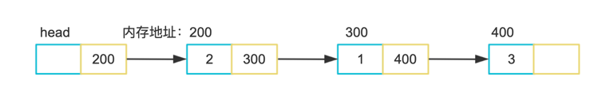

# List


列表的需求：

1. 列表，允许为空
2. 能添加数据，add
3. 能插入数据，insert 
4. 能修改数据，modify
5. 能读取数据，read
6. 能删除数据，remove 

我们可以用数组来实现：

```c
int a[MAXSIZE];
int end = -1;  //用 end 来确定尾部，当 end 为 -1 时，列表为空
```

数组满足以上所有的需求，但是有如下缺点：

1. 有最大值 MAXSIZE ，当数组存满时我们必须创建一个更大的数组来容纳接下来的元素，
    然后释放旧的数组占用的空间。数组长度增长策略为 2 * MAXSIZE
2. 时间复杂度，当我们访问(read/write)数组中的元素时需要`O(1)`时间复杂度，但是当我们
    需要插入元素或删除元素时则需要`O(n)`时间复杂度，n取决于你要插入位置后面存在的元素数量。
    同样的，当数组满或者数组内的元素远小于数组中元素一半时，我们需要对数组扩容或者缩容，这里
    同样需要`O(n)`时间复杂度。

# Link list

在`go`中我们还可以使用指针来实现

首先我们定义一个结构体，这个结构体有两个域：当前节点值、指向下一个节点的指针

```go
type node struct {
	Element  int
	Position *node
}
// Newnode 初始化一个node
func newNode() *node {
    return &node{Position: nil}
}
```

然后我们增加一个方法，用来插入节点

```go
func (r *node) Add(n int) {
    temp := newNode()
    temp.Element = n
    
    if r != nil {
    temp.Position = r.Position
    r.Position = temp
    }
}
```

我们构建一个链表

```go
func main() {
    head := newNode()
    head.Add(3)
    head.Add(1)
    head.Add(2)
}
```

它的构成如下图



我们补完它的一些常用方法

```go
// IsEmpty 判断node是否为空
func (r *node) IsEmpty() bool {
	return r.Position == nil
}

// Find 查找到node并返回node指针˜
func (r *node) Find(n int) *node {
	temp := r.Position

	for temp.Position != nil && temp.Element != n {
		temp = temp.Position
	}
	if temp.Element == n {
		return temp
	}
	return nil
}

// FindPrevious 查找到node 返回前一个node指针
func (r *node) FindPrevious(n int) *node {
	temp := r

	for temp.Position != nil && temp.Position.Element != n {
		temp = temp.Position
	}

	if temp.Position != nil && temp.Position.Element == n {
		return temp
	}
	return nil
}
// Delete 删除节点
func (r *node) Delete(n int) {
	temp := r.FindPrevious(n)
	if temp != nil {
		temp.Position = temp.Position.Position
	} else {
		println("Not in list")
	}
}
// ListNode 遍历节点
func (r *node) ListNode() {
	temp := r.Position
	for temp.Position != nil {
		fmt.Printf("%d", temp.Element)
		temp = temp.Position
	}
	println(temp.Element)
}

// Insert 将元素添加至给定元素后
func (r *node) Insert(n int, p *node) {
	temp := newNode()
	temp.Element = n

	if p != nil {
		temp.Position = p.Position
		p.Position = temp
	}
}
```