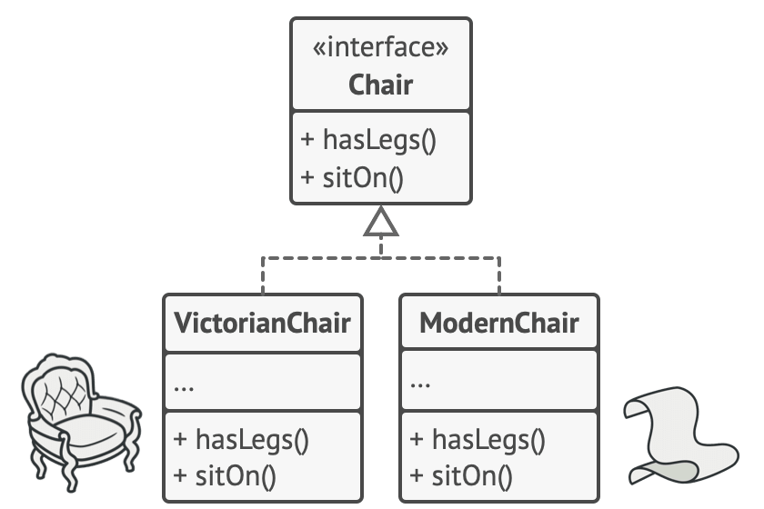
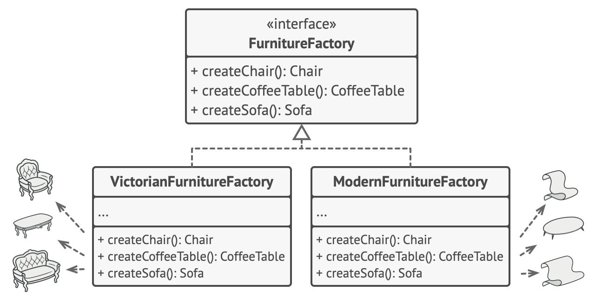

# 抽象工厂模式

*抽象工厂是一种创建型设计模式，它能创建一系列相关的对象，而无需指定其具体类。*

这里有几个概念:

- 抽象工厂接口   这个接口是对具体工厂的抽象
- 具体工厂       具体工厂实现了抽象工厂的接口，而其中的一些类型使用了抽象产品来实现，从而保证其灵活性
- 抽象产品       抽象产品是对一类具体产品的抽象，其中有抽象产品接口定义和抽象产品公共结构体定义两部分构成
- 具体产品       具体产品则是对抽象产品接口的实现，以及对公共结构部分的继承
- 客户端代码     客户端则为其他调用函数，这时客户端不用关心具体产品的产生，只需要根据风格初始化则可以拿到自己要的产品


## 示例

```go
package main

import (
	"fmt"
)

// 假设我们要建设一座家具工厂，我们可以直接写一个工厂结构体来实现，但是为了解耦，我们定义: 只要能生产椅子、沙发、咖啡桌的就是家具工厂，它就是 `IFurnitureFactory` 接口

type IFurnitureFactory interface {
	createChair() IChair
	createSofa() ISofa
	createCoffeeTable() ICoffeeTable
}

// 现在，我们想做一家现代风格的家具工厂，这家工厂只生产现代风格的家具，它实现了我们的家具工厂接口定义

// ModernFurnitureFactory 具体工厂: 现代家具工厂
type ModernFurnitureFactory struct {
}

func (m *ModernFurnitureFactory) createChair() IChair {
	return &ModernChair{Chair{legs: 3, style: "modern"}}
}

func (m *ModernFurnitureFactory) createSofa() ISofa {
	return &ModernSofa{}
}

func (m *ModernFurnitureFactory) createCoffeeTable() ICoffeeTable {
	return &ModernCoffeeTable{}
}

// VictorianFurnitureFactory 具体工厂: 维多利亚家具工厂
type VictorianFurnitureFactory struct {
}

func (m *VictorianFurnitureFactory) createChair() IChair {
	return &VictorianChair{Chair{legs: 4, style: "victorian"}}
}

func (m *VictorianFurnitureFactory) createSofa() ISofa {
	return &VictorianSofa{}
}

func (m *VictorianFurnitureFactory) createCoffeeTable() ICoffeeTable {
	return &VictorianCoffeeTable{}
}

// ArtDecoFurnitureFactory 具体工厂: 维多利亚家具工厂
type ArtDecoFurnitureFactory struct {
}

func (m *ArtDecoFurnitureFactory) createChair() IChair {
	return &ArtDecoChair{Chair{legs: 5, style: "artDeco"}}
}

func (m *ArtDecoFurnitureFactory) createSofa() ISofa {
	return &ArtDecoSofa{}
}

func (m *ArtDecoFurnitureFactory) createCoffeeTable() ICoffeeTable {
	return &ArtDecoCoffeeTable{}
}

// 当我们定义工厂时，发现少了很多细节，比如家具的类型，家具的定义。现在我们需要定义各种家具的抽象接口

// 抽象产品

type IChair interface {
	getLegs() int
	sitOn() bool
}

// 当定义完椅子的概念以后，我们用一个结构体，把椅子共性的那一部分统一定义，方便后续产品沿用，而不需要重复定义，造成代码冗余

type Chair struct {
	sit   bool
	legs  int
	style string
}

func (c *Chair) getLegs() int {
	return c.legs
}

func (c *Chair) sitOn() bool {
	return c.sit
}

// 在具体产品中，我们根据风格定义各种类型的椅子，虽然在示例中他们除了名字没有任何区别，但是他们都是独立的类型，可以做很多细节上的修改并且不会影响到其他的产品，实现了解耦合
// 具体产品

type ModernChair struct {
	Chair
}

type VictorianChair struct {
	Chair
}

type ArtDecoChair struct {
	Chair
}

// 抽象产品

type ISofa interface {
	getLegs() int
	getLength() int
}

type Sofa struct {
	length int
	legs   int
	style  string
}

func (c *Sofa) getLegs() int {
	return c.legs
}

func (c *Sofa) getLength() int {
	return c.length
}

// 具体产品

type ModernSofa struct {
	Sofa
}
type VictorianSofa struct {
	Sofa
}
type ArtDecoSofa struct {
	Sofa
}

// 抽象产品

type ICoffeeTable interface {
	getLegs() int
	getArea() int
}

type CoffeeTable struct {
	area  int
	legs  int
	style string
}

func (c *CoffeeTable) getLegs() int {
	return c.legs
}

func (c *CoffeeTable) getArea() int {
	return c.area
}

// 具体产品

type ModernCoffeeTable struct {
	CoffeeTable
}
type VictorianCoffeeTable struct {
	CoffeeTable
}
type ArtDecoCoffeeTable struct {
	CoffeeTable
}

// 最后我们使用一个函数来根据传入值的区别来初始化不同风格的家具工厂，而客户端使用同样的方法，便可以造出不同的风格的家具

func GetFurnitureFactory(style string) (IFurnitureFactory, error) {
	switch style {
	case "modern":
		return &ModernFurnitureFactory{}, nil
	case "victorian":
		return &VictorianFurnitureFactory{}, nil
	case "artDeco":
		return &ArtDecoFurnitureFactory{}, nil
	default:
		return nil, fmt.Errorf("Wrong style type passed")
	}
}

// 在客户端使用

func main() {
	factory, _ := GetFurnitureFactory("modern")
	chair := factory.createChair()
	fmt.Printf("%s\n", chair)
	factory, _ = GetFurnitureFactory("victorian")
	chair = factory.createChair()
	fmt.Printf("%s\n", chair)
	factory, _ = GetFurnitureFactory("artDeco")
	chair = factory.createChair()
	fmt.Printf("%s\n", chair)
}
```


