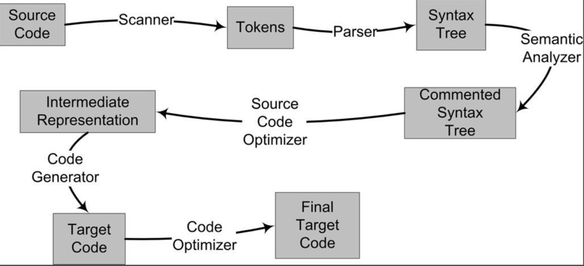

### 编译过程

- 预处理（Prepressing）
- 编译（Compilation）
- 汇编（Assembly）
- 链接（Linking）


### 编译器做了什么

*将高级语言翻译成机器语言*




- 扫描（Scanner）：有一个叫做lex的程序可以实现词法扫描，它会按照用户之前描述好的词法规则将输入的字符串分割成一个个记号(token)，或者说字符。另外对于一些有预处理的语言，比如C语言，它的宏替换和文件包含等工作一般不归入编译器的范围而交给一个独立的预处理器。
- 语法分析（Grammar Parser）：将对由扫描器产生的记号进行语法分析，从而产生语法树（Syntax Tree）。正如前面词法分析有lex一样，语法分析也有一个现成的工具叫做yacc（Yet Another Compiler Compiler）。
- 语义分析（Semantic Analyzer）：编译器所能分析的语义是静态语义（Static Semantic），所谓静态语义是指在编译期可以确定的语义，与之对应的动态语义（Dynamic Semantic）就是只有在运行期才能确定的语义。 静态语义通常包括声明和类型的匹配，类型的转换。比如当一个浮点型的表达式赋值给一个整型的表达式时，其中隐含了一个浮点型到整型转换的过程，语义分析过程中需要完成这个步骤。比如将一个浮点型赋值给一个指针的时候，语义分析程序会发现这个类型不匹配，编译器将会报错。动态语义一般指在运行期出现的语义相关的问题，比如将0作为除数是一个运行期语义错误。
- 源代码优化（Source Code Optimizer）：直接在语法树上作优化比较困难，所以源代码优化器往往将整个语法树转换成中间代码（Intermediate Code），它是语法树的顺序表示，其实它已经非常接近目标代码了。但是它一般跟目标机器和运行时环境是无关的，比如它不包含数据的尺寸、变量地址和寄存器的名字等。中间代码有很多种类型，在不同的编译器中有着不同的形式，比较常见的有：三地址码（Three-address Code）和P-代码（P-Code）。中间代码使得编译器可以被分为前端和后端。编译器前端负责产生机器无关的中间代码，编译器后端将中间代码转换成目标机器代码。这样对于一些可以跨平台的编译器而言，它们可以针对不同的平台使用同一个前端和针对不同机器平台的数个后端。
- 代码生成（Code Generator）：代码生成器将中间代码转换成目标机器代码，这个过程十分依赖于目标机器，因为不同的机器有着不同的字长、寄存器、整数数据类型和浮点数数据类型等。
- 目标代码优化（Target Code Optimizer）：目标代码优化器对代码生成器生成的目标代码进行优化，比如选择合适的寻址方式、使用位移来代替乘法运算、删除多余的指令等。


### 为什么需要编译

- 使用机器指令或汇编语言编写程序是十分费事及乏味的事情，它们使得程序开发的效率十分低下
- 并且使用机器语言或汇编语言编写的程序依赖于特定的机器，一个为某种CPU编写的程序在另外一种CPU下完全无法运行，需要重新编写，这几乎是令人无法接受的。
- 所以人们期望能够采用类似于自然语言的语言来描述一个程序，但是自然语言的形式不够精确，所以类似于数学定义的编程语言很快就诞生了。

*现代的编译器有着异常复杂的结构，这是因为现代高级编程语言本身非常地复杂，比如C++语言的定义就极为复杂，至今没有一个编译器能够完整支持C++语言标准所规定的所有语言特性。另外现代的计算机CPU相当地复杂，CPU本身采用了诸如流水线、多发射、超标量等诸多复杂的特性，为了支持这些特性，编译器的机器指令优化过程也变得十分复杂。使得编译过程更为复杂的是有些编译器支持多种硬件平台，即允许编译器编译出多种目标CPU的代码。比如著名的GCC编译器就几乎支持所有CPU平台，这也导致了编译器的指令生成过程更为复杂。*

### 为什么需要链接

- 在编译完成后的目标代码中有变量定义在其他模块，该怎么办？

*事实上，定义其他模块的全局变量和函数在最终运行时的绝对地址都要在最终链接的时候才能确定。所以现代的编译器可以将一个源代码文件编译成一个未链接的目标文件，然后由链接器最终将这些目标文件链接起来形成可执行文件。*

### 链接的由来

- 最开始，程序员人工将他写的机器语言程序写入到存储设备上，最原始的存储设备之一就是纸带，即在纸带上打相应的孔。纸带上打孔意味着所有的地址都是绝对地址，当我们需要在跳转指定与目标指令的代码行中插入代码时，插入代码后的所有行的地址以及插入代码前的跳转地址都将调整，当程序变得庞大时，这将会付出巨大的代价。
- 后来，有人发明了汇编语言，汇编语言中使用符号来标识代码段，当需要跳转时也可以直接使用标识符来跳转。当代码需要运行时，则由汇编器计算出所有标识符的实际地址，填入代码中。
- 随着汇编语言的流行以及计算机硬件的发展，程序的代码量迅速的膨胀，人们需要将不同功能的代码以一定的方式组织起来，使得更加容易阅读理解，以便日后修改和重复使用。这个在现代的软件源代码组织中很常见，比如在C语言中，最小的单位是变量和函数，若干个变量和函数组成一个模块，存放在一个“.c”的源代码文件里，然后这些源代码文件按照目录结构来组织。
- 在现代软件开发过程中，软件的规模往往都很大，动辄数百万行代码，如果都放在一个模块肯定无法想象。所以现代的大型软件往往拥有成千上万个模块，这些模块之间相互依赖又相对独立。这种按照层次化及模块化存储和组织源代码有很多好处，比如代码更容易阅读、理解、重用，每个模块可以单独开发、编译、测试，改变部分代码不需要编译整个程序等。
- 在一个程序被分割成多个模块以后，这些模块之间最后如何组合形成一个单一的程序是须解决的问题。模块之间如何组合的问题可以归结为模块之间如何通信的问题，最常见的属于静态语言的C/C++模块之间通信有两种方式，一种是模块间的函数调用，另外一种是模块间的变量访问。函数访问须知道目标函数的地址，变量访问也须知道目标变量的地址，所以这两种方式都可以归结为一种方式，那就是模块间符号的引用。
- 这种基于符号的模块化的一个直接结果是链接过程在整个程序开发中变得十分重要和突出。程序设计的模块化是人们一直在追求的目标，因为当一个系统十分复杂的时候，我们不得不将一个复杂的系统逐步分割成小的系统以达到各个突破的目的。一个复杂的软件也如此，人们把每个源代码模块独立地编译，然后按照需要将它们“组装”起来，这个组装模块的过程就是链接（Linking）。
- 链接的主要内容就是把各个模块之间相互引用的部分都处理好，使得各个模块之间能够正确地衔接。链接器所要做的工作其实跟前面所描述的“程序员人工调整地址”本质上没什么两样，只不过现代的高级语言的诸多特性和功能，使得编译器、链接器更为复杂，功能更为强大，但从原理上来讲，它的工作无非就是把一些指令对其他符号地址的引用加以修正。


### 静态链接

*使用链接器，你可以直接引用其他模块的函数和全局变量而无须知道它们的地址，因为链接器在链接的时候，会根据你所引用的符号 foo，自动去相应的func.c模块查找foo的地址，然后将main.c模块中所有引用到foo的指令重新修正，让它们的目标地“址为真正的foo函数的地址。这就是静态链接的最基本的过程和作用。*

```assembly
movl    $0x2a, var
```

- 这条指令就是给这个var变量赋值0x2a，相当于C语言里面的语句var = 42。然后我们编译目标文件B，得到这条指令机器码 `C705 00000000 2a000000`
- 由于在编译目标文件B的时候，编译器并不知道变量var的目标地址，所以编译器在没法确定地址的情况下，将这条mov指令的目标地址置为0，等待链接器在将目标文件A和B链接起来的时候再将其修正。
- 我们假设A和B链接后，变量var的地址确定下来为0x1000，那么链接器将会把这个指令的目标地址部分修改成0x1000。
- 这个地址修正的过程也被叫做重定位（Relocation），每个要被修正的地方叫一个重定位入口（Relocation Entry）。


