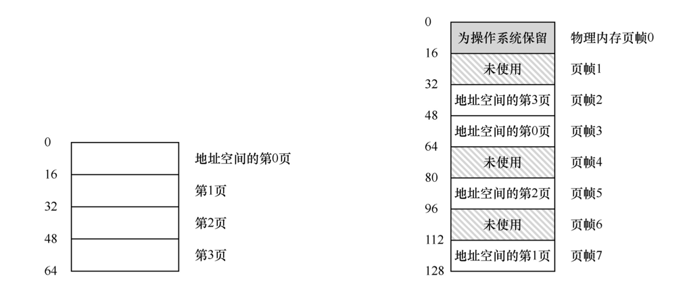
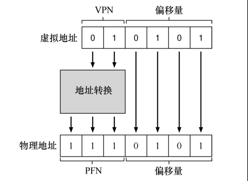

### 分页

操作系统对内存的分割，一种是将空间分割成不同长度的分片，就像虚拟内存管理中的分段；另一种是将空间分割成固定长度的分片，在虚拟内存中，我们称这种思想为分页，切分的每个单元称为一页，相对应的，物理内存也看成是定长槽块的阵列，叫作页帧（page frame）

### 例子

*假设我们有一个 64 字节的小地址空间，有 4 个 16 字节的页（虚拟页 0、1、2、3），实际放置在由 8 个页帧构成的 128 字节物理内存中*

#### 页表

*大多数页表都是每个进程的数据结构*

*由上图可知虚拟页与页帧的对应关系*

- 虚拟页 0 → 物理帧 3
- VP 1 → PF 7
- VP 2 → PF 5
- VP 3 → PF 2

#### 地址转换计算

*虚拟地址由虚拟页面号（virtual page number，VPN）和页内的偏移量（offset）两部分组成*

- 虚拟地址：因为虚拟地址只有 64 字节，所以由二进制表示需要 $log64 = 6$ ，所以需要 6 位来表示
- VPN：由于只有 4 页，所以由二进制表示需要 $log4 = 2$，由虚拟地址高两位表示
- offset：由于每页有 16 字节，所以由二进制表示需要 $log16 = 4$，由虚拟地址低四位表示

*当进程生成虚拟地址时，操作系统和硬件必须协作，将它转换为有意义的物理地址*

- 假设上面加载的虚拟地址是21，即 010101
  - movl 21, %eax
  - VPN：01
  - offset：0101
  - 假设页表现实VPN 1对应 PFN 7，即 01 → 111
  - 偏移量保持不变
  - 则我们得到实际地址为 1110101

