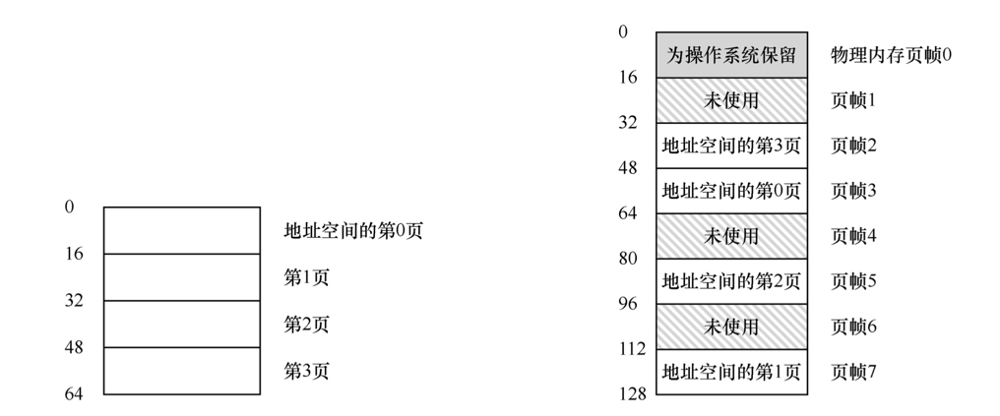
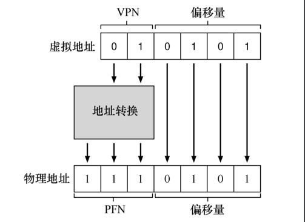
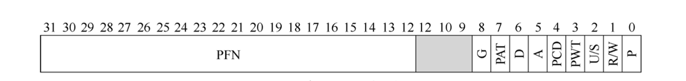
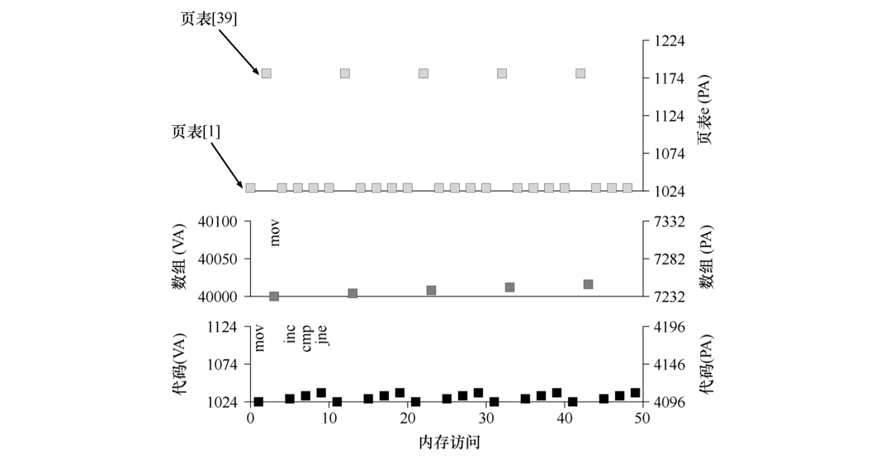

### 分页概述

操作系统对内存的分割，一种是将空间分割成不同长度的分片，就像虚拟内存管理中的分段；另一种是将空间分割成固定长度的分片，在虚拟内存中，我们称这种思想为分页，切分的每个单元称为一页，相对应的，物理内存也看成是定长槽块的阵列，叫作页帧（page frame）


### 例子

*假设我们有一个 64 字节的小地址空间，有 4 个 16 字节的页（虚拟页 0、1、2、3），实际放置在由 8 个页帧构成的 128 字节物理内存中*




#### 页表

*大多数页表都是每个进程的数据结构*

*由上图可知虚拟页与页帧的对应关系*

- 虚拟页 0 → 物理帧 3
- VP 1 → PF 7
- VP 2 → PF 5
- VP 3 → PF 2

#### 地址转换计算

*虚拟地址由虚拟页面号（virtual page number，VPN）和页内的偏移量（offset）两部分组成*

- 虚拟地址：因为虚拟地址只有 64 字节，所以由二进制表示需要 $log64 = 6$ ，所以需要 6 位来表示
- VPN：由于只有 4 页，所以由二进制表示需要 $log4 = 2$，由虚拟地址高两位表示
- offset：由于每页有 16 字节，所以由二进制表示需要 $log16 = 4$，由虚拟地址低四位表示


*当进程生成虚拟地址时，操作系统和硬件必须协作，将它转换为有意义的物理地址*

- 假设上面加载的虚拟地址是21，即 010101
  - movl 21, %eax
  - VPN：01
  - offset：0101
  - 假设页表现实VPN 1对应 PFN 7，即 01 → 111
  - 偏移量保持不变
  - 则我们得到实际地址为 1110101



### 页表的存储

*页表可以变得非常大，比我们之前讨论过的小段表或基址/界限对要大得多。例如，想 象一个典型的 32 位地址空间，带有 4KB 的页。这个虚拟地址分成 20 位的 VPN 和 12 位的偏移量*

*一个 20 位的 VPN 意味着，操作系统必须为每个进程管理 $2^20$ 个地址转换（大约一百万）。 假设每个页表格条目（PTE）需要 4 个字节，来保存物理地址转换和任何其他有用的东西， 每个页表就需要巨大的 4MB 内存！这非常大。现在想象一下有 100 个进程在运行：这意味着操作系统会需要 400MB 内存，只是为了所有这些地址转换！*

*由于页表如此之大，我们没有在 MMU 中利用任何特殊的片上硬件，来存储当前正在运行的进程的页表，而是将每个进程的页表存储在内存中。*


### 页表的构成

*页表就是一种数据结构，用于将虚拟地址（或者实际上， 是虚拟页号）映射到物理地址（物理帧号）。因此，任何数据结构都可以采用。最简单的形 式称为线性页表（linear page table），就是一个数组。*

- PTE中需要了解的位
  - 有效位（valid bit）：通常用于指示特定地址转换是否有效，访问无效内存则会陷入操作系统
  - 有保护位（protection bit）：表明页是否可以读取、写入或执行，没有将要执行操作的权限则会陷入操作系统
  - 存在位（present bit）：表示该页 是在物理存储器还是在磁盘上（即它已被换出，swapped out）
  - 参考位（reference bit，也被称为访问位，accessed bit）：有时用于追踪页是否被访问，也用于确定哪些页很受欢迎，因此应该保留在内存中


*下图为 x86 架构的示例页表项，包含一个存在位（P），确定是否允许写入该页面的读/写位（R/W） 确定用户模式进程是否可以访问该页面的用户/超级用户位 （U/S），有几位（PWT、PCD、PAT 和 G）确定硬件缓存如何为这些页面工作，一个访问位（A）和一个脏位（D），最后是页帧号（PFN）本身*




### 分页让运行变慢

*以简单的指令 `movl 21, %eax` 为例，我们只看对地址 21 的显式引用，而不关心指令获取，我们假定硬件为我们执行地址转换*

- 要获取所需数据，系统必须首先将虚拟地址（21）转换为正确的物理地址（117）。
- 因此，在从地址 117 获取数据之前，系统必须首先从进程的页表中提取适当的页表项，执行转换，然后从物理内存中加载数据。 
- 为此，硬件必须知道当前正在运行的进程的页表的位置。现在让我们假设一个页表基址寄存器（page-table base register）包含页表的起始位置的物理地址。
- 为了找到 PTE 的位置，硬件需要执行 `VPN = (VirtualAddress & VPN_MASK) >> SHIFT`，在这里VPN MASK 将被设置为 0x30（110000），SHIFT 设置为 4（偏移量的位数）
- 使用虚拟地址 21（010101），掩码将 此值转换为 010000，移位将它变成 01，或虚拟页 1
- 然后，我们使用该值作为页表基址寄存器指向的 PTE 数组的索引 `PTEAddr = PageTableBaseRegister + (VPN * sizeof(PTE))`
- 一旦知道了这个物理地址，硬件就可以从内存中获取 PTE，提取 PFN，并将它与来自虚拟地址的偏移量连接起来，形成所需的物理地址。
- `offset = VirtualAddress & OFFSET_MASK`
- `PhysAddr = (PFN << SHIFT) | offset`
- 最后，硬件可以从内存中获取所需的数据并将其放入寄存器 eax。


*完整逻辑类似下列伪代码*

```pseudo
// Extract the VPN from the virtual address
VPN = (VirtualAddress & VPN_MASK) >> SHIFT
// Form the address of the page-table entry (PTE)
PTEAddr = PTBR + (VPN * sizeof(PTE))
// Fetch the PTE
PTE = AccessMemory(PTEAddr)

// Check if process can access the page 
if (PTE.Valid == False) 
    RaiseException(SEGMENTATION_FAULT) 
else if (CanAccess(PTE.ProtectBits) == False) 
    RaiseException(PROTECTION_FAULT) 
else 
    // Access is OK: form physical address and fetch it 
    offset = VirtualAddress & OFFSET_MASK 
    PhysAddr = (PTE.PFN << PFN_SHIFT) | offset 
    Register = AccessMemory(PhysAddr)
```

*对于每个内存引用（无论是取指令还是显式加载或存储），分页都需要我们执行一个额外的内存引用，以便首先从页表中获取地址转换。工作量很大！额外的内存引用开销很大，在这种情况下，可能会使进程减慢两倍或更多。*

### 内存访问的例子

*假设我们有以下代码*

```c
int array[1000];

for (i = 0; i < 1000; i++)
  array[i] = 0;
```

*汇编代码类似*

```
0x1024 movl $0x0,(%edi,%eax,4) 
0x1028 incl %eax 
0x102c cmpl $0x03e8,%eax 
0x1030 jne  0x1024
```

- 假设一个大小为 64KB 的虚拟地址空间（不切实际地小）。我们还假定页面大小为 1KB。
- 假设有一个线性（基于数组）的页表，它位于物理地址 1KB（1024）。
- 首先，存在代码所在 的虚拟页面。由于页大小为 1KB，虚拟地址 1024 驻留在虚拟地址空间的第二页（VPN = 1， 因为 VPN = 0 是第一页）。 假设这个虚拟页映射到物理帧 4
  - (VPN 1  → PFN 4)
- 接下来是数组本身。它的大小是 4000 字节（1000 整数），我们假设它驻留在虚拟地址 40000 到 44000（不包括最后一个字节）。 它的虚拟页的十进制范围是 VPN = 39……VPN = 42。因此，我们需要这些页的映射。针对这个例子，让我们假设以下虚拟到物理的映射：*
  - (VPN 39 → PFN 7)
  - (VPN 40 → PFN 8)
  - (VPN 41 → PFN 9)
  - (VPN 42 → PFN 10)

*它运行时的内存访问情况如下图所示*



- 访问代码页表获取物理地址
- 访问物理地址取第一条指令 `movl $0x0,(%edi,%eax,4)` 并执行
- 访问数组页表获取物理地址
- 访问物理地址并将内容置为0
- 访问代码页表获取物理地址
- 访问物理地址获取第二条指令 `incl %eax` 并执行 寄存器值+1
- 访问代码页表获取物理地址
- 访问物理地址获取第三条指令 `cmpl $0x03e8,%eax` 并执行 比较寄存器值和0x03e8
- 访问代码页表获取物理地址
- 访问物理地址表获取第四条指令 `jne  0x1024` 并执行 上条比较不相等则跳转至 0x1024


*现代操作系统的内存管理子系统中最重要的数据结构之一就是页表（page table）。通常，页表存储 虚拟—物理地址转换（virtual-to-physical address translation），从而让系统知道地址空间的每个页实际驻 留在物理内存中的哪个位置。由于每个地址空间都需要这种转换，因此一般来说，系统中每个进程都有 一个页表。页表的确切结构要么由硬件（旧系统）确定，要么由 OS（现代系统）更灵活地管理。*