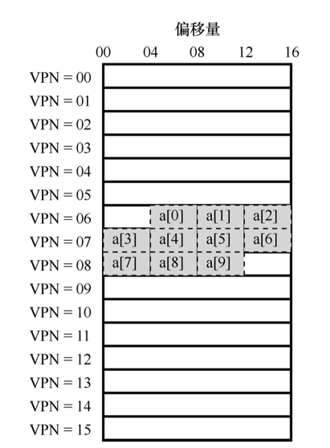

## 快速地址转换

*额外的内存读取让指令执行慢的无法接受，想要加速这个过程通常需要一些来自硬件的帮助，地址转换旁路缓冲存储器（translation-lookaside buffer，TLB），它就是频繁发生的虚拟到物理地址转换的硬件缓存（cache）。因此，更好的名称应该是地址转换缓存（address-translation cache）。对每次内存访问，硬件先检查 TLB，看看其中是否有期望的转换映射，如果有，就完成转换（很快），不用访问页表（其中有全部的转换映射）。*


### TLB基本算法

```cgo
VPN = (VirtualAddress & VPN_MASK) >> SHIFT 
(Success, TlbEntry) = TLB_Lookup(VPN) 
if (Success == True) // TLB Hit 
    if (CanAccess(TlbEntry.ProtectBits) == True) 
        Offset = VirtualAddress & OFFSET_MASK 
        PhysAddr = (TlbEntry.PFN << SHIFT) | Offset 
        AccessMemory(PhysAddr) 
    else 
        RaiseException(PROTECTION_FAULT) 
else // TLB Miss 
    PTEAddr = PTBR + (VPN * sizeof(PTE)) 
    PTE = AccessMemory(PTEAddr)
    if (PTE.Valid == False) 
        RaiseException(SEGMENTATION_FAULT) 
    else if (CanAccess(PTE.ProtectBits) == False) 
        RaiseException(PROTECTION_FAULT) 
    else 
        TLB_Insert(VPN, PTE.PFN, PTE.ProtectBits) 
        RetryInstruction()
```

- 首先从虚拟地址中提取页号（VPN）
- 然后检查 TLB 是否有该 VPN 的转换映射
- 如果有，我们有了 TLB 命中（TLB hit）， 这意味着 TLB 有该页的转换映射
  - 保护检查没有失败
    - 从相关的 TLB 项中取出页帧号（PFN）
    - 与原来虚拟地址中的偏移量组合形成期望的物理地址（PA）
    - 并访问内存
  - 保护检查没有失败
    - 报保护错误
- 如果没有，硬件访问页表来寻找转换映射
  - 如果 PTE 无效则
    - 报错段错误
  - 保护检查没有失败
    - 报保护错误
  - 将 PTE 插入 TLB
  - 重新执行触发陷阱的代码(将pc置为触发陷阱代码的地址)


### TLB的例子

*由于时间局部性与空间局部性，TLB 带来了巨大的性能提升，它使得虚拟内存成为可能。TLB 和其他缓存相似，在一般情况下，转换映射会在缓存中（即命中）。如果是这样，只增加了很少的开销，因为 TLB 处理器核心附近，设计的访问速度很快。如果 TLB 未命中，就会带来很大的分页开销。必须访问页表来查找转换映射，导致一次额外的内存引用（或者更多，如果页表更复杂）。如果这经常发生，程序的运行就会显著变慢。*

#### 简单的循环

```cgo
int sum = 0;

for (i = 0; i < 10; i++) {
    sum += a[i];
}
```

#### 数组的构成

- 假设
  - 有一个 8 位的小虚地址空间
  - 页大小为 16B
  - 虚地址划分为 4 位的 VPN（有 16 个虚拟内存 页）和 4 位的偏移量（每个页中有 16 个字节）
  - 在 c 语言中 int 为 4B 的整形

*数组在内存中的构成可能如下图所示：*



#### 访问数组时的TLB

*简单起见，我们假装循环产生的内存访问只是针对数组（忽略变量 i 和 sum，以及指令本身）*

- a[0] : TLB Miss
- a[1] : TLB Hit
- a[2] : TLB Hit
- a[3] : TLB Miss
- a[4] : TLB Hit
- a[5] : TLB Hit
- a[6] : TLB Hit
- a[7] : TLB Miss
- a[8] : TLB Hit
- a[9] : TLB Hit

*三次未命中，七次命中，所以 TLB 的命中率为 70%。即使这是程序首次访问该数组，但得益于空间局部性（spatial locality），TLB 还是提高了性能。数组的元素被紧密存放在几页中（即它们在空间中紧密相邻），因此只有对页中第一个元素的访问才会导致 TLB 未命中。*

*如果在这次循环后不久，该程序再次访问该数组，我们会看到更好的结果，假设 TLB 足够大，能缓存所需的转换映射：命中、命中、命中、命中、命中、命中、命中、命中、命中、命中。在这种情况下，由于时间局部性（temporal locality）， 即在短时间内对内存项再次引用，所以 TLB 的命中率会很高。类似其他缓存，TLB 的成功依赖于空间和时间局部性。如果某个程序表现出这样的局部性（许多程序是这样），TLB 的命中率可能很高。*

*硬件缓存，无论是指令、数据还是地址转换（如 TLB），都利用了局部性，在小而快的芯片内存储器中保存一份内存副本。处理器可以先检查缓存中是否存在就近的副本，而不是必须访问（缓慢的）内存来满足请求。如果存在，处理器就可以很快地访问它（例如在几个 CPU 时钟内），避免花很多时间来 访问内存（好多纳秒）。*

*既然像 TLB 这样的缓存这么好，为什么不做更大的缓存，装下所有的数据？可惜的是，这里我们遇到了更基本的定律，就像物理定律那样。如果想要快速地缓存，它就必须小，因为光速和其他物理限制会起作用。大的缓存注定慢，因此无法实现目的。*

### 未命中的处理

