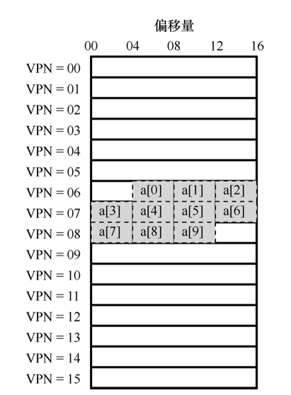

## 快速地址转换

*额外的内存读取让指令执行慢的无法接受，想要加速这个过程通常需要一些来自硬件的帮助，地址转换旁路缓冲存储器（translation-lookaside buffer，TLB），它就是频繁发生的虚拟到物理地址转换的硬件缓存（cache）。因此，更好的名称应该是地址转换缓存（address-translation cache）。对每次内存访问，硬件先检查 TLB，看看其中是否有期望的转换映射，如果有，就完成转换（很快），不用访问页表（其中有全部的转换映射）。*


### TLB基本算法

```cgo
VPN = (VirtualAddress & VPN_MASK) >> SHIFT 
(Success, TlbEntry) = TLB_Lookup(VPN) 
if (Success == True) // TLB Hit 
    if (CanAccess(TlbEntry.ProtectBits) == True) 
        Offset = VirtualAddress & OFFSET_MASK 
        PhysAddr = (TlbEntry.PFN << SHIFT) | Offset 
        AccessMemory(PhysAddr) 
    else 
        RaiseException(PROTECTION_FAULT) 
else // TLB Miss 
    PTEAddr = PTBR + (VPN * sizeof(PTE)) 
    PTE = AccessMemory(PTEAddr)
    if (PTE.Valid == False) 
        RaiseException(SEGMENTATION_FAULT) 
    else if (CanAccess(PTE.ProtectBits) == False) 
        RaiseException(PROTECTION_FAULT) 
    else 
        TLB_Insert(VPN, PTE.PFN, PTE.ProtectBits) 
        RetryInstruction()
```

- 首先从虚拟地址中提取页号（VPN）
- 然后检查 TLB 是否有该 VPN 的转换映射
- 如果有，我们有了 TLB 命中（TLB hit）， 这意味着 TLB 有该页的转换映射
  - 保护检查没有失败
    - 从相关的 TLB 项中取出页帧号（PFN）
    - 与原来虚拟地址中的偏移量组合形成期望的物理地址（PA）
    - 并访问内存
  - 保护检查没有失败
    - 报保护错误
- 如果没有，硬件访问页表来寻找转换映射
  - 如果 PTE 无效则
    - 报错段错误
  - 保护检查没有失败
    - 报保护错误
  - 将 PTE 插入 TLB
  - 重新执行触发陷阱的代码(将pc置为触发陷阱代码的地址)


### TLB的例子

*由于时间局部性与空间局部性，TLB 带来了巨大的性能提升，它使得虚拟内存成为可能。TLB 和其他缓存相似，在一般情况下，转换映射会在缓存中（即命中）。如果是这样，只增加了很少的开销，因为 TLB 处理器核心附近，设计的访问速度很快。如果 TLB 未命中，就会带来很大的分页开销。必须访问页表来查找转换映射，导致一次额外的内存引用（或者更多，如果页表更复杂）。如果这经常发生，程序的运行就会显著变慢。*

#### 简单的循环

```cgo
int sum = 0;

for (i = 0; i < 10; i++) {
    sum += a[i];
}
```

#### 数组的构成

- 假设
  - 有一个 8 位的小虚地址空间
  - 页大小为 16B
  - 虚地址划分为 4 位的 VPN（有 16 个虚拟内存 页）和 4 位的偏移量（每个页中有 16 个字节）
  - 在 c 语言中 int 为 4B 的整形

*数组在内存中的构成可能如下图所示：*



#### 访问数组时的TLB

*简单起见，我们假装循环产生的内存访问只是针对数组（忽略变量 i 和 sum，以及指令本身）*

- a[0] : TLB Miss
- a[1] : TLB Hit
- a[2] : TLB Hit
- a[3] : TLB Miss
- a[4] : TLB Hit
- a[5] : TLB Hit
- a[6] : TLB Hit
- a[7] : TLB Miss
- a[8] : TLB Hit
- a[9] : TLB Hit

*三次未命中，七次命中，所以 TLB 的命中率为 70%。即使这是程序首次访问该数组，但得益于空间局部性（spatial locality），TLB 还是提高了性能。数组的元素被紧密存放在几页中（即它们在空间中紧密相邻），因此只有对页中第一个元素的访问才会导致 TLB 未命中。*

*如果页大小变大一倍（32 字节，而不是 16），数组访问遇到的未命中更少。典型页的大小一般为 4KB，这种情况下，密集的、基于数组的访问会实现极好的 TLB 性能，每页的访问只会遇到一次未命中。*

*如果在这次循环后不久，该程序再次访问该数组，我们会看到更好的结果，假设 TLB 足够大，能缓存所需的转换映射：命中、命中、命中、命中、命中、命中、命中、命中、命中、命中。在这种情况下，由于时间局部性（temporal locality）， 即在短时间内对内存项再次引用，所以 TLB 的命中率会很高。类似其他缓存，TLB 的成功依赖于空间和时间局部性。如果某个程序表现出这样的局部性（许多程序是这样），TLB 的命中率可能很高。*

*硬件缓存，无论是指令、数据还是地址转换（如 TLB），都利用了局部性，在小而快的芯片内存储器中保存一份内存副本。处理器可以先检查缓存中是否存在就近的副本，而不是必须访问（缓慢的）内存来满足请求。如果存在，处理器就可以很快地访问它（例如在几个 CPU 时钟内），避免花很多时间来访问内存（好多纳秒）。*

*既然像 TLB 这样的缓存这么好，为什么不做更大的缓存，装下所有的数据？可惜的是，这里我们遇到了更基本的物理定律。如果想要快速地缓存，它就必须小，因为光速和其他物理限制会起作用。大的缓存注定慢，因此无法实现目的。*

### 未命中的处理

#### 硬件处理

- 以前的硬件有复杂的指令集（有时称为复杂指令集计算机，Complex-Instruction Set Computer，CISC），造硬件的人不太相信那些搞操作系统的人。
- 因此，硬件全权处理 TLB 未命中。为了做到这一点，硬件必须知道页表在内存中的确切位置（通过页表基址寄存器， page-table base register），以及页表的确切格式。
- 发生未命中时， 硬件会“遍历”页表，找到正确的页表项，取出想要的转换映射，用它更新 TLB，并重试 该指令。 

*这种“旧”体系结构有硬件管理的 TLB，一个例子是 x86 架构，它采用固定的多级页表（multi-level page table），当前页表由 CR3 寄存器指出。*

#### 软件处理

- 更现代的体系结构都是精简指令集计算机（Reduced-Instruction Set Computer，RISC），有所谓的软件管理 TLB（softwaremanaged TLB）。
- 发生 TLB 未命中时，硬件系统会抛出一个异常，这会暂停当前的指令流，将特权级提升至内核模式，跳转至陷阱处理程序（trap handler）。
- 这个陷阱处理程序是操作系统的一段代码，用于处理 TLB 未命中。
- 这段代码在运行时，会查找页表中的转换映射，然后用特别的“特权”指令更新 TLB，并从陷阱返回。
- 此时，硬件会重试导致 TLB 未命中的指令。


```cgo
// TLB 控制流算法（操作系统处理）
VPN = (VirtualAddress & VPN_MASK) >> SHIFT 
(Success, TlbEntry) = TLB_Lookup(VPN) 
if (Success == True) // TLB Hit 
    if (CanAccess(TlbEntry.ProtectBits) == True) 
        Offset = VirtualAddress & OFFSET_MASK 
        PhysAddr = (TlbEntry.PFN << SHIFT) | Offset 
        AccessMemory(PhysAddr) 
    else 
        RaiseException(PROTECTION_FAULT) 
else // TLB Miss 
    RaiseException(TLB_MISS)
```

*对于这种方式有几个重要的细节*

- 不同于之前提到的服务于系统调用的从陷阱返回，它们从陷阱返回应该继续执行陷入操作系统之后那条指令，就像从函数调用返回后，会继续执行此次调用之后的语句。但在从 TLB 未命中的陷阱返回后，硬件必须从导致陷阱的指令继续执行。这次重试因此导致该指令再次执行，但这次会命中 TLB。因此，根据陷阱或异常的原因，系统在陷入内核时必须保存不同的程序计数器（pc），以便将来能够正确地继续执行。
- 在运行 TLB 未命中处理代码时，操作系统需要格外小心避免引起 TLB 未命中的无限递归。可以把 TLB 未命中陷阱处理程序直接放到物理内存中 [它们没有映射过（unmapped），不用经过地址转换]。或者在 TLB 中保留一些项，记录永久有效的地址转换，并将其中一些永久地址转换槽块留给处理代码本身，这些被监听的（wired） 地址转换总是会命中 TLB。

### TLB的内容

*典型的 TLB 有 32 项、64 项或 128 项，并且是全相联的（fully associative）。基本上，这就意味着一条地址映射可能存在 TLB 中的任意位置，硬件会并行地查找 TLB，找到期望的转换映射。它的构成可能是 `VPN ｜ PFN ｜ 其他位`。*

*VPN 和 PFN 同时存在于 TLB 中，因为一条地址映射可能出现在任意位置（用硬件的术语，TLB 被称为全相联的（fully-associative）缓存）。*

- 其他位：
  - 有效（valid）位：此有效位与页表的有效位表示的不是同一件事。TLB 中包含的虚拟到物理的地址映射只对当前进程有效，当发生上下文切换时，硬件或操作系统（或二者）必须注意确保即将运行的进程不要误读了之前进程的地址映射，则可以使用将有效位置0的方式清空 TLB。
  - 地址空间标识符（Address Space Identifier，ASID）：当操作系统频繁的切换进程，清空 TLB 的开销会很高，这时添加 ASID 用来保证 TLB 的唯一性，可以把 ASID 看作是进程标识符（Process Identifier，PID），但通常比 PID 位数少（PID 一般 32 位， ASID 一般是 8 位）。此时硬件也需要知道当前是哪个进程正在运行，以便进行地址转换，因此操作系 统在上下文切换时，必须将某个特权寄存器设置为当前进程的 ASID
  - 保护（protection）位：rwx，标识该页是否有访问权限。
  - 脏位（dirty bit）：追踪页的访问情况。

#### 实际的 TLB 表项

*MIPS R4000，它是一种现代 的系统，采用软件管理 TLB。*


- MIPS R4000 支持 32 位的地址空间，页大小为 4KB。
- 所以在典型的虚拟地址中，预期会看到 20 位的 VPN 和 12 位的偏移量。
- TLB 中只有 19 位的 VPN，因为用户地址只占地址空间的一半（剩下的留给内核），所以只需要 19 位的 VPN。
- VPN 转换成最大 24 位的物理帧号（PFN），因此可以支持最多有 64GB 物理内存（$2^24$ 个 4KB 内存页）的系统（需要硬件支持）。


*标识位：*
- ASID
- 全局位（Global，G），用来指示这个页是不是 所有进程全局共享的。因此，如果全局位置为 1，就会忽略 ASID。
- 致性位（Coherence，C），决定硬件 如何缓存该页
- 脏位（dirty），表示该页是否被写入新数据
- 有效位（valid），告诉硬件该项的地址映射是否有效
- 页掩码（page mask）字段，用来支持不同的页大小


*MIPS 的 TLB 通常有 32 项或 64 项，大多数提供给用户进程使用，也有一小部分留给操作系统使用。操作系统可以设置一个被监听的寄存器，告诉硬件需要为自己预留多少 TLB 槽，以避免操作系统的关键代码 TLB Miss。*


*由于 MIPS 的 TLB 是软件管理的，所以系统需要提供一些更新 TLB 的特权指令。MIPS 提 供了 4 个这样的指令：*

- TLBP，用来查找指定的转换映射是否在 TLB 中
- TLBR，用来将 TLB 中的内容读取到指定寄存器中
- TLBWI，用来替换指定的 TLB 项
- TLBWR，用来随机替换一个 TLB 项