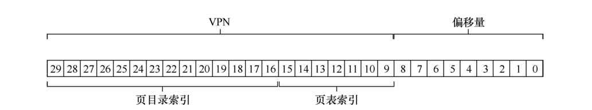

### 巨大的页表

- 32 位地址空间（232 字节）
- 4KB（212 字节）的页
- 4 字节的页表项

*一个地址空间中大约有一百万个虚拟页面 （232/212）。乘以页表项的大小，你会发现页表大小为 4MB。通常系统中的每个进程都有一个页表！有一百个活动进程（在现代系统中并不罕见），就要为页表分配400MB的内存，对于32位的系统来说，它们通常仅拥有4GB的内存上限。*


### 更大的页

*以 32 位地址空间为例，但这次假设用 16KB 的页。因此，会有 18 位的 VPN 加上 14 位的偏移量。假设每个页表项（4 字节）的大小相同，现在线性页表中有 218 个项，因此每个页表的总大小为 1MB，页表缩到四分之一。*

*然而，这种方法的主要问题在于，大内存页会导致每页内的浪费，这被称为内部碎片（internal fragmentation）问题（因为浪费在分配单元内部）。因此，结果是应用程序会分配页，但只用每 页的一小部分，而内存很快就会充满这些过大的页。因此，大多数系统在常见的情况下使用相 对较小的页大小：4KB（如 x86）或 8KB（如 SPARCv9）。*


### 混合方法

*在生活中，每当有两种合理但不同的方法时，你应该总是研究两者的结合，看看能否两全其美。我们称这种组合为杂合（hybrid）。混合方法就是将分页和分段相结合，以减少页表的内存开销。*


*从图中可以看到，大部分页表都没有使用，充满了无效的（invalid）项。*


*因此，我们的杂合方法不是为进程的整个地址空间提供单个页表，而是为每个逻辑分段 提供一个。在这个例子中，我们可能有 3 个页表，地址空间的代码、堆和栈部分各有一个。*

- 在分段中：
  - 基址（base）寄存器 告诉我们每个段在物理内存中的位置
  - 界限（bound）或限制（limit）寄存器，告诉我们该段的结束位置

*在杂合方案中， 我们仍然在 MMU 中拥有这些结构。在这里，我们使用基址不是指向段本身，而是保存该段的页表的物理地址。界限寄存器用于指示页表的结尾（即它有多少有效页）。*

*要确定地址引用哪个段，我们会用地址空间的前两位。假设 00 是未使用的段，01 是代 码段，10 是堆段，11 是栈段。因此，虚拟地址如下所示：*


*在硬件中，假设有 3 个基本/界限对，代码、堆和栈各一个。当进程正在运行时，每个段的基址寄存器都包含该段的线性页表的物理地址。因此，系统中的每个进程现在都有 3 个与 其关联的页表。在上下文切换时，必须更改这些寄存器，以反映新运行进程的页表的位置。*

*在 TLB 未命中时（假设硬件管理的 TLB，即硬件负责处理 TLB 未命中），硬件使用分段位（SN）来确定要用哪个基址和界限对。然后硬件将其中的物理地址与 VPN 结合起来， 形成页表项（PTE）的地址：*

```cgo
SN = (VirtualAddress & SEG_MASK) >> SN_SHIFT 
VPN = (VirtualAddress & VPN_MASK) >> VPN_SHIFT 
AddressOfPTE = Base[SN] + (VPN * sizeof(PTE))
```

*它与我们之前在线性页表中看到的几乎完全相同， 唯一的区别是使用 3 个段基址寄存器中的一个，而不是单个页表基址寄存器。杂合方案的关键区别在于，每个分段都有界限寄存器，每个界限寄存器保存了段中最大有效页的值。当访问的页表超出段的末尾时，则会产生一个异常，并可能导致进程终止。*

*以这种方式，与线性页表相比，杂合方法实现了显著的内存节省。栈和堆之间未分配的页不再占用页表中的空间（仅将其标记为无效）。*

*这种方式的缺点也是分段带来的，分段并不像我们需要的那样灵活，因为它假定地址空间有一定的使用模式。如果有一个大而稀疏的堆，仍然可能导致大量的页表浪费。其次，这种杂合导致外部碎片再次出现。尽管大部分内存是以页面大小单位管理的，但页表现在可以是任意大小（是 PTE 的倍数）。*


### 多级页表

*多级页表（multi-level page table）将线性页表变成了类似树的东西。这种方法非常有效，许多现代系统都用它 （例如 x86）。多级页表的基本思想很简单。首先，将页表分成页大小的单元。然后，如果整页的页表项（PTE）无效，就完全不分配该页的页表。为了追踪页表的页是否有效（以及如果有效， 它在内存中的位置），使用了名为页目录（page directory）的新结构。页目录因此可以告诉 你页表的页在哪里，或者页表的整个页不包含有效页。*

#### 二级页表


- 页目录：它由多个页目录项（Page Directory Entries，PDE）组成。PDE（至少）拥有有效位（valid bit）和页帧号（page frame number， PFN），类似于 PTE。如果 PDE 项无效（即等于零），则 PDE 的其余部分没有定义（没有对于页表）。
- 页表：存储了至少一条页表项，否则不分配，页表的大小为页大小

*多级页表分配的页表空间，与你正在使用的地址空间内存量成比例。因此它通常很紧凑，并且支持稀疏的地址空间。*

*如果仔细构建，页表的每个部分都可以整齐地放入一页中，从而更容易管理内存。操作系统可以在需要分配或增长页表时简单地获取下一个空闲页。有了多级结构，我们增加了一个间接层 （level of indirection），使用了页目录，它指向页表的各个部分。这种间接方式，让我们能够将页表页放在物理内存的任何地方。*

#### 多级页表的代价

- 在 TLB 未命中时，需要从内存加载两次，才能从页表中获取正确的地址转换信息（一次用于页目录，另一次用于 PTE 本身），而用线性页表只需要一次加载。因此，多级表是一个时间—空间折中（time-space trade-off）的小例子。我们想要更小的表（并得到了），但不是没代价。尽管在常见情况下（TLB 命中），性能显然是相同的，但 TLB 未命中时，则会因较小的表而导致较高的成本。
- 另一个明显的缺点是复杂性。无论是硬件还是操作系统来处理页表查找（在 TLB 未命中时），这样做无疑都比简单的线性页表查找更复杂。


#### 例子

- 16KB 的小地址空间
- 64 个字节的页
- 14 位的虚拟地址空间：8 位VPN，6 位偏移量
- 4 个字节的 PTE

*即使只有一小部分地址空间正在使用，线性页表也会有 $2^8$（256）个项。*

*在这个例子中，虚拟页 0 和 1 用于代码，虚拟页 4 和 5 用 于堆，虚拟页 254 和 255 用于栈。地址空间的其余页未被使用。*


*由上述给出信息，我们可以计算页表的大小为 1KB（256×4 字节），而我们的页大小为 64B，则需要 16 个内存页来放置页表，没页容纳 16 个 PTE*

*如何使用 VPN 来首先索引到页目录中，然后再索引到页表的页中。*

- 因为页表存放在 16 张页表中，所以我们需要 4 位来表示页表的索引
- 又因为每个页表中存放了 16 条 PTE，所以我们还需要 4 位来表示 PTE 的索引
- 然后就是偏移量了，因为页大小为 64 ，所以我们需要 $log64 = 6$ 位来表示偏移量


*一旦从 VPN 中提取了页目录索引（简称 PDIndex），我们就可以通过简单的计算来找到页目录项（PDE）的地址：PDEAddr = PageDirBase +（PDIndex × sizeof（PDE））。*

*如果页目录项标记为无效，则我们知道访问无效，从而引发异常。如果 PDE 有效，我们现在必须从页目录项指向的页表的页中获取页表项（PTE）。要找到这个 PTE，我们必须使用 VPN 的剩余位索引到页表的部分。*

*这个页表索引（Page-Table Index，PTIndex）可以用来索引页表本身 `PTEAddr = (PDE.PFN << SHIFT) + (PTIndex * sizeof(PTE))`*


*页表的这一页包含前 16 个 VPN 的映射。*

- 在我们的例子中
  - 物理页100
    - VPN 0 和 1 是有效的（代码段）
    - VPN 4 和 5（堆）
  - 物理页101
    - VPN 254 和 255（栈）
  - 其余项标记为无效。


*转换：*
- 0x3F80，或二进制的 11 1111 1000 0000
- 1111 对应页目录第 16 项，即 PFN 101
- 1110 我们从 101 表中找到第 15 项得到物理地址 55（110111）
- 向内存系统发出请求：PhysAddr =（PTE.PFN << SHIFT）+ offset = (0011 0111 << 6) + 000000 = 00 1101 1100 0000 = 0x0DC0

#### 超过两级

- 512 个字节的页
- 30 位的虚拟地址空间：21 位VPN，9 位偏移量
- 4 个字节的 PTE

*因为 512 的页大小，所以我们可以在页中放入 128 个PTE，需要 7 位 VPN 来索引。*

*21 - 7 ，我们将有 14 位来索引页目录表项， $2 ^ 128$ 需要 128 个页目录页才能存放，多级页表的每一个部分放入一页目标失败了。*



*为了解决这个问题，我们为树再加一层，将页目录本身拆成多个页，然后在其上添加另一个页目录，指向页目录的页。*


- 我们使用虚拟地址的最高几位（图中的 PD 索引 0）。该索引用于从顶级页目录中获取页目录项。
- 如果有效，则通过组合来自顶级 PDE 的物理帧号和 VPN 的下一部分（PD 索引 1）来查阅页目录的第二级。
- 最后，如果有效，则可以通过使用与第二级 PDE 的地址组合的页表索引来形成 PTE 地址。

*多级页表控制流*

```cgo
VPN = (VirtualAddress & VPN_MASK) >> SHIFT 
(Success, TlbEntry) = TLB_Lookup(VPN) 
if (Success == True) // TLB Hit 
    if (CanAccess(TlbEntry.ProtectBits) == True) 
        Offset = VirtualAddress & OFFSET_MASK 
        PhysAddr = (TlbEntry.PFN << SHIFT) | Offset 
        Register = AccessMemory(PhysAddr) 
    else 
        RaiseException(PROTECTION_FAULT) 
else // TLB Miss 
    // first, get page directory entry 
    PDIndex = (VPN & PD_MASK) >> PD_SHIFT 
    PDEAddr = PDBR + (PDIndex * sizeof(PDE)) 
    PDE = AccessMemory(PDEAddr) 
    if (PDE.Valid == False) 
        RaiseException(SEGMENTATION_FAULT) 
    else 
        // PDE is valid: now fetch PTE from page table 
        PTIndex = (VPN & PT_MASK) >> PT_SHIFT 
        PTEAddr = (PDE.PFN << SHIFT) + (PTIndex * sizeof(PTE)) 
        PTE = AccessMemory(PTEAddr) 
        if (PTE.Valid == False) 
            RaiseException(SEGMENTATION_FAULT) 
        else if (CanAccess(PTE.ProtectBits) == False) 
            RaiseException(PROTECTION_FAULT) 
        else 
            TLB_Insert(VPN, PTE.PFN, PTE.ProtectBits) 
            RetryInstruction()
```

### 反向页表

*在反向页表（inverted page table）中，可以看到页表世界中更极端的空间节省。在这里，我们只保留一个页表，其中的项代表系统的每个物理页，而不是有许多页表（系统的每个进程一个）。页表项告诉我们哪个进程正在使用此页，以及该进程的哪个虚拟页映射到此物理页。*

*现在，要找到正确的项，就是要搜索这个数据结构。线性扫描是昂贵的，因此通常在此基础结构上建立散列表，以加速查找。PowerPC 就是这种架构的一个例子。*