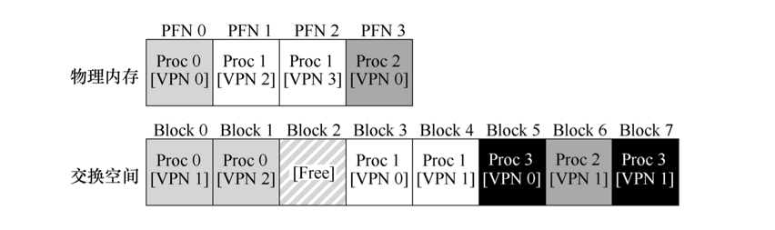

### 内存空间不存

到目前为止，我们一直假定地址空间非常小，假设每个正在运行的进程的地址空间都能放入内存。但在现实中我们通常支持同时运行的许多巨大地址空间。

*为了达到这个目的，需要在内存层级（memory hierarchy）上再加一层。为了支持更大的地址空间，操作系统需要把当前没有在用的那部分地址空间找个地方存储起来。这个地方会比内存更慢，但容量更大，硬盘（hard disk drive）通常能够满足这个需求。*

*因此，在我们的存储层级结构中，大而慢的硬盘位于底层，内存在它上面。*

#### 提供巨大虚拟地址空间的假象

*有了巨大的地址空间，你不必担心程序的数据结构是否有足够空间存储，只需自然地编写程序，根据需要分配内存。这是操作系统提供的一个强大的假象，让编程变得简单。*

*一些早期系统使用“内存覆盖（memory overlays）”，它需要程序员根据需要手动移入或移出内存中的代码或数据，这对现在的人来说是难以想象的。*

*不仅是一个进程，增加交换空间让操作系统为多个并发运行的进程都提供巨大地址空间的假象。多道程序（能够“同时”运行多个程序，更好地利用机器资源）的出现，强烈要求能够换出一些页，因为早期的机器显然不能将所有进程需要的所有页同时放在内存中。*


### 交换空间

*我们要做的第一件事情就是，在硬盘上开辟一部分空间用于物理页的移入和移出。在操作系统中，一般这样的空间称为交换空间（swap space）。我们会假设操作系统能够以页大小为单元读取或者写入交换空间。为了达到这个目的，操作系统需要记住给定页的硬盘地址（disk address）。*

*交换空间的大小是非常重要的，它决定了系统在某一时刻能够使用的最大内存页数。 简单起见，现在假设它非常大。*



- 如上图，你可以看到一个 4 页的物理内存和一个 8 页的交换空间。
- 在这个例子中，3 个进程（进程 0、进程 1 和进程 2）共享物理内存。
  - 但 3 个中的每一个， 都只有一部分有效页在内存中，剩下的在硬盘的交换空间中。
  - 第 4 个进程（进程 3）的所有页都被交换到硬盘上，因此很清楚它目前没有运行。
  - 有一块交换空间是空闲的。

*我们需要注意，交换空间不是唯一的硬盘交换目的地。例如，假设运行一个二进制程序（如 ls，或者你自己编译的 main 程序）。这个二进制程序的代码页最开始是在硬盘上，但程序运行的时候，它们被加载到内存中（要么在程序开始运行时全部加载，要么在现代操作系统中，按需要一页一页加载）。但是，如果系统需要在物理内存中腾出空间以满足其他需求，则可以安全地重新使用这些代码页的内存空间，因为稍后它又可以重新从硬盘上的二进制文件加载。*

### 存在位

*简单起见，假设有一个硬件管理 TLB 的系统。*

*访问内存走下面的流程*

- 首先从虚拟地址中提取页号（VPN）
- 然后检查 TLB 是否有该 VPN 的转换映射
- 如果有，我们有了 TLB 命中（TLB hit）， 这意味着 TLB 有该页的转换映射
  - 保护检查没有失败
    - 从相关的 TLB 项中取出页帧号（PFN）
    - 与原来虚拟地址中的偏移量组合形成期望的物理地址（PA）
    - 并访问内存
  - 保护检查没有失败
    - 报保护错误
- 如果没有，硬件访问页表来寻找转换映射
  - 如果 PTE 无效则
    - 报错段错误
  - 保护检查没有失败
    - 报保护错误
  - 将 PTE 插入 TLB
  - 重新执行触发陷阱的代码(将pc置为触发陷阱代码的地址)

*如果允许页交换到硬盘，当硬件在 PTE 中查找时，可能发现页不在物理内存中。必须添加更多的机制来支持这种行为，硬件（或操作系统，在软件管理 TLB 时）判断是否在内存中的方法，是通过页表项中的一条新信息，即存在位（present bit）。*

*如果存在位设置为 1，则表示该页存在于物理内存中，并且所有内容都如上所述进行。如果存在位设置为零，则页不在内存中，而在硬盘上。访问不在物理内存中的页，这种行为通常被称为页错误（page fault）。*


### 页错误

*硬件管理的 TLB（硬件在页表中找到需要的转换映射）和软件管理的 TLB（操作系统执行查找过程）。不论在哪种系统中，如果页不存在，都由操作系统负责处理页错误。由操作系统的页错误处理程序 （page-fault handler）确定要做什么。几乎所有的系统都在软件中处理页错误。即使是硬件管理的 TLB，硬件也信任操作系统来管理这个重要的任务。*

*操作系统如何知道所需的页在哪儿？在许多系统中，页表是存储这些信息最自然的地方。因此，操作系统可以用 PTE 中的某些位来存储硬盘地址， 这些位通常用来存储像页的 PFN 这样的数据。*

- 当操作系统接收到页错误时
- 它会在 PTE 中 查找磁盘地址
- 将请求发送到硬盘
- 将页读取到内存中
- 当硬盘 I/O 完成时，操作系统会更新页表
- 将此页标记为存在
- 更新页表项（PTE）的 PFN 字段以记录新获取页的内存位置，并重试指令
- 重新访问 TLB 还是未命中
- 最后的重试操作会在 TLB 中找到转换映射
- 获取所需的数据或指令

*当 I/O 在运行时，进程将处于阻塞（blocked）状态。因此，当页错误正常处理时，操作系统可以自由地运行其他可执行的进程。因为 I/O 操作是昂贵的，一个进程进行 I/O（页错误）时会执行另一个进程，这种交叠（overlap）是多道程序系统充分利用硬件的一种方式。*

### 内存满了

*内存可能已满（或接近满了）。操作系统希望先交换出（page out）一个或多个页，以便为操作系统即将交换入的新页留出空间。选择哪些页被交换出或被替换（replace）的过程，被称为页交换策略（page-replacement policy）。*

### 页错误处理流程

*页错误控制流算法（硬件）*

```cgo
VPN = (VirtualAddress & VPN_MASK) >> SHIFT 
(Success, TlbEntry) = TLB_Lookup(VPN) 
if (Success == True) // TLB Hit
    if (CanAccess(TlbEntry.ProtectBits) == True) 
        Offset = VirtualAddress & OFFSET_MASK 
        PhysAddr = (TlbEntry.PFN << SHIFT) | Offset 
        Register = AccessMemory(PhysAddr) 
    else 
        RaiseException(PROTECTION_FAULT)
else // TLB Miss 
    PTEAddr = PTBR + (VPN * sizeof(PTE)) 
    PTE = AccessMemory(PTEAddr) 
    if (PTE.Valid == False) 
        RaiseException(SEGMENTATION_FAULT) 
    else
        if (CanAccess(PTE.ProtectBits) == False) 
            RaiseException(PROTECTION_FAULT) 
        else if (PTE.Present == True) 
            // assuming hardware-managed TLB 
            TLB_Insert(VPN, PTE.PFN, PTE.ProtectBits) 
            RetryInstruction() 
        else if (PTE.Present == False) 
            RaiseException(PAGE_FAULT)
```

*页错误控制流算法（软件）*

```cgo
PFN = FindFreePhysicalPage()
if (PFN == -1)              // no free page found 
    PFN = EvictPage()       // run replacement algorithm 
DiskRead(PTE.DiskAddr, pfn) // sleep (waiting for I/O) 
PTE.present = True          // update page table with present 
PTE.PFN = PFN               // bit and translation (PFN) 
RetryInstruction()          // retry instruction
```

### 何时交换

*操作系统可以更主动地预留一小部分空闲内存，为了保证有少量的空闲内存，大多数操作系统会设置高水位线（High Watermark，HW） 和低水位线（Low Watermark，LW），来帮助决定何时从内存中清除页。*

- 当操作系统发现有少于 LW 个页可用时，后台负责释放内存的线程会开始运行，直到有 HW 个可用的物理页。这个后台线程有时称为交换守护进程（swap daemon）或页守护进程（page daemon）。
- 通过同时执行多个交换过程，我们可以进行一些性能优化。例如，许多系统会把多个要写入的页聚集（cluster）或分组（group），同时写入到交换区间，从而提高硬盘的效率。
- 为了配合后台的分页线程，交换算法需要先简单检查是否有空闲页，而不是直接执行替换。如果没有空闲页，会通知后台分页线程按需要释放页。当线程释放一定数目的页时，它会重新唤醒原来的线程，然后就可以把需要的页交换进内存，继续它的工作。