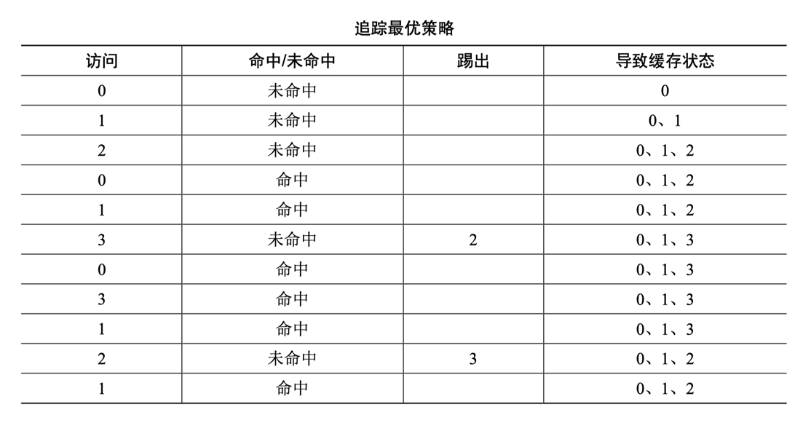
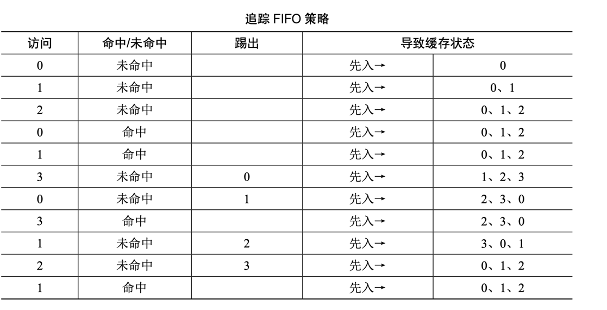
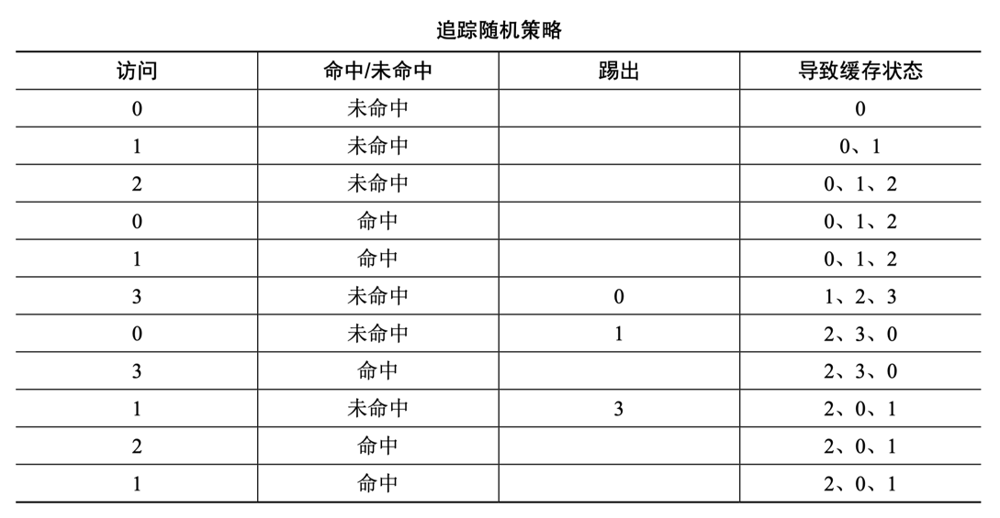
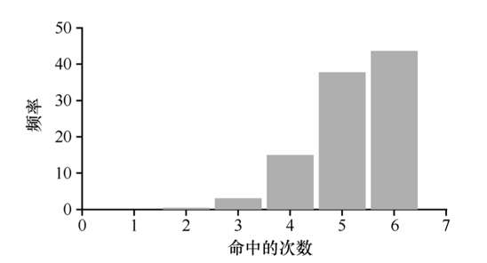
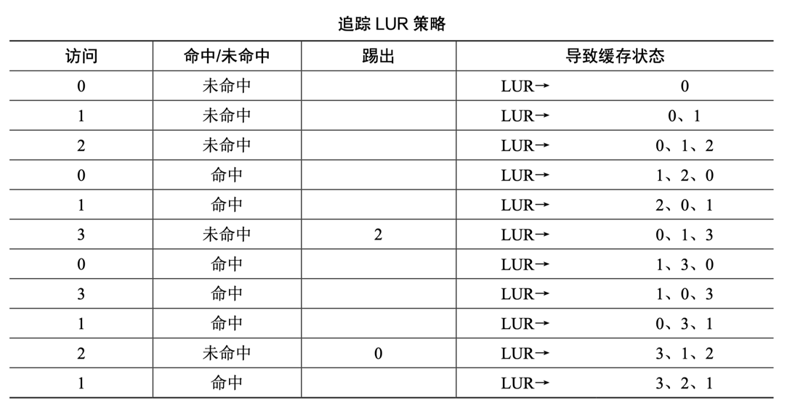
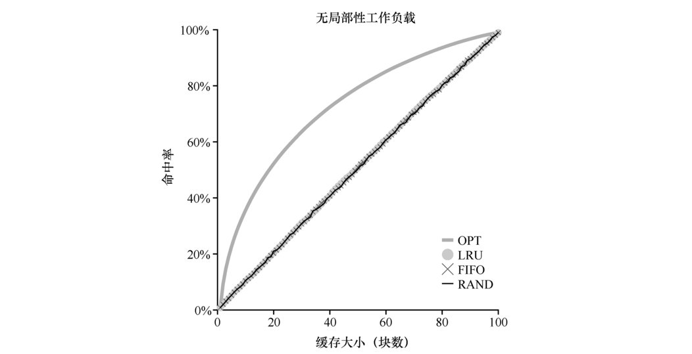
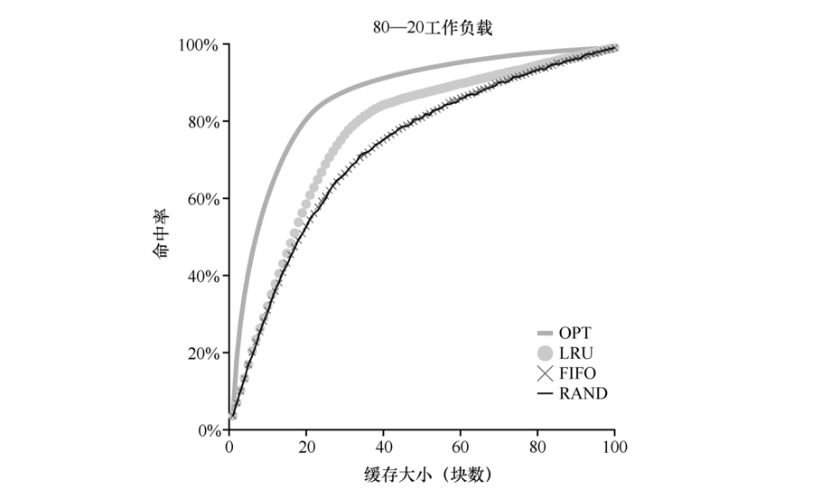
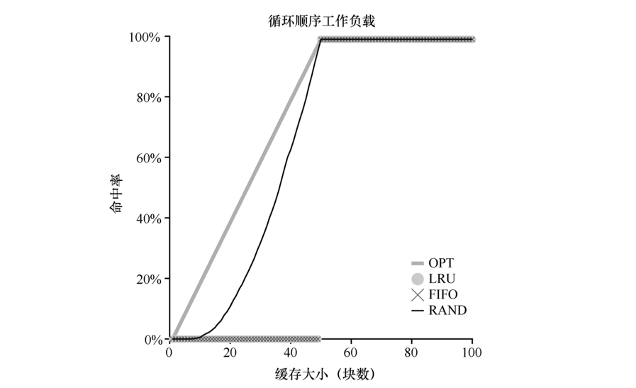
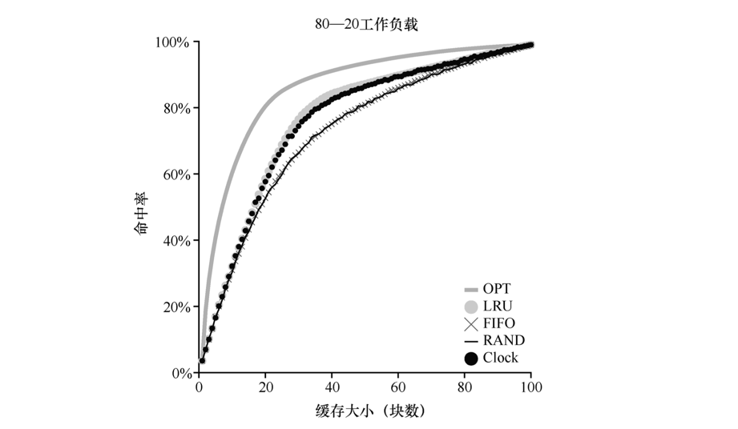

*操作系统如何决定从内存中踢出哪一页（或哪几页）？这个决定由系统的替换策略做出，替换策略通常会遵循一些通用的原则（下面将会讨论），但也会包括一些调整，以避免特殊情况下的行为。*

### 缓存管理

*由于内存只包含系统中所有页的子集，因此可以将其视为系统中虚拟内存页的缓存（cache）。*

*可以将目标看成让缓存命中（cache hit）最多，即在内存中找到待访问页的次数最多。*

*知道了缓存命中和未命中的次数， 就可以计算程序的平均内存访问时间（Average Memory Access Time，AMAT，计算机架构师衡量硬件缓存的指标）。*

$AMAT = (P_{Hit} \cdot T_M) + (P_{Miss} \cdot T_D)$

- $T_M$ 表示访问内存的成本
- $T_D$ 表示访问磁盘的成本
- $P_Hit$ 表示在缓存中找到数据的概率（命中）
- $P_Miss$ 表示在缓存中找不到数据的概率（未命中）
- $P_Hit$ 和 $P_Miss$ 从 0.0 变化到 1.0， 并且 $P_Miss$ + $P_Hit$ = 1.0。

#### 例子

- 假设有一个机器有小型地址空间：4KB，每页 256 字节。
- 因此，虚拟地址由两部分组成：一个 4 位 VPN（最高有效位）和一个 8 位偏移量（最低有效位）。
- 因此，本例中的一个进程可以访问总共 $2^4 =16$ 个虚拟页。
- 在这个例子中，该进程将产生以下内存引用（即虚拟地址）0x000，0x100，0x200，0x300，0x400，0x500，0x600，0x700，0x800，0x900。
- 这些虚拟地址指向地址空间中前 10 页的每一页的第一个字节（页号是每个虚拟地址的第一个十六进制数字）。
- 让我们进一步假设，除了虚拟页 3 之外，所有页都已经在内存中。
- 因此，我们的内存引用序列将遇到以下行为：命中，命中，命中，未命中，命中，命中，命中，命中，命中。 
- 我们可以计算命中率（hit rate，在内存中找到引用的百分比）：90%（P Hit = 0.9），因为 10 个引用中有 9 个在内存中。
- 未命中率（miss rate）显然是 10%（P Miss= 0.1）。
- 假设访问内存（TM）的 成本约为 100ns，并且访问磁盘（TD）的成本大约为 10ms。
- 则我们有以下 AMAT：0.9×100ns + 0.1×10ms，即90ns + 1ms或1.0009ms，或约1ms。
- 如果我们的命中率是99.9%（P Miss= 0.001），结果是完全不同的：AMAT 是 10.1μs，大约快 100 倍。
- 当命中率接近 100%时，AMAT 接近 100ns。

*在现代系统中，磁盘访问的成本非常高，即使很小概率的未命中也会拉低正在运行的程序的总体 AMAT。显然，我们必须尽可能地避免缓存未命中，避免程序以磁盘的速度运行。*

### 最优替换策略

*虽然最优策略过于理论化且几乎无法实现，但是对可以实现的其它策略具有比较意义，用最优策略作为标尺，可以评价新算法的好坏。*

*内存替换的最优策略是，替换内存中在最远将来才会被访问到的页，可以达到缓存未命中率最低。*

#### 例子

- 假设内存可以缓存 3 个页
- 而我们需要访问虚拟页 0，1，2，0，1，3，0，3，1，2，1

- 0，1，2 都是未命中，因为缓存是空的
- 当需要访问 3 时，需要踢出一页，而我们根据缓存内容查找即将访问的虚拟页，发现 2 在最远的将来被访问，于是踢出 2
- 最后到访问 2 时，又要查看最远访问情况，但下一步到 1 就结束了，也就是说踢出 0 或者 3 都可以

*我们计算缓存命中率，有 6 次命中和 5 次未命中，那么缓存命中率是或 54.5%，除去强制未命中（即忽略页的第一次未命中），那么命中率为 81.8%。*

*遗憾的是，正如我们之前在开发调度策略时所看到的那样，未来的访问是无法知道的，你无法为通用操作系统实现最优策略。因此，最优策略只能作为比较，知道我们的策略有多接近“完美”。*

#### 缓存为命中的三种类型

- 强制性（compulsory miss）未命中（或冷启动未命中，cold-start miss ）是因为缓存开始是空的，而这是对项目的第一次引用。
- 容量未命中（capacity miss）当缓存的空间不足而不得不踢出一个项目以将新项目引入缓存，就会发生。
- 冲突未命中（conflict miss）它出现在硬件中，因为硬件缓存中对项的放置位置有限制，这是由于所谓的集合关联性（set-associativity）。它不会出现在操作系统页面缓存中，因为这样的缓存总是完全关联的（fully-associative），即对页面可以放置的内存位置没有限制。

### FIFO

*许多早期的系统采用了非常简单的 FIFO（先入先出）替换策略。页在进入系统时，简单地放入一个队列。当发生替换时，队列尾部的页（“先入”页）被踢出。FIFO 有一个很大的优势：实现相当简单。*

*在 FIFO 中应用上面的例子*

*对比 FIFO 和最优策略，FIFO 明显不如最优策略，FIFO 命中率只有 36.4%（不包括强制性未命中为 57.1%）。先进先出（FIFO）根本无法确定页的重要性，并且假设我们将缓存大小提高到 4 ，它命中率反而下降了，稳定性不佳。*

### RANDOM

*在内存满的时候它随机选择一个页进行替换。随机具有类似于 FIFO 的属性，实现起来很简单。*

*随机的表现完全取决于多幸运（或不幸）。在上面的例子中，随机比 FIFO 好一点，比最优的差一点。*

*事实上，我们可以运行数千 次的随机实验，求得一个平均的结果。*

*有些时候（仅仅40%的概率），随机和最优策略一样好，在上述例子中，命中内存的次数是 6 次。有时候情况会更糟糕，只有 2 次或更少。随机策略取决于当时的运气。*

### LRU

*正如在调度策略所做的那样，为了提高后续的命中率，我们再次通过历史的访问情况作为参考。例如，如果某个程序在过去访问过某个页，则很有可能在不久的将来会再次访问该页。*

*页替换策略可以使用的一个历史信息是频率（frequency）。如果一个页被访问了很多次，也许它不应该被替换，因为它显然更有价值。*

*页更常用的属性是访问的近期性（recency），越近被访问过的页，也许再次访问的可能性也就越大。*

*这一系列的策略是基于人们所说的局部性原则（principle of locality）。*

#### 基于历史的算法

- “最不经常使用”（Least-Frequent LFU）策略会替换最不经常使用的页。
- “最少最近使用”（Least-Recently-Used，LRU）策略替换最近最少使用的页面。

#### 局部性类型

- 空间局部性（spatial locality），它指出如果页 P 被访问，可能围绕它的页（比如 P−1 或 P + 1）也会被访问。
- 时间局部性（temporal locality），它指出近期访问过的页面很可能在不久的将来再次访问。

*局部性原则（principle of locality）是各类缓存的存在的根基，但它并不是所有的程序都必须遵守的硬性规定，仍然有一些程序以相当随机的方式访问内存（或磁盘）。*

*在 LRU 中应用上面的例子*

*基于历史的 LRU 的决定是更准确的，并且下一个引用也是命中。因此，在我们的简单例子中，LRU 的表现几乎快要赶上最优策略了。*

*与这些算法完全相反的算法也是存在，这些策略效果都不好，因为它们忽视了大多数程序都具有的局部性特点。*

### 工作负载示例

*在实验中，我们将缓存大小从非常小（1 页）变化到足以容纳所有页（100 页），以便了解每个策略在缓存大小范围内的表现。*

- 第一个工作负载没有局部性，这意味着每个引用都是访问一个随机页。
- 在这个简单的例子中，工作负载每次访问独立的 100 个页，随机选择下一个要引用的页，一共访问了 10000 个页。

- 第二个工作负载就是所谓的“80—20”负载场景，它表现出局部性。
- 80 的引用访问的是 20%的页（“热门”页）。剩下的 20% 是对剩余的 80% 的页（“冷门”页）访问。
- 在我们的负载场景，总共有 100 个不同的页。

- 第三个工作负载我们称之为“循环顺序”工作负载，其中依次引用 50 个页，从 0 开始，然后是 1，…，49，然后循环，重复访问。
- 总共有 10000 次访问 50 个单独页。
- 这种工作负载在许多应用程序（包括重要的商业应用，如数据库）中非常常见。

#### 算法总结

- 对于随机访问来说，三种策略并没有差别，命中率都会随着缓存增加而增加。
- 在经典二八场景中，FIFO 和 RANDOM 表现相同，LRU则会优于这两种算法，但离最优仍有差距。
- “循环顺序”工作负载中，RANDOM 会显著优于其它两种算法（至少能用），但是离最优仍然有差距。

### 实现 LRU

*理想的方式*

- 在每次页访问（即每次 内存访问，不管是取指令还是加载指令还是存储指令）时，我们都必须更新一些数据，从而将该页移动到列表的前面（即 MRU 侧）。
- 为了记录哪些页是最少和最近被使用，系统必须对每次内存引用做一些记录工作。显然，如果不十分小心，这样的记录反而会极大地影响性能。
- 增加一点硬件支持可以大大提高效率，硬件可以在每个页访问时更新内存中的时间字段（时间字段可以在每个进程的页表中，或者在内存的某个单独的数组中，每个物理页有一个）。当页被访问时，时间字段将被硬件设置为当前时间。
- 然后，在需要替换页时，操作系统可以简单地扫描系统中所有页的时间字段以找到最近最少使用的页。

*遗憾的是，随着系统中页数量的增长，扫描所有页的时间字段只是为了找到最精确最少使用的页，这个代价太昂贵。想象一下一台拥有 4GB 内存的机器，内存切成 4KB 的页。这台机器有一百万页，即使以现代 CPU 速度找到 LRU 页也将需要很长时间。*

#### 近似 LRU

*从计算开销的角度来看，近似 LRU 更为可行，实际上这也 是许多现代系统的做法。*

- 这个想法需要硬件增加一个使用位（use bit，有时称为引用位，reference bit），这种做法在第一个支持分页的系统 Atlas one-level store 中实现。
- 系统的每个页有一个使用位，然后这些使用位存储在某个地方（例如，它们可能在每个进程的页表中，或者只在某个数组中）。
- 每当页被引用（即读或写）时，硬件将使用位设置为 1。 但是，硬件不会清除该位（即将其设置为 0）。
- 操作系统周期性地清除使用位，例如使用时钟算法（clock algorithm）：
  - 系统中的所有页都放在一个循环列表中。时钟指针（clock hand）开始时指向某个特定的页（哪个页不重要）。
  - 当必须进行页替换时，操作系统检查当前指向的页 P 的使用位是 1 还是 0。
  - 如果是 1，则意味着页面 P 最近被使用，因此不适合被替换。然后，P 的使用位设置为 0，时钟指针递增到下一页（P + 1）。
  - 该算法一直持续到找到一个使用位为 0 的页，使用位为 0 意味着这个页最近没有被使用过（在最坏的情况下，所有的页都已经被使用了，那么就将所有页的使用位都设置为 0）。

#### 考虑脏页

*时钟算法的一个小修改，是对内存中的页是否被修改的额外考虑。*

- 如果页已被修改（modified）并因此变脏（dirty），则踢出它就必须将它写回磁盘，这很昂贵。
- 如果它没有被修改（因此是干净的，clean），踢出就没成本。物理帧可以简单地重用于其他目的而无须额外的 I/O。

*为了支持这种行为，硬件应该包括一个修改位（modified bit，又名脏位，dirty bit）。每次写入页时都会设置此位，因此可以将其合并到页面替换算法中。例如，时钟算法可以被改变，以扫描既未使用又干净的页先踢出。*

### 其他虚拟内存策略

*页面替换不是虚拟内存子系统采用的唯一策略（尽管它可能是最重要的）。操作系统还必须决定何时将页载入内存。该策略有时称为页选择（page selection）策略（因为 Denning 这样命名），它向操作系统提供了一些不同的选项。*

*对于大多数页而言，操作系统只是使用按需分页（demand paging），这意味着操作系统在页被访问时将页载入内存中，“按需”即可。当然，操作系统可能会猜测一个页面即将被使用，从而提前载入。这种行为被称为预取（prefetching），只有在有合理的成功机会时才应该这样做。例如，一些系统将假设如果代码页 P 被载入内存，那么代码页 P + 1 很可能很快被访问，因此也应该被载入内存。*

*另一个策略决定了操作系统如何将页面写入磁盘。许多系统会在内存中收集一些待完成写入，并以一种（更高效）的写入方式将它们写入硬盘。这种行为通常称为聚集（clustering）写入，或者就是分组写入（grouping），这样做有效是因为硬盘驱动器的性质，执行单次大的写操作，比许多小的写操作更有效。*

### 抖动

*当内存就是被超额请求时，系统将不断地进行换页，这种情况有时被称为抖动（thrashing）。*

- 准入控制（admission control）：一些早期的操作系统有一组相当复杂的机制，以便在抖动发生时检测并应对。例如，给定一组进程，系统可以决定不运行部分进程，希望减少的进程工作集（它们活跃使用的页面）能放入内存，从而能够取得进展。
- 内存不足的杀手（out-of-memory killer）：目前的一些系统采用更严格的方法处理内存过载。当内存超额请求时，某些版 本的 Linux 会运行“内存不足的杀手程序（out-of-memory killer）”。这个守护进程选择一个内存密集型进程并杀死它，从而以不怎么委婉的方式减少内存。

*页替换算法的发展一直在发展，现代系统增加了对时钟等简单 LRU 近似值的一些调整。例如， 扫描抗性（scan resistance）是许多现代算法的重要组成部分，如 ARC。扫描抗性算法通常是类似 LRU 的，但也试图避免 LRU 的最坏情况行为，我们曾在循环顺序工作负载中看到这种情况。*

*然而，在许多情况下，由于内存访问和磁盘访问时间之间的差异增加，这些算法的重要性降低了。由于分页到硬盘非常昂贵，因此频繁分页的成本太高。所以，过度分页的最佳解决方案往往很简单：购买更多的内存。*
