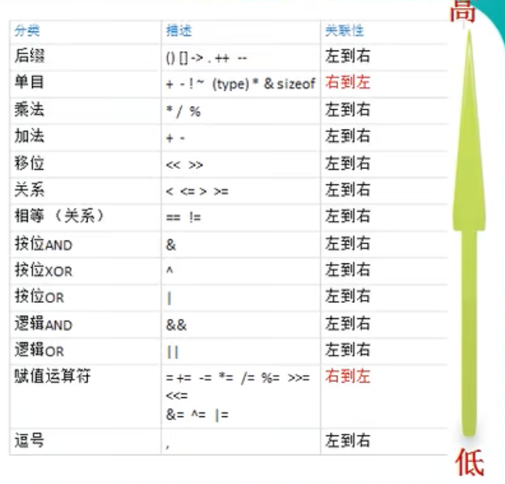

### 运算符介绍

- 运算符是一种特殊的符号，用以表示数据的运算、赋值和比较等
- 运算符有不同的优先级，所谓优先级就是表达式中的运算顺序，只有单目运算符、赋值运算符是从右向左运算的


### 算术运算符

| 运算符 |   运算   |     范例     |  结果   |
|:---:|:------:|:----------:|:-----:|
|  +  |   正号   |     +3     |   3   |
|  -  |   负号   |     -4     |  -4   |
|  +  |   加    |    1+1     |   2   |
|  -  |   减    |    1-1     |   0   |
|  *  |   乘    |    1*1     |   1   |
|  /  |   除    |    1/1     |   1   |
|  %  | 取模(余数) |    7%3     |   1   |
| ++  |   自增   |  a=2 a++   |  a=3  |
| --  |   自减   |  a=2 a--   |  a=1  |
|  +  | 字符串拼接  | "he"+"llo" | "hello" |


```golang
package main
import (
	"fmt" 
)

func main() {

	//重点讲解 /、%
	//说明，如果运算的数都是整数，那么除后，去掉小数部分，保留整数部分
	fmt.Println(10 / 4) 
	
	var n1 float32 = 10 / 4 //
	fmt.Println(n1)

	//如果我们希望保留小数部分，则需要有浮点数参与运算
	var n2 float32 = 10.0 / 4
	fmt.Println(n2)

	// 演示  % 的使用 
	// 看一个公式 a % b = a - a / b * b
	// fmt.Println("10%3=", 10 % 3) // =1
	// fmt.Println("-10%3=", -10 % 3) // = -10 - (-10) / 3 * 3 = -10 - (-9) = -1
	// fmt.Println("10%-3=", 10 % -3) // =1
	// fmt.Println("-10%-3=", -10 % -3) // =-1

	// ++ 和 --的使用
	var i int = 10
	i++ // 等价 i = i + 1
	fmt.Println("i=", i) // 11
	i-- // 等价 i = i - 1
	fmt.Println("i=", i) // 10

	if i > 0 {
		fmt.Println("ok")
	}
	//在golang中，++ 和 -- 只能独立使用.
	// var i int = 8
	// var a int 
	// a = i++ //错误，i++只能独立使用 
	// a = i-- //错误, i--只能独立使用

	// if i++ > 0 {
	// 	fmt.Println("ok")
	// }

	// var i int = 1
	// i++
	// ++i // 错误，在golang没有 前++
	// i-- 
	// --i // 错误，在golang没有 前--
	// fmt.Println("i=", i)
}

```

### 賦值运算符

| 运算符 |          描述           |      实例       |
|:---:|:---------------------:|:-------------:|
|  =  | 简单的赋值运算符，将等号左边赋值给等号右边 |     c=b+a     |
| +=  |        相加后再赋值         | c+=a 等于 c=c+a |
| -=  |        相减后再赋值         | c-=a 等于 c=c-a |
| *=  |        相乘后再赋值         | c*=a 等于 c=c*a |
| /=  |        相除后再赋值         | c/=a 等于 c=c/a |
| %=  |        求余后再赋值         | c%=a 等于 c=c%a |


```golang
package main
import (
	"fmt" 
)

func test() int {
	return 90
}

func main() {
	//赋值运算符的使用演示
	// var i int 
	// i = 10 //基本赋值

	//有两个变量，a和b，要求将其进行交换，最终打印结果
	// a = 9 , b = 2 ==> a = 2 b = 9
	a := 9
	b := 2
	fmt.Printf("交换前的情况是 a = %v , b=%v \n", a, b)
	//定义一个临时变量
	t := a
	a = b //
	b = t //
	fmt.Printf("交换后的情况是 a = %v , b=%v \n", a, b)

	//复合赋值的操作
	a += 17 // 等价 a = a + 17
	fmt.Println("a=", a)


	var c int 
	c = a + 3 // 赋值运算的执行顺序是从右向左
	fmt.Println(c)

	//2)赋值运算符的左边 只能是变量,右边 可以是变量、表达式、常量值
	// 表达式：任何有值都可以看做表达式
	var d int
	d = a //  
	d = 8 + 2 * 8 // =的右边是表达式
	d = test() + 90 //  =的右边是表达式
	//d = 890 // 890常量
	fmt.Println(d)
}
```

### 关系运算符(比较运算符)

- 关系运算符的结果都是bool型，也就是要么是true，要么是false
- 关系表达式经常用在 if 结构的条件中或循环结构的条件中

| 运算符 |  运算  |  范例  |  结果   |
|:---:|:----:|:----:|:-----:|
| ==  | 相等于  | 1=2  | false |
| !=  | 不等于  | 1!=2 | true  |
|  <  |  小于  | 1<2  | true  |
|  >  |  大于  | 1>2  | false |
| <=  | 小于等于 | 1<=2 | true  |
| >=  | 大于等于 | 1>=2 | false |


```golang
package main
import (
	"fmt" 
)

func main() {
	//演示关系运算符的使用
	var n1 int = 9
	var n2 int = 8
	fmt.Println(n1 == n2) //false
	fmt.Println(n1 != n2) //true
	fmt.Println(n1 > n2) //true
	fmt.Println(n1 >= n2) //true
	fmt.Println(n1 < n2) //flase
	fmt.Println(n1 <= n2) //flase
	flag := n1 > n2
	fmt.Println("flag=", flag)
}
```
### 逻辑运算符

- && 与，短路与：当第一条件为 false 时，第二个条件不会判断，即为短路
- || 或，短路或：当第一个条件为 true 时，第二个条件不会判断，即为短路
- ！ 非

```golang
package main
import (
	"fmt" 
)

//声明一个函数(测试)
func test() bool {
	fmt.Println("test....")
	return true
}

func main() {

	var i int = 10
	//短路与
	//说明 因为  i < 9 为 false ,因此后面的 test() 就不执行
	// if i < 9 && test() {
	// 	fmt.Println("ok...")
	// }

	if i > 9 || test() {
		fmt.Println("hello...")
	}

   /*

	//演示逻辑运算符的使用  &&
	var age int = 40
	if age > 30 && age < 50 {
		fmt.Println("ok1")
	}

	if age > 30 && age < 40 {
		fmt.Println("ok2")
	}

	//演示逻辑运算符的使用  ||

	if age > 30 || age < 50 {
		fmt.Println("ok3")
	}

	if age > 30 || age < 40 {
		fmt.Println("ok4")
	}

	//演示逻辑运算符的使用  !

	if age > 30 {
		fmt.Println("ok5")
	}

	if !(age > 30) {
		fmt.Println("ok6")
	} */

}
```


### 位运算符


##### 进制转换

```golang
package main
import (
	"fmt" 
)


func main() {

	var i int = 5
	//二进制输出 
	fmt.Printf("%b \n", i)

	//八进制：0-7 ，满8进1. 以数字0开头表示
	var j int = 011 // 011=> 9
	fmt.Println("j=", j)

	//0-9及A-F，满16进1. 以0x或0X开头表示
	var k int = 0x11 // 0x11=> 16 + 1 = 17
	fmt.Println("k=", k)
}

// 二进制转八进制，将二进制每三位一组（从低位到高位），转成对应的八进制数即可
// 11010101 拆解为 11 010 101 转换为 3 2 5 即八进制为 0325

// 二进制转十六进制，将二进制每四位一组（从低位到高位），转成对应的十六进制数即可
// 11010101 拆解为 1101 0101 转换为 D 5 即十六进制为 0xD5

//反之亦然
```

##### 原码、反码、补码

- 对于有符号的而言：
    - 1) 二进制的最高位是符号位：0表示正数,1表示负数
    - 2) 正数的原码，反码，补码都一样
    - 3) 负数的反码=它的原码符号位不变，其它位取反(0->1,1->0)
    - 4) 负数的补码=它的反码+1
    - 5) 0的反码，补码都是0
    - 6) 在计算机运算的时候，都是以补码的方式来运算的.

```golang
// 以一个byte存储的 1 和 -1
//1： 原码 00000001 --> 反码 00000001 --> 补码 00000001
//-1：原码 10000001 --> 反码 11111110 --> 补码 11111111
```
##### 位运算详解

- &: 按位与运算，两位全为1，结果为1，否则为0
- |: 按位或运算，两位有一个为1，结果为1，否则为0
- ^: 按位异或运算，两位全为1，结果为0，否则为1
- \>>: 右位移运，低位溢出，符号位不变，并用符号位字符补溢出的高位
- <<: 左位移运算，符号位不变，低位补0

```golang
package main
import (
	"fmt" 
)
func main() {
// 所有运算都是以补码计算
	//位运算的演示
	fmt.Println(2&3) // 2
	// 2 原码 00000010 --> 反码 00000010 --> 补码 00000010
	// 3 原码 00000011 --> 反码 00000011 --> 补码 00000011
	// 结果: 补码 00000010 --> 反码 00000010 --> 原码 00000010 --> 十进制 2
	
	fmt.Println(2|3) // 3
	// 2 原码 00000010 --> 反码 00000010 --> 补码 00000010
	// 3 原码 00000011 --> 反码 00000011 --> 补码 00000011
	// 结果: 补码 00000011 --> 反码 00000011 --> 原码 00000011 --> 十进制 3
	
	fmt.Println(2^3) // 1
	// 2 原码 00000010 --> 反码 00000010 --> 补码 00000010
    // 3 原码 00000011 --> 反码 00000011 --> 补码 00000011
    // 结果: 补码 00000001 --> 反码 00000001 --> 原码 00000001 --> 十进制 1

	fmt.Println(2^-2) //-4
	// 2  原码 00000010 --> 反码 00000010 --> 补码 00000010
    // -2 原码 10000010 --> 反码 11111101 --> 补码 11111110
    // 结果: 补码 11111100 --> 反码 11111011 --> 原码 10000100 --> 十进制 -4
    
	a := 1 >> 2 //0
	// 1  原码 00000001 --> 反码 00000001 --> 补码 00000001
	// 向右位移两位 补码 00000000
	
	c := 1 << 2 //4
	// 1  原码 00000001 --> 反码 00000001 --> 补码 00000001
	// 向左位移两位 补码 00000100
	
	
	fmt.Println("a=", a, "c=", c)
	
}
```

### 其它运算符

- & 
- \*
```golang
package main
import (
	"fmt" 
)
func main() {
	//演示一把 & 和 *的使用

	a := 100
	fmt.Println("a 的地址=", &a)

	var ptr *int = &a
	fmt.Println("ptr 指向的值是=", *ptr)

	var n int 
	var i int = 10
	var j int = 12
	//传统的三元运算
	//n = i > j ? i : j
	if i > j {
		n = i
	} else {
		n = j
	}
	fmt.Println("n=", n) // 12
}
```

### 进制转换

- 对于整数，有四种表示方式：
  - 1）二进制：0,1 ，满 2 进 1。
    - 在 golang 中，不能直接使用二进制来表示一个整数，它沿用了 c 的特点。
  - 2）十进制：0-9 ，满 10 进 1。
  - 3）八进制：0-7 ，满 8 进 1. 以数字 0 开头表示。
  - 4）十六进制：0-9 及 A-F，满 16 进 1. 以 0x 或 0X 开头表示。此处的 A-F 不区分大小写。

#### 转十进制

- 规则：
  - 二进制：从最低位开始（右边的），将每个位上的数提取出来，乘以2的(位数-1)次方，然后求和。
  - 八进制：从最低位开始（右边的），将每个位上的数提取出来，乘以8的(位数-1)次方，然后求和。
  - 十六进制：从最低位开始，将每个位上的数提取出来，乘以16的(位数-1)次方，然后求和。

#### 十进制转

- 规则：
  - 二进制：将该数不断除以2，直到商为零为止，然后将每步得到的余数倒过来，就是对应的二进制。
  - 八进制：将该数不断除以8，直到商为0为止，然后将每步得到的余数倒过来，就是对应的八进制。
  - 十六进制：将该数不断除以16，直到商为0为止，然后将每步得到的余数倒过来，就是对应的十六进制。

#### 二进制转

- 规则：
  - 八进制：将二进制数每三位一组(从低位开始组合），转成对应的八进制数即可。
    - 11 010 101 = 0 3 2 5
  - 十六进制：将二进制数每四位一组(从低位开始组合)，转成对应的十六进制数即可。
    - 1101 0101 = 0x D 5

#### 转二进制

- 规则：
  - 八进制：将八进制数每1位，转成对应的一个3位的二进制数即可。
    - 0 2 3 7= 10 011 111
  - 十六进制：将十六进制数每1位，转成对应的一个4位的二进制数即可。
    - 0x 2 3 7 = 10 0011 0111