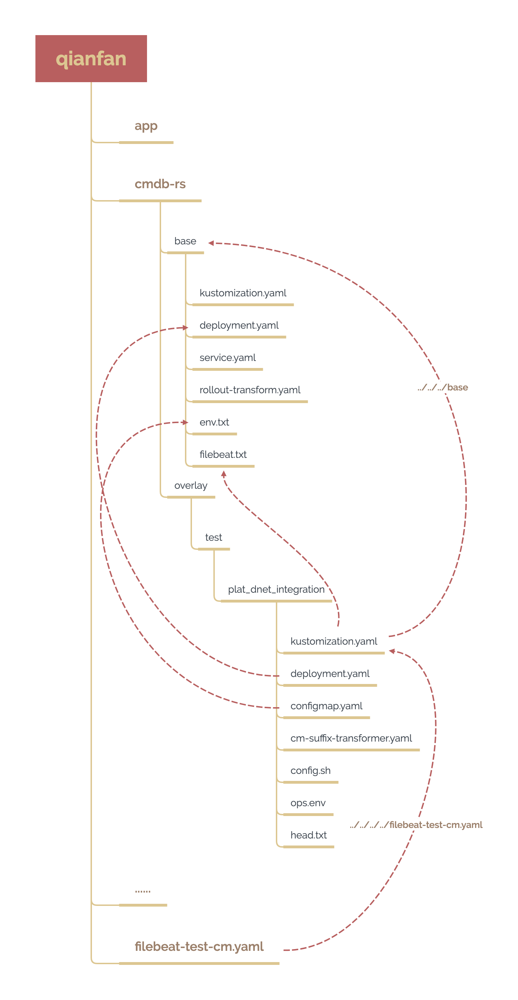
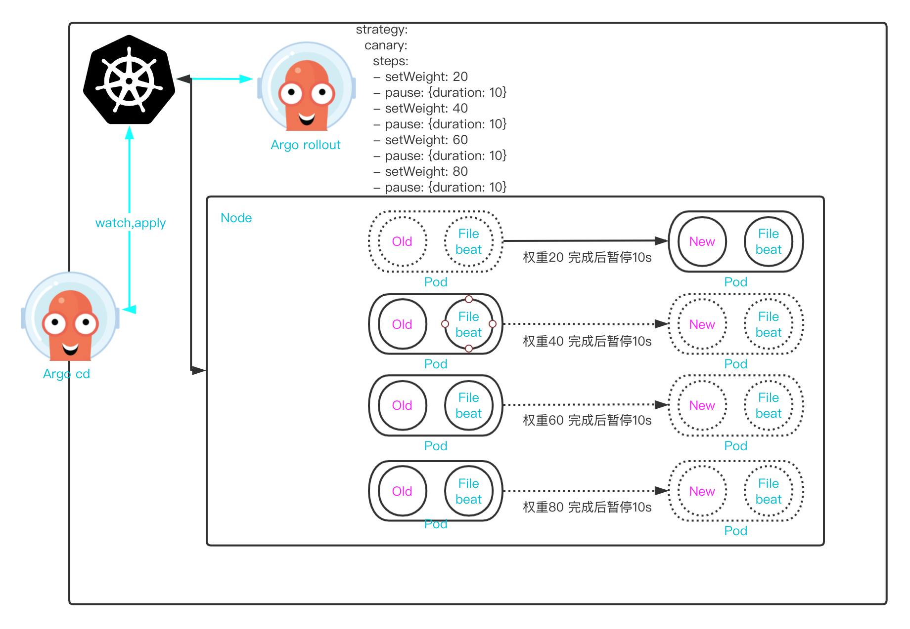

# CICD概述

## 一、架构图

## 二、基本流程

### 1）新环境部署

~~~bash
1.根据环境需求申请服务器
2.k8s环境准备及argo rollout、argo cd、Kustomize等相关依赖安装
3.Apollo对应项目或环境创建与env写入
4.在对应的 toolset 中新建 branch，使用 init 脚本生成 git 并提交，修改filebeat、配置拉取脚本、jenkins部署脚本，提交
5.新建jenkins job，并将新job 生成至jenkins
6.使用jenkins job 拉取env并部署应用
7.进入argo cd图形化界面检查创建状态
~~~

### 2）升级

~~~bash
# 配置升级
1.修改apollo
2.运行部署job

# 版本升级
1.数据库升级
    1） 升级数据库
2.应用升级
    1） 拉取env
    2） 创建app
    3） 同步
3.镜像升级
    1） 修改image version
~~~

## 三、细节

### 1）Jenkins

#### 使用

~~~bash
1.升级镜像
    1） 打开http://47.97.75.60:18080/view/DNET/job/DNET_Integration_test_K8s/job/DNET_modify_version_Int/
    2） 运行Build with Parameters
    3） 填写image:version ，用,号分隔， 样例: img1:v1,img2:v2....
~~~

#### 说明

~~~bash
1.template
https://gitee.com/hdops/jjb_templates/blob/master/kubernetes/

2.jjb
http://github.app.hd123.cn:10080/qianfanops/jenkins-cd/tree/k8s_int_aliyun/jenkins/dnet/k8s/int

3.jenkinsfile
https://devops-gitlab.hd123.com/hdops/jenkins_builder/-/blob/develop/jenkinsfile/Jenkinsfile.k8s_modify_version
~~~

#### 细节

~~~bash
1.更新env及argo cd创建app并同步
cat deploy.sh
#!/bin/bash
DNET_PRODUCT=$1
image=$2
DNET_PROFILE=$3
argocd_addr=$4
argocd_user=$5
argocd_passwd=$6
argocd_proj=$7
argocd_repo=$8
k8s_cluster=$9
k8s_namespace=$10
DNET_PROJECT=$11
git_parameter=$12

stackId=$(find ${DNET_PROJECT}/${DNET_PRODUCT}/${image}/overlays/${DNET_PROFILE} -name config.sh | awk -F'/' '{print $6}' | xargs echo)
file_path=$(find ${DNET_PROJECT}/${DNET_PRODUCT}/${image}/overlays/${DNET_PROFILE} -name config.sh | sed s#/config.sh## | xargs echo)
[ _${stackId} == _"" ] || [ _${file_path} == _"" ] && exit 1
for i in ${file_path};do
    cd ${i}
    sh config.sh
    cd -
done

git config --global user.email "qianfan@hd123.com" 
git config --global user.name  "qianfan"
git add --all .
git commit -m "${image} env update"
git push ${git_parameter}

argocd login argocd.hd123.com  --grpc-web-root-path ${argocd_addr}  --username ${argocd_user} --password ${argocd_passwd}   --insecure && \
for i in ${stackId};do
    k8s_prefix=$(echo ${i} | sed s#_#-#g )
    k8s_namespace=$(echo ${k8s_namespace} |sed s#_#-#g )
    argocd app create ${k8s_prefix}-${image} --repo ${argocd_repo}  --path ${DNET_PROJECT}/${DNET_PRODUCT}/${image}/overlays/${DNET_PROFILE}/${i}  --dest-server ${k8s_cluster} --dest-namespace ${k8s_namespace} --revision develop --project ${argocd_proj} --kustomize-version v4.1.3 && \ 
    argocd app sync ${k8s_prefix}-${image} --prune
done

        

2.更新镜像版本
cat modify_image_version.sh
#!/bin/bash
DNET_PRODUCT=$1
image=$2
DNET_PROFILE=$3
version=$4
DNET_PROJECT=$5

file_name=$(grep -rl harbor.qianfan123.com ${DNET_PROJECT}/${DNET_PRODUCT}/${image}/overlays/${DNET_PROFILE})
if [ $? -eq 0 ];then
    for i in ${file_name};do
        sed -i "s#newTag.*#newTag: \"${version}\"#" ${i}
    done
else
    image_name=$(grep harbor.qianfan123.com  ${DNET_PROJECT}/${DNET_PRODUCT}/${image}/base/deployment.yaml | awk -F '[:" ]+' '{print $3}'| head -1)
    file_path=$(find ${DNET_PROJECT}/${DNET_PRODUCT}/${image}/overlays/${DNET_PROFILE} -name config.sh | sed s#/config.sh## | xargs echo)
    for i in ${file_path};do
        cd ${i}
        kustomize edit set image ${image_name}:${version}
        cd -
    done
fi
stackId=$(find ${DNET_PROJECT}/${DNET_PRODUCT}/${image}/overlays/${DNET_PROFILE} -name config.sh | awk -F'/' '{print $6}' | xargs echo)
file_path=$(find ${DNET_PROJECT}/${DNET_PRODUCT}/${image}/overlays/${DNET_PROFILE} -name config.sh | sed s#/config.sh## | xargs echo)
[ _${stackId} == _"" ] || [ _${file_path} == _"" ] && exit 1
for i in ${file_path};do
    cd ${i}
    sh config.sh
    cd -
done

git config --global user.email "qianfan@hd123.com"
git config --global user.name  "qianfan"
git add --all .
git commit -m "${image} version update to ${version}"

3.基础镜像
cat Dockerfile
FROM    alpine:3.11
RUN apk add --no-cache \
        bash \
        coreutils \
        tzdata \
        git \
        jq \
        sed \
    && rm -f /etc/localtime \
    && ln -sv /usr/share/zoneinfo/Asia/Shanghai /etc/localtime \
    && echo "Asia/Shanghai" > /etc/timezone \
    && [ ! -e /etc/nsswitch.conf ] \
    && echo "hosts: files dns" > /etc/nsswitch.conf \
COPY argocd /usr/local/bin/
COPY kustomize /usr/local/bin/
WORKDIR /root/

# 构建推送
docker build -t argocd-cli .
docker tag  argocd-cli:latest harbor.qianfan123.com/toolset/argocd-cli:v2.0.0
docker push  harbor.qianfan123.com/toolset/argocd-cli:v2.0.0
~~~

### 2）Kustomize

#### 安装

~~~bash
# v4.1.3
wget http://download.init0.cn/kustomize
chmod +x kustomize
mv kustomize /usr/local/bin

# 从k8s 1.14开始，kustomize被内置进了k8s中，但是存在版本低的情况，缺少很多功能
~~~

#### 使用

~~~bash
# <> 中的部分需要依据实际情况替换
1.生成yaml
kustomize build <directory> --load-restrictor LoadRestrictionsNone

# 这个使用 --load-restrictor LoadRestrictionsNone 参数是因为我们在overlay中引用的filebeat配置文件 并不再当前的路径中 出于安全考虑默认是不被允许的 添加这个参数即可忽略

2.设置镜像 # 需要在对应目录中
kustomize edit set image <name:versoin>
~~~

#### 说明

~~~bash
# 以cmdb-rs为例
1.目录结构
qianfan/cmdb-rs/
├── base
│   ├── deployment.yaml
│   ├── env.txt
│   ├── filebeat.txt
│   ├── kustomization.yaml # 核心配置文件 关联目录中的其他资源
│   ├── rollout-transform.yaml # argo rollout语法文件 用于向kustomize说明
│   └── service.yaml
└── overlays
    └── test
        └── plat_dnet_integration
            ├── cm-suffix-transformer.yaml # kustomize配置 用于生成针对configmap文件的后缀
            ├── configmap.yaml
            ├── config.sh # 配置拉取脚本 拉取apollo中对应项目配置并结合ops.env写入configmap
            ├── deployment.yaml
            ├── head.txt
            ├── kustomization.yaml # 核心配置文件 关联目录中的其他资源以及base目录
            └── ops.env # 运维需要维护的env
            
2.工作原理
    1） 当执行 kustomize build qianfan/cmdb-rs/overlays/test/plat_dnet_integration/ --load-restrictor LoadRestrictionsNone 时
    
    2） kustomize读取kustomization.yaml文件
    apiVersion: kustomize.config.k8s.io/v1beta1
    kind: Kustomization
    
    commonLabels:
      environment: test
    
    commonAnnotations:
      note: qianfan test
    
    patchesStrategicMerge:
    - deployment.yaml
    - configmap.yaml
    - ../../../../filebeat-test-cm.yaml
    
    resources:
    - ../../../base
 
    namePrefix: plat-dnet-integration-
    transformers:
    - cm-suffix-transformer.yaml
    
    3） 通过 `resources:` 字段找到base所在 读取../../../base/kustomization.yaml文件
    apiVersion: kustomize.config.k8s.io/v1beta1
		kind: Kustomization
		metadata:
		
		configurations:
		- rollout-transform.yaml
		
		resources:
		- deployment.yaml
		- service.yaml
		
		configMapGenerator:
		- name: cmdb-rs-env
		  envs:
		  - env.txt
		- name: filebeat-cm
		  envs:
		  - filebeat.txt
		
		4） 通过 `resources:` 字段找到所有yaml文件 通过 `configMapGenerator:` 字段根据配置及对应txt文件生成configmap并与resources对应的资源拼接成一个完整的yaml文件 # 这里的 configurations: 字段定义的是定制资源通过kustomize转化其字段的对应关系 https://argoproj.github.io/argo-rollouts/features/kustomize/
		
		5） 回到 `qianfan/cmdb-rs/overlays/test/plat_dnet_integration/kustomization.yaml` 依据`patchesStrategicMerge:` 字段定义的资源内容 对原文件进行覆盖 而后根据`commonLabels: commonAnnotations: ` 给所有资源加上标签及注释 根据`namePrefix: nameSuffix:` 给所有的名称加上前后缀  最后生成一份cmdb-rs应用test环境的完整yaml文件

3.注意点
    1） 资源名称对应 在overlay中 需要覆盖base对应资源时必须保证name:字段完全一致
    2） 当突破工作目录引用文件时 需要在build时添加--load-restrictor LoadRestrictionsNone参数 v4版本
    3） configMapGenerator: 字段只能用一次且只能在base中使用 默认会为configmap名称添加hash值
    4） 当使用kustomize命令修改可修改部分时 最终的结果是放在 kustomization.yaml 文件中的 而不会直接修改资源
~~~

#### 详解

~~~bash
1.核心概念
`base` 存放基础部分配置 提供基础框架
`overlays` 中可定义多个环境，以目录的方式进行定义，生成时使用overlay中文件对base中文件进行覆盖
`resources` 表示`kustomization.yml`的位置，这个可以是一个文件，也可以指向一个文件夹，读取的时候会按照顺序读取，路径可以是相对路径也可以是绝对路径
`crds` 和 `resources` 类似，只是 `crds` 是我们自定义的资源
`namespace` 为所有资源进行添加 namespace的操作
`images` 修改镜像的名称、tag 或 image digest ，而无需使用 patches
`replicas` 修改资源副本数
`namePrefix` 为所有资源和引用的名称添加前缀
`nameSuffix` 为所有资源和引用的名称添加后缀
`patches` 在资源上添加或覆盖字段，Kustomization 使用 `patches` 字段来提供该功能。
`patchesJson6902` 列表中的每个条目都应可以解析为 kubernetes 对象和将应用于该对象的 [JSON patch](https://tools.ietf.org/html/rfc6902)。
`patchesStrategicMerge` 使用 strategic merge patch 标准 Patch resources.
`vars` 类似指定变量
`commonAnnotations` 为所有资源加上 `annotations`  如果对应的 key 已经存在值，这个值将会被覆盖
`commonLabels` 为所有资源的加上 `label` 和 `label selector`
`configMapGenerator` 可以生成 config map，列表中的每一条都会生成一个 configmap
`secretGenerator` 用于生成 secret 资源
`generatorOptions` 用于控制 `configMapGenerator` 和 `secretGenerator` 的行为

2.官方文档
https://kubernetes.io/zh/docs/tasks/manage-kubernetes-objects/kustomization/
https://kubectl.docs.kubernetes.io/zh/api-reference/
~~~

### 3）Argo rollout

#### 安装

~~~bash
# argo rollout为定制资源 所以在使用前需要在目标集群中安装才能使用
1.定制资源及提供者安装
kubectl create namespace argo-rollouts
kubectl apply -n argo-rollouts -f https://github.com/argoproj/argo-rollouts/releases/latest/download/install.yaml
# 高可用：将副本数改为3

2.cli安装
wget http://download.init0.cn/kubectl-argo-rollouts
chmod +x kubectl-argo-rollouts
mv kubectl-argo-rollouts /usr/local/bin
~~~

#### 使用

~~~bash
# <> 中的部分需要依据实际情况替换
# 详情见 kubectl argo rollouts --help
# 在引入argo rollout时主要考虑的是版本升级时平滑过度的问题 所以基本不会涉及到单独使用argo rollout的情况
1.版本检查
kubectl argo rollouts version

2.开启图形界面
kubectl argo rollouts dashboard

3.创建
kubectl argo rollouts create -f <rollout_resources>

4.列出已有rollout
kubectl argo rollouts list rollouts

5.获取rollout状态
kubectl argo rollouts get rollout <rollout_name>

6.更新镜像
kubectl argo rollouts set image <rollout_name> <name:version>

7.暂停更新
kubectl argo rollouts pause <rollout_name>

8.推动暂停的rollout更新
kubectl argo rollouts promote <rollout_name>
kubectl argo rollouts promote <rollout_name> --full #忽略更新策略全面更新

9.重启rollout部署的pod
kubectl argo rollouts restart <rollout_name>

10.重新发布
kubectl argo rollouts retry rollout <rollout_name>

11.回滚
kubectl argo rollouts undo <rollout_name>
kubectl argo rollouts undo <rollout_name> --to-revision=3 # 回滚至指定版本
~~~

#### 说明

~~~bash
# rollout 带来的是更加灵活的滚动更新策略 例如灰度和蓝绿 配合上service可以完成更新过程中的流量管理
1.资源定义
apiVersion: argoproj.io/v1alpha1
kind: Rollout
metadata:
  name: cmdb-rs
spec:
  replicas: 1
  selector:
    matchLabels:
      name: cmdb-rs
  strategy:
    canary:
      steps:
      - setWeight: 20 # 权重为20
      - pause: {duration: 10} # 暂停10s
      - setWeight: 40 # 权重为40
      - pause: {duration: 10} # 暂停10s
      - setWeight: 60 # 权重为60
      - pause: {duration: 10} # 暂停10s
      - setWeight: 80 # 权重为80
      - pause: {duration: 10} # 暂停10s
  template:
    ...
# 在资源的定义中 除新增的spec.strategy字段 其余部分与标准资源deployment的定义完全一致

2.工作原理
    1） 当创建argo cd应用时 由于是第一次部署 所以rollout会忽略spec.strategy字段定义的更新策略 全量部署
    2） 当应用中资源发生变动时 argo cd触发同步操作 这个时候rollout会按照spec.strategy字段定义的更新规则进行更新
    3） 根据spec.strategy.canary判断采用的是金丝雀也就是灰度发布
    4） 根据spec.strategy.canary.steps定义的步骤进行滚动更新
    
3.注意点
		1） 当pause值为空时 将会无限期暂停 可以使用命令继续 此功能可以用于保证一部分新应用用于测试 但是不利于自动化发布
~~~

#### 详解

~~~bash
官方文档
https://argoproj.github.io/argo-rollouts/index.html
~~~

### 4）Argo cd

#### 安装

~~~bash
https://github.com/argoproj/argo-cd/tree/master/manifests

1.单节点本地集群部署
kubectl create ns argocd
kubectl apply -f https://github.com/argoproj/argo-cd/blob/master/manifests/install.yaml -n argocd

2.单节点部署
kubectl create ns argocd
kubectl apply -f https://github.com/argoproj/argo-cd/blob/master/manifests/namespace-install.yaml

# 以上两种部署 以及以下两种高可用部署的唯一区别 在于是否绑定本地集群权限 对本地集群进行管理

3.高可用本地集群部署
kubectl create ns argocd
kubectl apply -f https://github.com/argoproj/argo-cd/blob/master/manifests/ha/install.yaml

4.高可用部署
kubectl create ns argocd
kubectl apply -f https://github.com/argoproj/argo-cd/blob/master/manifests/ha/namespace-install.yaml

5.cli安装
wget http://download.init0.cn/argocd
chmod +x argocd
mv argocd /usr/local/bin

6.目标集群部署定制资源
kubectl apply -k https://github.com/argoproj/argo-cd/manifests/crds\?ref\=stable
~~~

#### 使用

~~~bash
# <> 中的部分需要依据实际情况替换
# 详情见 argocd --help
1.获取admin登陆密码
kubectl -n argocd get secret argocd-initial-admin-secret -o jsonpath="{.data.password}" | base64 -d

2.登陆argo cd
argocd login <argocd_server_ip:port> --username <user_name> --password <password>   --insecure

3.退出登陆
argocd logout <argocd_server_ip:port>

3.修改密码
argocd account update-password --account <user_name> --new-password <want_password> --current-password <admin_password>

4.添加repo
argocd repo add <git_addr> --username <git_user> --password <password> --insecure-skip-server-verification

5.添加project https://argoproj.github.io/argo-cd/user-guide/projects/
argocd proj create <proj_name>

6.创建app
argocd app create <app_name> --repo <git_addr> --path <git_dir_path> --revision <git_branch>  --dest-server <deploy_to_k8s_cluster> --dest-namespace <k8s_namespace> --project <project>  --kustomize-version v4.1.3
# 自动同步 可选 --sync-policy auto --auto-prune

7.同步app
argocd app sync <app_name> --prune

8.图形化界面
vim argocd-service.yaml
apiVersion: v1
kind: Service
metadata:
  namespace: argocd
  labels:
    app.kubernetes.io/component: server
    app.kubernetes.io/name: argocd-server
    app.kubernetes.io/part-of: argocd
  name: argocd-server
spec:
  type: NodePort
  ports:
  - name: http
    port: 80
    protocol: TCP
    targetPort: 8080
    nodePort: 30002
  - name: https
    port: 443
    protocol: TCP
    targetPort: 8080
  selector:
    app.kubernetes.io/name: argocd-server

kubectl apply -f argocd-service.yaml

# 访问 http://ip:30002
# 操作部分都可以在图形化界面上完成 但是关于argo cd的配置就只能使用cli或者yaml来修改
~~~

#### 说明

~~~bash
1.资源定义
    1） project
apiVersion: argoproj.io/v1alpha1
kind: AppProject
metadata:
  name: qianfan-test
  namespace: argocd
spec:
  clusterResourceWhitelist:
  - group: '*'
    kind: '*'
  destinations:
  - namespace: '*'
    server: '*'
  namespaceResourceWhitelist:
  - group: '*'
    kind: '*'
  orphanedResources:
    ignore:
    - {}
    warn: false
  sourceRepos:
  - '*'
  
    2） applications
apiVersion: argoproj.io/v1alpha1
kind: Application
metadata:
  name: s02c-dpos-rs
  namespace: argocd
spec:
  destination:
    namespace: default
    server: https://kubernetes.default.svc
  project: qianfan-test
  source:
    kustomize:
      version: v4.1.3
    path: qianfan/dpos-rs/overlays/test/s02c
    repoURL: https://gitlab.hd123.com/qianfanops/kubernetes.git
    targetRevision: develop
  syncPolicy:
    automated:
      prune: true
# 无论是project还是app都是k8s中的定制资源 并不仅仅只是运行在argocd程序内部 我们使用cli或者图形界面生成的应用都会被转化成定制资源的形式生成在k8s中 所以所有的应用部署的数据都是存放在etcd中的

2.工作原理
    1） 当我们创建了应用以后 argocd会去对应的git repo中拉取代码
    2） 根据我们定义的目录 使用kustomize生成yaml 并apply至指定的集群中指定的名称空间
    3） 如果定义了自动同步 argocd会以三分钟一次的速度比对git的变化

3.注意点
    1） 在argo cd中有内嵌的kustomize 但是功能不全不支持--load-restrictor选项需要自已定义kustomize
    
~~~

#### 详解

~~~bash
1.核心概念
Application 清单定义的一组 Kubernetes 资源。这是自定义资源定义 (CRD)。
Application source type 哪些工具来构建应用程序。
Target state 应用程序所需的状态，由 Git 存储库中的文件表示。
Live state 该应用程序的实时状态。部署了哪些 Pod 等。
Sync status 实时状态是否与目标状态匹配。部署的应用程序是否与 Git 所说的一样？
Sync 使应用程序移动到其目标状态的过程。例如，通过对 Kubernetes 集群应用更改。
Sync operation status 同步是否成功。
Refresh 将 Git 中的最新代码与实时状态进行比较。弄清楚有什么不同。
Health 应用程序的健康状况，是否正常运行？它可以服务请求吗？

2.用户及kustomize版本参数配置
vim argocd-cm.yaml
apiVersion: v1
kind: ConfigMap
metadata:
  name: argocd-cm
  namespace: argocd
  labels:
    app.kubernetes.io/name: argocd-cm
    app.kubernetes.io/part-of: argocd
data:
  kustomize.path.v4.1.3: /usr/local/bin/kustomize # 配置kustomize命令的引用
  kustomize.buildOptions.v4.1.3: --load-restrictor LoadRestrictionsNone # 配置kustomize默认参数
    
  admin.enabled: "false" # 禁用admin
  accounts.qianfan: apiKey, login # 千帆用户账户权限
  accounts.qianfan.enabled: "true" # 启动千帆用户
  # 使用内置的dex服务进行LDAP配置
  url: https://47.118.34.109:9876
  dex.config: |
    connectors:
      - type: ldap
        id: ldap
        name: LDAP
        config:
          host: "ldap.hddomain.cn:389"
          insecureNoSSL: true
          insecureSkipVerify: true
          bindDN: "*@domain.cn"
          bindPW: "password"
          userSearch:
            baseDN: "OU=HDUsers,dc=hddomain,dc=cn"
            filter: ""
            username: "sAMAccountName"
            idAttr: distinguishedName
            emailAttr: mail
            nameAttr: displayName
          groupSearch:
            baseDN: "OU=HDGroups,dc=hddomain,dc=cn"
            filter: ""
            userAttr: distinguishedName
            groupAttr: member
            nameAttr: name
    
kubectl apply -f argocd-cm.yaml

3.用户权限管理
vim argocd-rbac.yaml
apiVersion: v1
kind: ConfigMap
metadata:
  name: argocd-rbac-cm
  namespace: argocd
data:
  #policy.default: role:readonly # 默认策略 只读
  scopes: '[groups,email]' 在ldap组信息中显示邮箱
  policy.csv: |
    # 定义角色权限
    #p, role:org-admin, applications, *,/, allow
    p, role:octopus, applications, *, octopus/*, allow
    #p, role:org-admin, clusters, get, *, allow
    #p, role:org-admin, projects, get, *, allow
    #p, role:org-admin, repositories, get, *, allow
    # 绑定角色
    g, kangpeiwen@hd123.com, role:admin # 邮箱绑定角色
    g, dept_000700110002, role:octopus # 通过组绑定角色
    g, qianfan, role:admin # 用户绑定角色

kubectl apply -f argocd-rbac.yaml

4.官方文档
https://argoproj.github.io/argo-cd/
~~~

### 5）Apollo

#### 使用

~~~bash
1.官方文档
https://www.apolloconfig.com/#/zh/usage/apollo-user-guide
~~~

#### 说明

~~~bash
1.工作原理
    1） 运维人员创建项目并授权给开发、测试
    2） 运维拉取git code修改对应overlay中的config.sh脚本 变量部分
    3） 开发、测试将env写入apollo对应项目的对应环境
    4） 运行jenkins同步更新job 将环境变量同步成为configmap并更新app

2.注意点
    1） 创建新项目时 AppId与应用名称需要与创建的应用名一致
    2） 创建完成后需要在 管理员工具 --> 开放平台授权管理 中对新应用进行创建和授权 并将token写入对应git的config脚本中
    3） 项目授权时开发测试各一位
~~~

#### 详解

~~~bash
1.开放平台官方文档
https://www.apolloconfig.com/#/zh/usage/apollo-open-api-platform

2.配置拉取脚本
cat git/qianfan/cmdb-rs/overlays/test/plat_dnet_integration/config.sh
#!/bin/bash
# https://www.apolloconfig.com/#/zh/usage/apollo-open-api-platform
token="cfddbde832eb855vc3cc7b3c690f2530eb2873ec"
ip_addr="apollo-portal.hd123.com"
env="INT"
app_id="cmdb-rs"
cluster="default"
namespace="application"
hash_num=$(echo $RANDOM | md5sum | cut -c 1-7)
# 从API获取apollo配置 使用jq进行格式化 awk匹配key或者vaule取值
curl -s -H "Authorization:${token}" -H 'Content-Type:application/json;charset=UTF-8'  http://${ip_addr}/openapi/v1/envs/${env}/apps/${app_id}/clusters/${cluster}/namespaces/${namespace}/ | jq | awk -F '["]+'  '/key|value/{print "\""$4"\""}'  > apollo_env.txt

# 将奇数行写入1.txt 偶数行写入2.txt
sed -n 1~2p apollo_env.txt > 1.txt
sed -n 0~2p apollo_env.txt > 2.txt
# 将configmap头部及运维管理的env写入configmap.yaml
cat head.txt > configmap.yaml
cat ops.env >> configmap.yaml
# 将两个txt文件拼接到一起后 进行格式处理 然后追加写入configmap.yaml
paste -d:  1.txt 2.txt | sed "s#^#  #" | sed "s#:#: #" | sed s#\"## | sed s#\"##  >> configmap.yaml
# 写入一个随机env 保证git提交成功
echo "  version_check: \"${hash_num}\"" >> configmap.yaml

rm -f 1.txt 2.txt apollo_env.txt
~~~

