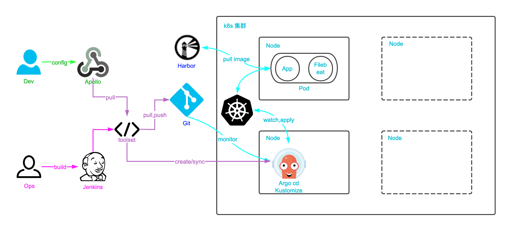

## 海鼎k8s运维手册


### 一、快速入门

- 以 dnet 环境下的 cmdb-rs 的 int 环境为例

#### 1）相关信息

##### 1.1 配置管理

- 应用配置由存放在 apollo 及 git 中的配置拼接而成，故如需修改配置需要知晓两份配置的存放地址及修改方式
- apollo 存放 dev 需要管理的配置
- git 存放 ops 需要管理的配置

```bash
# apollo
1.使用浏览器打开：https://apollo-portal.hd123.com/signin 并登录
2.在搜索框中搜索需要管理的项目，例如 cmdb-rs
3.如果拥有此项目的权限即可查看到所有环境的配置并添加或修改配置

# git
1.使用浏览器或IDE打开：http://gitlab.app.hd123.cn:10080/qianfanops/toolset 并登录
2.切换至 k8s_dnet 分支，找到 cmdb-rs 应用，并找到int环境对应得目录，例如 cmdb-rs/overlays/integration_test/
3.在对应资源栈中找到 ops.j2 文件，例如 cmdb-rs 应用 int 环境中的 stackid 为 plat_dnet_integration，则配置完整路径为 cmdb-rs/overlays/integration_test/plat_dnet_integration/ops.j2
4.此文件中放置了运维需要管理的配置，修改、提交、推送即可
```

##### 1.2 修改镜像版本

- 修改镜像版本实质上是修改 git 中的 k8s 配置
- 在修改 k8s 配置的镜像版本时会触发 job 同步修改 toolset 里的版本信息，如果是生产环境则需要将 release merge 到 develop

```bash
1.打开对应的jenkins，这里以 dnet int 环境为例，则打开 http://47.97.75.60:18080/
2.找到 dnet 分类中的含有 int 和 k8s 信息的目录并打开，此处为 DNET_Integration_test_K8s
3.打开含有 modify version 的 job，此处为 DNET_modify_version_Int
4.点击参数构建，填入 版本:iamge 开始构建，多个以 ';' 作为分隔
```

##### 1.3 升级数据库版本

- 此处升级的为程序启动时校验的数据库版本，并非修改数据或表结构操作

```bash
1.打开对应的jenkins，这里以 dnet int 环境为例，则打开 http://47.97.75.60:18080/
2.找到 dnet 分类中的含有 int 和 k8s 信息的目录并打开，此处为 DNET_Integration_test_K8s
3.打开含有 deploy rdb 的 job，此处为 DNET_Deploy_Rdb_Int
4.点击参数构建，填入 iamge 开始构建，多个以 ',' 作为分隔
```

##### 1.4 升级应用

- 此时 toolset 会拉取 apollo 中的配置并写入 git，而后调用 argocd 接口同步应用，argocd 会触发 k8s 滚动更新

```bash
1.打开对应的jenkins，这里以 dnet int 环境为例，则打开 http://47.97.75.60:18080/
2.找到 dnet 分类中的含有 int 和 k8s 信息的目录并打开，此处为 DNET_Integration_test_K8s
3.打开仅有 deploy 的 job，此处为 DNET_deploy_Int
4.点击参数构建，填入 iamge 开始构建，多个以 ',' 作为分隔
```

##### 1.5 检验

- 打开部署 job 执行时输出的 argocd 地址并登录
- 观察左边 HEALTH 栏中的状态，Healthy 为正常，Degraded 为失败，Progressing 为更新中
- 正在升级的应用处于 Progressing 状态，当所有应用都处于 Healthy 时，更新完成


### 二、基本了解

- 以下为简要说明，详细请参考：https://gitlab.hd123.com/qianfanops/kubernetes_doc/-/tree/develop

#### 1）k8s yaml

- 对于 k8s 运维来讲，在日常使用中主要是通过 yaml 文件来部署服务，每次部署或更新应用的时候，只需要修改 yaml，然后使用命令将 yaml 部署至集群即可。

##### 1.1 yaml文件的定义

```yaml
- 绝大多数由这五个字段构成
apiVersion: #api version || api group/api version
kind: # api类型
metadata: # 元数据 名称、标签、注释等
spec: # 规格 详细的定义
status: # 状态 由集群自动生成
```

##### 1.2 最基础的nginx pod

~~~yaml
apiVersion: apps/v1 #pod 属于app组 v1版本
kind: Pod # api类型为pod
metadata: # 元数据
  labels: # 标签
    name: nginx
  name: nginx # pod 名称
  namespace: default # 名称空间
spec: # 规格
  containers:
  - name: nginx # 容器名称
    image: nginx:1.19 # 容器使用的镜像
    ports: # 定义容器端口和协议
    - containerPort: 5678
      protocol: TCP

1.labels为非必须项，但没有labels将无法被控制器或资源进行关联管理
2.ports为非必需项，如果没有声明端口容器网络将为none
~~~

##### 1.3 常用yaml字段

```yaml
apiVersion: apps/v1 #pod 属于app组 v1版本
kind: Pod # api类型为pod
metadata: # 元数据
  labels: # 标签
    name: nginx
  name: nginx # pod 名称
  namespace: default # 名称空间
spec: # 规格
  imagePullSecrets: # 镜像仓库密钥
  - name: harbor # 需提前创建
  containers: # 容器配置
  - name: nginx # 容器名称
    image: nginx:1.19 # 容器使用的镜像
    ports: # 定义容器端口和协议
    - containerPort: 5678
      protocol: TCP
    resources: # 资源限制
      limits: # 上限使用
        cpu: "1"
        memory: 2Gi
      requests: # 请求使用 占用k8s资源池
        cpu: 50m
        memory: 1Gi
      lifecycle: # 生命周期钩子
        postStart: # 启动时执行 与容器同步启动
          exec:
            command: ["/bin/sh", "-c", "echo Hello from the postStart handler > /usr/share/message"]
        preStop: # 结束前执行
          exec:
            command: ["/bin/sh","-c","nginx -s quit; while killall -0 nginx; do sleep 1; done"]
      startupProbe: # 启动探测
        exec: # 执行命令
          command:
          - cat
          - /tmp/healthy
        failureThreshold: 30 # 判断为失败次数
        periodSeconds: 10 # 间隔时间
        successThreshold: 1 # 判断为成功的次数
        timeoutSeconds: 1 # 超时时间
      livenessProbe: # 存活性探测
        tcpSocket: # tcp探测
          port: 8080 # 端口 8080
        failureThreshold: 3
        periodSeconds: 10
        successThreshold: 1
        timeoutSeconds: 1
      readinessProbe: # 就绪性探测
        httpGet: # http探测
          path: /adapter-weixin/s/about # 请求的路径
          port: 8080 # 端口
          scheme: HTTP # 请求的协议
        failureThreshold: 1
        periodSeconds: 6
        successThreshold: 3
        timeoutSeconds: 1
    restartPolicy: Always # 容器重启策略
    imagePullPolicy: Always # 镜像拉取策略
    volumeMounts: # 挂载到容器的路径配置
      - mountPath: /etc/nginx/conf.d/
        name: proxy-config
      - name: vol
        mountPath: /tmp
      - name: nginx-html
        mountPath: /usr/share/nginx/html
  initContainers: # 初始化容器 执行完成后启动主容器
    - name: init-myservice
      image: busybox:1.28
      command: ['sh', '-c', 'until nslookup nginx; do echo waiting for nginx; sleep 2; done;']
    - name: init-mydb
      image: busybox:1.28
      command: ['sh', '-c', 'until nslookup mydb; do echo waiting for mydb; sleep 2; done;']
  volumes: # 集群资源挂载配置 与容器挂载一一对应
  - name: proxy-config
    configMap:
      defaultMode: 0644
      name: nginx-proxy-config
  - name: vol
    hostPath:
      path: /tmp
  - name: nginx-html
    persistentVolumeClaim:
      claimName: my-pvc
```

##### 1.4 最常用控制器

```yaml
apiVersion: apps/v1
kind: Deployment
metadata:
  name: nginx
  labels:
    app: nginx
spec:
  replicas: 1
  revisionHistoryLimit: 10 # rs历史版本保留
  selector:
    matchLabels:
      name: frontend
  strategy: # 更新策略
    rollingUpdate:
      maxSurge: 25%
      maxUnavailable: 25%
    type: RollingUpdate # 更新类型
  template:
    metadata:
      labels:
        name: frontend
    spec:
      containers:
      - image: nginx:1.19
        imagePullPolicy: IfNotPresent
        name: nginx
        ports:
        - containerPort: 80

deployment将pod的配置放入了spec.template中，配置方式与pod无异，需要注意格式
```

#### 2）kustomize

##### 2.1 yaml文件的管理

- 在实际使用过程中，往往会有数目众多的应用需要维护，而一个应用往往也有着多个环境，这时候需要维护的 yaml 数量将会成倍增长，最简单的方式就是使用目录的方式将 yaml 管理起来，应用命作为目录，下一级是环境，再接着便是 yaml 文件，部署的时候一级一级找下去便可以方便的找到需要部署的 yaml。

```
 app1
 ├── bra
 │   └── app1.yaml
 ├── int
 │   └── app1.yaml
 └── prd
     └── app1.yaml
 app2
 ├── bra
 │   └── app2.yaml
 ├── int
 │   └── app2.yaml
 └── prd
     └── app2.yaml
```

##### 2.2 kustomize结构

- 在实际使用中我们会发现，不同环境的 yaml 文件差异非常小，而有些时候同样的修改我需要每个环境都改一次，实在是没有意义的重复劳动，那么有没有办法让我能复用一份 yaml，将相同的部分放在这里，不同的部分放在各自的环境中呢？这个时候便引入了 kustomize。
- 它使用 base 和 overlays 进行切分，base目录中放主干的 yaml，然后用 kustomization.yaml 文件引用 yaml，而 overlays 中则可以区分多环境，仅存放差异的 yaml，同样也使用 kustomization.yaml 文件引用，并且在 overlays 的 kustomization.yaml 中还会指向 base 目录，完成对 base 的绑定，在 build 时便会使用 overlays 中的 yaml 覆盖 base 的yaml 中对应的字段，从而生成一份完整得配置。

```bash
app1
├── base
│   ├── app1.yaml
│   └── kustomization.yaml
└── overlays
    ├── bra
    │   ├── bra.yaml
    │   └── kustomization.yaml
    ├── int
    │   ├── int.yaml
    │   └── kustomization.yaml
    └── prd
        ├── prd.yaml
        └── kustomization.yaml

# base 目录
cat app1/base/kustomization.yaml
resources:
- app1.yaml

# int 环境
cat app1/overlays/int/kustomization.yaml
resources:
- ../../base # 引用base

patchesStrategicMerge: # 指定 yaml
- int.yaml
```

#### 3）git

- 这时候解基本解决了配置管理的问题，但是又出现了新的问题，这个配置放在主机上是独一份，如果意外造成丢失，重新整理就会异常的麻烦，另一个问题就是当我修修补补以后，我根本不会记得以前干了什么，如果出了问题程序需要回滚，那么也仅仅是回滚版本，配置什么的无从谈起，谁也不会记得以前改了什么。这个时候就必须将整个目录结构放到 git 中。

```bash
1.git的定义与区分
# 所有项目均在 http://gitlab.app.hd123.cn:10080/qianfanops 中对应的 toolset 项目中以分支作为区分

例如：heading 中的 dnet
1.heading 对应的 toolset 为 http://gitlab.app.hd123.cn:10080/qianfanops/toolset
2.而 dnet 为此仓库里的一个分支，所有 k8s 相关的分支均以 k8s_ 开头，故 dnet 分支为 k8s_dnet
3.此 git 仓库中还有 baas 分支 k8s_baas、adi 分支 k8s_adi、ecm 分支 k8s_ecm...
```

#### 4）argocd

- 在解决了大问题后，小问题开始显现，部署还是太麻烦，每次都得手动 pull push，再使用 kustomize 命令 build 后再使用 kubectl 命令部署到 k8s 中，一个服务一次，累的够呛，还会存在人为出错的问题，于是再引入 argocd，基于 git 的自动化部署工具。

```bash
# argocd 的工作流程
1.当我们需要部署一个服务到 k8s 集群时，需要在 argocd 中创建一个 application，使用 jenkins 中的 job 创建即可
2.当创建完成后，application 中记录的有此应用的 git 地址 git 分支及目录结构，此时 application 为未同步状态
3.此时使用 deploy job 部署该服务即可触发 argocd 向 k8s 集群中正式部署该服务
4.argocd 会以三分钟每次的循环去 git 中对比 与当前部署在 k8s	集群中的有没有变化，当 git 发生修改后，argocd 发现其变化，application 便会转换为未同步状态，需要手动触发更新
5.正常更新过程中，application 会经历 OutOfSync --> Synced --> Progressing --> Suspended --> Healthy 的过程，背后则是 k8s 的滚动更新过程

# argocd 的访问
1.在设计中我们使用同一个域名 argocd.hd123.com，使用不用的 URL 来区分集群，背后使用 nginx 来进行跳转，所以实际的访问路径为 argocd.hd123.com --> nginx --> argocd addr
2.这里 URL 的设定为 产品-环境，例如 dnet-int dnet-prd pay-prd，所以当我们访问千帆测试的argocd时，访问地址为 argocd.hd123.com/dnet-int/
3.argocd ldap 与权限的管理同样也是在 git 中，在每个产品的 git 中会有 associated-resources 目录，其中存放着所有的相关资源，例如 argocd 与 prometheus 的配置，在 argocd 对应的环境目录中存放着 user-rbac.yaml，此文件中存放着 argocd 的所有权限配置
```


### 三、架构图

