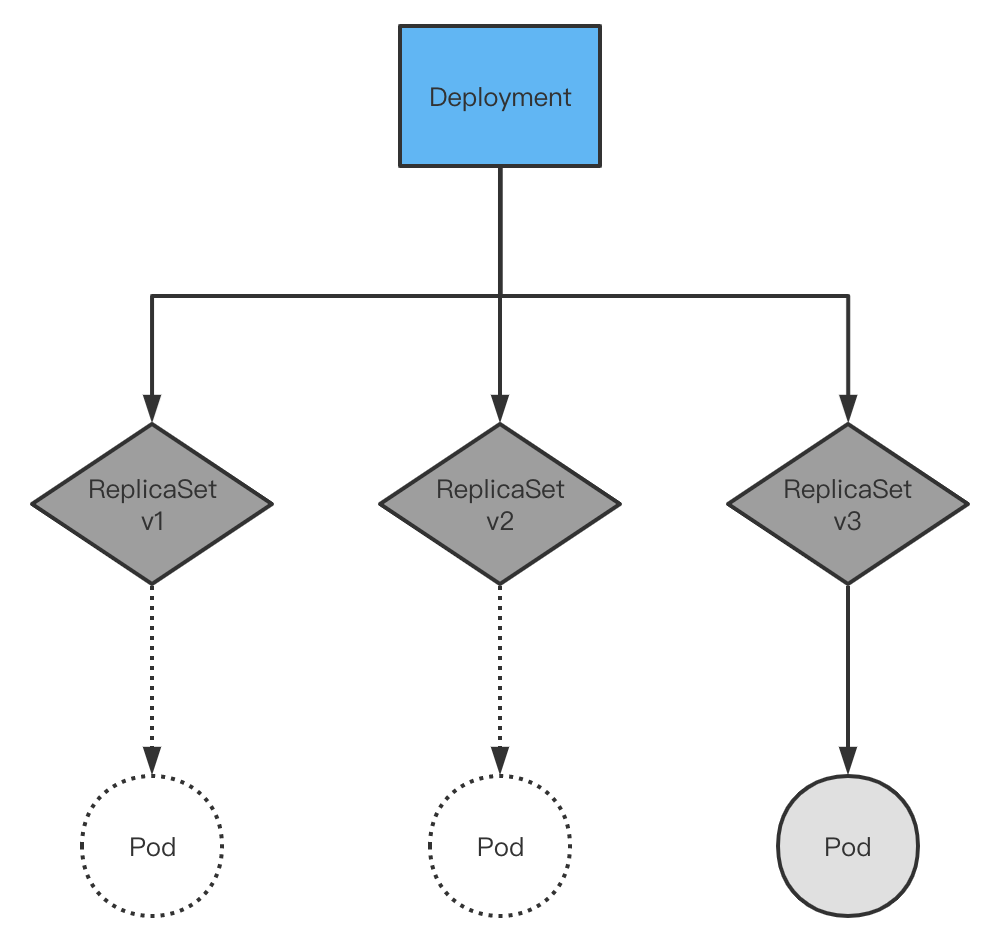

# Deployment

## 一、副本集控制器

### 副本集基本构成
- 副本集控制器用于pod的水平扩展

~~~bash
apiVersion: apps/v1
kind: ReplicaSet
metadata:
  name: nginx
  labels:
    app: test
spec:
  replicas: 3
  selector:
    matchLabels:
      tier: frontend
  template:
    metadata:
      labels:
        tier: frontend
    spec:

1.副本集的核心在于三个字段
  - replicas 定义副本数
  - selector 定义管理哪些pod
  - template 定义pod的模板
2.控制器与pod根据labels进行关联，这也是k8s的核心
3.ReplicaSet是ReplicationController的升级版，默认使用ReplicaSet
~~~

### 标签和标签选择

~~~bash
...
  selector:
    matchLabels:
      component: redis
    matchExpressions:
      - {key: tier, operator: In, values: [cache]}
      - {key: environment, operator: NotIn, values: [dev]}
---
...
  nodeSelector:
    disk: ssd

1.标签必须是唯一的键值对
2.基于等值的标签选择，=、==或者!=
3.基于集合的标签选择，in、notin和exists
https://kubernetes.io/zh/docs/concepts/overview/working-with-objects/labels/
~~~

### 完整示例
~~~bash
apiVersion: apps/v1
kind: ReplicaSet
metadata:
  name: nginx
  labels:
    app: test
spec:
  replicas: 3
  selector:
    matchLabels:
      tier: frontend
  template:
    metadata:
      labels:
        tier: frontend
    spec:
      containers:
      - image: nginx:1.19
        name: nginx
        ports:
        - containerPort: 80
          protocol: TCP
~~~

## 二、部署控制器

### deployment和rs及pod的关系

~~~bash
apiVersion: apps/v1
kind: Deployment
metadata:
  name: nginx
  labels:
    app: nginx
spec:
  replicas: 1
  revisionHistoryLimit: 10 # rs历史版本保留
  selector:
    matchLabels:
      name: frontend
  strategy: # 更新策略
    rollingUpdate:
      maxSurge: 25%
      maxUnavailable: 25%
    type: RollingUpdate # 更新类型
  template:
    metadata:
      labels:
        name: frontend
    spec:
      containers:
      - image: nginx:1.19
        imagePullPolicy: IfNotPresent
        name: nginx
        ports:
        - containerPort: 80

1.更新类型有两种:
  - Recreate 重建，停止所有pod，而后重新创建
  - RollingUpdate 滚动更新
2.滚动更新策略:
  - maxUnavailable 更新过程中不可用的Pod的个数上限,可以为数值或百分比
  - maxSurge 创建的超出期望Pod个数的Pod数量,可以为数值或百分比
3.历史版本通过rs创建多个rs来实现，当滚动更新时创建新rs逐渐添加pod，同时缩减旧rs的pod个数
~~~

## 三、argo-rollouts
`使用deployment控制器可以满足滚动更新的需求，但是无法做到蓝绿或者灰度发布，这里引入自定义资源argo-rollouts，它在基础的滚动更新策略上添加了步骤的概念，还可以定义不同的service来做到流量的分流`

[官方文档](https://argoproj.github.io/argo-rollouts/)
