# Docker


## 一、容器技术的发展

### 传统架构发展

- 单体应用

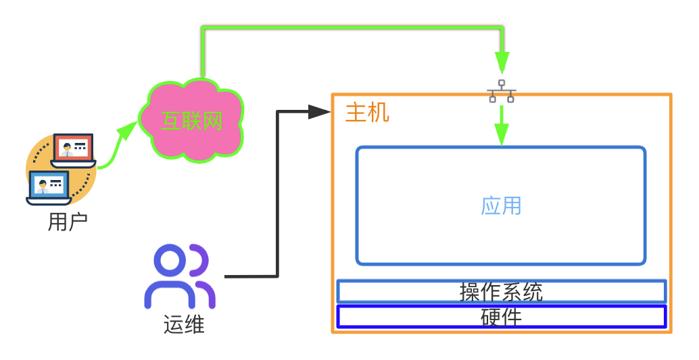

- 分层架构

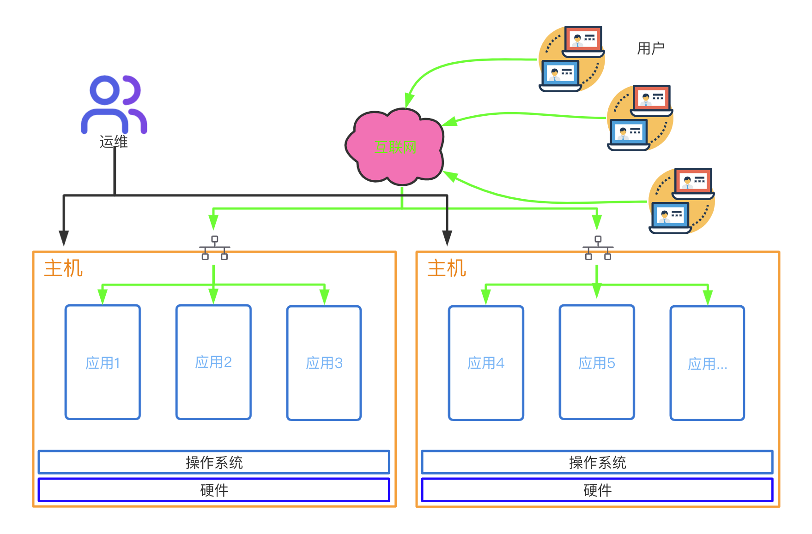

- 主机虚拟化

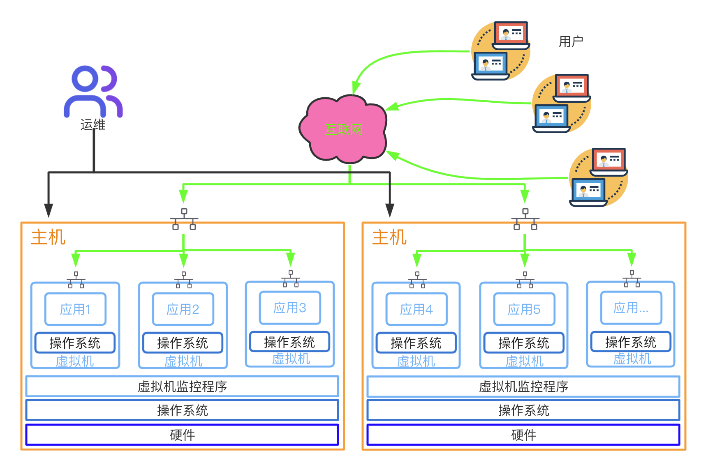

- 容器虚拟化

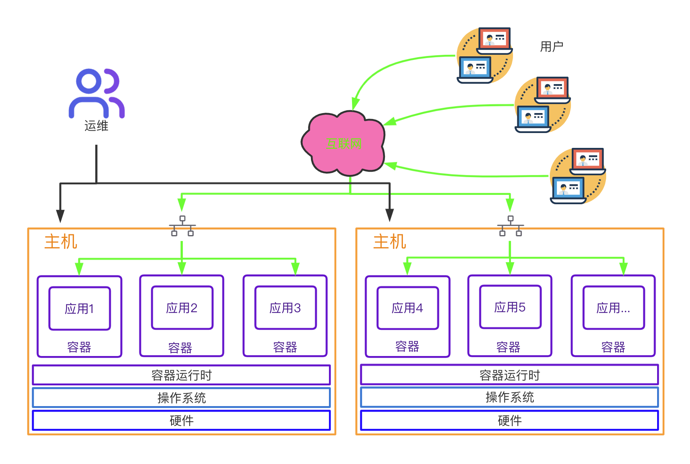

### 容器虚拟化发展

- [参考文章](http://dockone.io/article/8832)


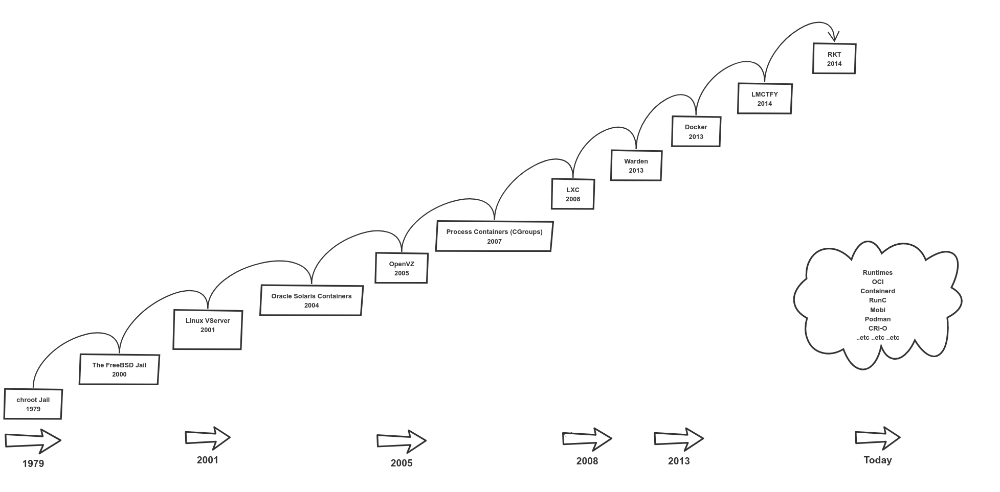


#### FreeBASE jail --> Linux vserver

** chroot **

- 容器技术最早出现在FreeBSd上叫做 jail，将一个进程放入jail中运行，不管这个进程在其中发生怎样的错误都不会影响到系统上其他进程的运行
- jail技术在Linux中的实现叫做vserver，vserver所实现的功能体现为chroot以及namespaces实现资源的隔离。
- 容器技术出现的主要目的是为了"资源隔离"

#### LXC-->docker

- LXC(LinuX Container),将原来需要手工编码实现的容器技术，进行了封装。实现了，更加方便、快速的容器创建及管理的技术。通过固有“模板”，安装并启动容器。将远程的程序包下载到本地，安装并创建好我们需要的容器。
- LXC已经很大程度上降低了容器管理的难度，方便容器的生命周期管理，但是依然使用一些弊端。有些时候可能需要自定制模板，以及使用LXC中自带的模板，以及大规模创建及复制依然比较麻烦，很难大规模的应用。
- docker是在LXC基础上，使用GoLang二次开发的封装版。
  \- LXC 把一个容器当一个用户空间使用 相当于虚拟机
  \- docker 把一个容器当一个应用运行 一个容器只运行一个进程（可以有子进程）

### 现阶段容器技术的实现

~~~bash
# UnionFS   ---> 联合文件系统，是一种通过创建文件层进程操作的文件系统
# namespace ---> UTS、Mount、IPC、PID、user、network
# cgroup    ---> 资源的分配和监控

通过比较复杂的代码开发的过程，调用以上三项技术
实现容器的 创建--->管理--->销毁
~~~
#### UnionFS
```bash
[root@kang ~]# docker pull openjdk
Using default tag: latest
latest: Pulling from library/openjdk
c67289558ae5: Pull complete
12787f1f3888: Pull complete
61bd18e93178: Pull complete
digest: sha256:37348b1fc822bc530805e8f6c8167c695559de597f4c15d05d59b24494ce3f46
Status: downloaded newer image for openjdk:latest
docker.io/library/openjdk:latest
```

#### Linux Namespaces

| Namespace | 系统调用参数  | 隔离内容                   | 内核版本 |
| --------- | ------------- | -------------------------- | -------- |
| UTS       | CLONE_NEWUTS  | 主机名和域名               | 2.6.19   |
| IPC       | CLONE_NEWIPC  | 信号量、消息队列和共享内存 | 2.6.19   |
| PID       | CLONE_NEWPID  | 进程编号                   | 2.6.24   |
| Network   | CLONE_NEWNET  | 网络设备、网络栈、端口等   | 2.6.29   |
| Mount     | CLONE_NEWNS   | 挂载点(文件系统)           | 2.4.19   |
| User      | CLONE_NEWUSER | 用户和用户组               | 3.8      |

#### cgroups子系统

```
ls /sys/fs/cgroup/

cpu子系统       主要限制进程的 cpu 使用率。
cpuacct子系统   可以统计 cgroups 中的进程的 cpu 使用报告。
cpuset子系统    可以为 cgroups 中的进程分配单独的 cpu 节点或者内存节点。
memory子系统    可以限制进程的 memory 使用量。
blkio子系统     可以限制进程的块设备 io。
devices子系统   可以控制进程能够访问某些设备。
net_cls子系统   可以标记 cgroups 中进程的网络数据包，然后可以使用 tc 模块（traffic control）对数据包进行控制。
net_prio子系统  用来设计网络流量的优先级
freezer子系统   可以挂起或者恢复 cgroups 中的进程。
ns子系统        可以使不同 cgroups 下面的进程使用不同的 namespace
hugetlb子系统   主要针对于HugeTLB系统进行限制，这是一个大页文件系统。
```
### 发展简介
```
1.基于LXC容器引擎封
2.发展壮大后，自己开发libcontainer容器引擎
3.迫于大厂的压力，共同成立OCI，开发开源runC标准容器引擎(2015)
4.由于OCI发展缓慢，CNCF成立，用k8s暴打docker swarm
5.k8s社区崛起，成为事实上的容器编排标准，docker将CRI containerd捐给CNCF(2017)

docker标准：

OCI (Open Container Initiative)
- 镜像标准
- 容器运行标准

OCF (Open Container Format)
- runC 容器引擎标准
```

## 二、docker基本概念及操作
### docker简介
- docker是一个开源的应用容器引擎，让开发者可以打包他们的应用以及依赖包到一个可移植的镜像中，然后发布到任何流行的 Linux或Windows 机器上。
- 容器是完全使用沙箱机制，相互之间不会有任何接口。

### docker的作用

```
# 解决以下问题:
1.环境不一致。
2.在多用户的操作系统下，会相互影响。
3.运维成本过高的问题。
4.关于安装软件成本过高。
```

### docker特性

```
1.集装箱:
    会将所有需要的内容放到不同的集装箱中，谁需要这些环境就直接拿到这个集装箱就可以了。
2.标准化:
    1.运输的标准化: docker有一个码头，所有上传的集装箱都放在了这个码头上。
    2.命令的标准化: docker提供了一些列的命令，帮助我们去获取集装箱等等操作。
    3.提供了REST的API: 衍生出了很多的图形化界面，Rancher。
3.隔离性:
    docker在运行集装箱内的内容时，会在Linux的内核中，单独的开辟一片空间， 这片空
间不会影响到其他程序。
```

- 镜像仓库(超级码头， 上面放的就是集装箱)
- 镜像 (集装箱)
- 容器 (运行起来的镜像)

### 三类镜像仓库

```
1.docker官方的镜像仓库：这个仓库是镜像最全的，但是下载速度较慢。
https://hub.docker.com/
2.国内的镜像网站：网易蜂巢，daoCloud等，下载速度快，但是镜像相对不全。
https://c.163yun.com/hub#/home 
http://hub.daocloud.io/ （推荐使用）
3.在公司内部会采用私服的方式拉取镜像（添加配置）
#需要创建 /etc/docker/daemon.json，并添加如下内容
{
	"registry-mirrors":["https://registry.docker-cn.com"],
	"insecure-registries":["ip:port"]
}
#重启两个服务
systemctl daemon-reload
systemctl restart docker
```
### 组件构成
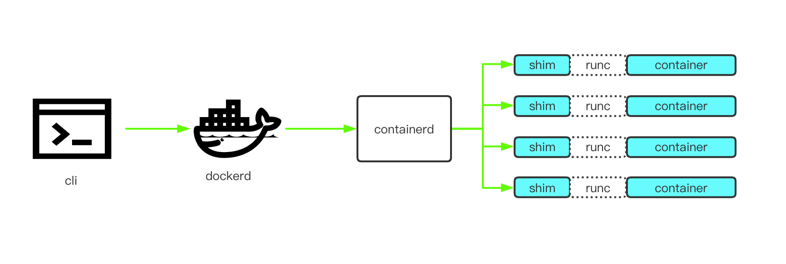

```bash
1.docker cli
- 供用户使用的命令行工具，负责请求 docker API 与 dockerd 交互，使得用户可以便捷友好的操作 docker。

2.dockerd
- 监听 Docker API 请求，通过 containerd 管理 container 生命周期。

3.containerd
- 容器的生命周期管理
- 镜像的 pull & push
- 管理 storage
- 运行容器的时候通过 runc，并附带上合适的参数
- 管理网络

4.containerd-shim
- 使容器脱离 containerd 不会受到其状态的影响
- 使得 runc 运行完 container 后可以退出，无需为了一个 container 开启一个 runtime 常驻进程
- 保持容器的 stdio 开启状态，不至于容器写 stdio 后收到 SIGPIPE 而退出
- 把容器的 exit status 报告给 containerd

5.runc
- 一个运行遵从 OCI 标准容器的二进制工具，负责运行容器。
```

### 镜像的操作

#### 1.拉取镜像

```
从中央仓库拉取镜像到本地
docker pull 镜像名称[:tag]
#举个栗子:docker pull daocloud.io/library/tomcat:8.5.15-jre8
ps: （daocloud.io/library/tomcat:8.5.15-jre8）为需要下载的镜像
```

#### 2.查看本地全部镜像

```
查看本地已经安装过的镜像信息，包含标识，名称，版本，更新时间，大小
docker images
```

#### 3.删除本地镜像

```
镜像会占用磁盘空间，可以直接手动删除，标识通过查看获取
docker rmi 镜像的标识
```

#### 4.镜像的导入导出

```
如果因为网络原因可以通过硬盘的方式传输镜像，虽然不规范，但是有效，但是这种方式导出的镜像名称和版本都是null，需要手动修改
#将本地的镜像导出
docker save -o 导出的路径 镜像id
#加载本地的镜像文件
docker load -i 镜像文件
#修改镜像文件
docker tag 镜像id 新镜像名称：版本
```

### 容器的操作

#### 1.运行容器

```
运行容器需要定制具体镜像，如果镜像不存在，会直接下载
#简单操作
docker run 镜像的标识|镜像的名称[:tag]
#常用的参数
docker run -d -p 宿主机端口:容器端口 --name 容器名称 镜像的标识|镜像名称[:tag]
#-d:代表后台运行容器
#-p 宿主机端口:容器端口：为了映射当前Linux的端口和容器的端口
#--name 容器名称:指定容器的名称

[root@jenkins ~]# docker run -d -p 8080:8080 --name tomcat  daocloud.io/library/tomcat:8.5.15-jre8
WARNING: IPv4 forwarding is disabled. Networking will not work.
b1f63ebb268e2484964ed6dabed3938ca99d3ff8ba29fce9aecea86ddefa290e

加入一行配置  解决IPv4 forwarding is disabled
vi /usr/lib/sysctl.d/00-system.conf
net.ipv4.ip_forward=1
重启网卡
```

#### 2.查看正在运行的容器

```
查看全部正在运行的容器信息
docker ps [-qa]
#-a 查看全部的容器，包括没有运行
#-q 只查看容器的标识
```

#### 3.查看容器日志

```
查看容器日志，以查看容器运行的信息
docker logs -f 容器id
#-f：可以滚动查看日志的最后几行
```

#### 4.进入容器的内部

```
可以进入容器的内部进行操作
docker exec -it 容器id bash
```

#### 5.复制内容到容器

```
将宿主机的文件复制到容器内部的指定目录
docker cp 文件名称 容器id:容器内部路径
```

#### 6.重启&启动&停止&删除容器

```
容器的启动，停止，删除等操作，后续会经常使用到
#重新启动容器
docker restart 容器id
#启动停止运行的容器
docker start 容器id
 
#停止指定的容器(删除容器前，需要先停止容器)
docker stop 容器id
#停止全部容器
docker stop $(docker ps -qa)
#删除指定容器
docker rm 容器id
#删除全部容器
docker rm $(docker ps -qa)
```

### 数据卷

#### 1.创建数据卷

```
#创建数据卷后，默认会存放在一个目录下/var/lib/docker/volumes/数据卷名称/_data
docker volume create 数据卷名称
```

#### 2.查看全部数据卷

```
#查看全部数据卷信息
docker volume ls
```

#### 3.查看数据卷详情

```
#查看数据卷的详细信息，可以查询到存放的路径，创建时间等等
docker volume inspect 数据卷名称
```

#### 4.删除数据卷

```
#删除指定的数据卷
docker volume rm 数据卷名称
```

#### 5.容器映射数据卷

```
#通过数据卷名称映射，如果数据卷不存在。docker会帮你自动创建，会将容器内部自带的文
件，存储在默认的存放路径中。
docker run -d -p 8080:8080 --name tomcat -v 数据卷名称:容器内部的路径 镜像id 
#通过路径映射数据卷，直接指定一个路径作为数据卷的存放位置。但是这个路径下是空的。
docker run -d -p 8080:8080 --name tomcat -v 路径(/root/自己创建的文件夹):容器内
部的路径 镜像id
```

#### 6.数据卷的备份与恢复

```
数据备份方法：
docker run  --volumes-from [container name] -v $(pwd):/backup centos tar czvf /backup/backup.tar [container data volume]

例子：
docker run --volumes-from data-volume2  -v  /root/backup:/backup --name datavolume-copy centos tar zcvf /backup/data-volume2.tar.gz /datavolume6


数据还原方法：
docker run --volumes-from [container name] -v $(pwd):/backup centos tar xzvf /backup/backup.tar.gz [container data volume]

例：
docker exec -it data-volume2 /bin/bash
cd /datavolume6
rm -rf lucky.txt

docker run --volumes-from data-volume2 -v /root/backup/:/backup centos tar zxvf /backup/data-volume2.tar.gz -C /datavolume6
```

### [dockerfile](https://www.runoob.com/docker/docker-dockerfile.html)

- dockerfile文件 是一个基于image文件生成container文件的一个描述文件，加载了能够生成container时需要用到的source code

**通过dockerfile制作镜像**

```
#编写完dockerfile后需要通过命令将其制作为镜像，并且要在dockerfile的当前目录下，之
后即可在镜像中查看到指定的镜像信息，注意最后的 .
docker build -t 镜像名称[:tag] .
```

### docker event state

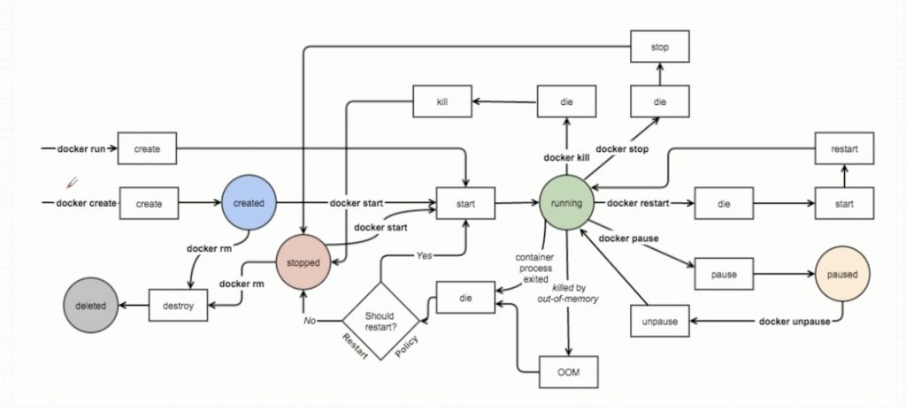docker的状态转换及常用命令

## 三、docker网络

### linux中的基础网络模型

#### 1）veth-pair

- veth设备形象的理解可以比作：两张虚拟网卡中间连着一根虚拟网线，用来连接各虚拟设备

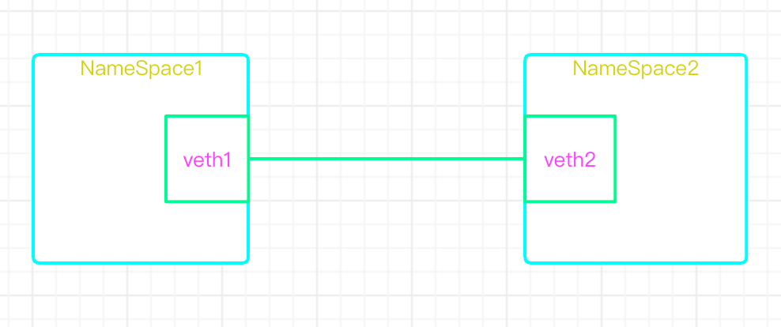

#### 2）linux Bridge

- bridge可以理解为一个虚拟交换机，提供mac转发

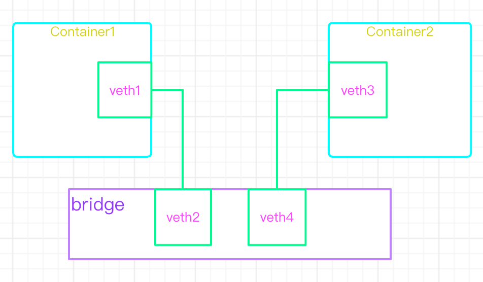

#### 3）iptables

- iptables可以理解为虚拟路由器，提供ip转发

#### linux网络模式总结

| Linux网络模式     | 作用总结                                                     |
| ----------------- | ------------------------------------------------------------ |
| network namespace | 主要提供了关于网络资源的隔离，包括网络设备、IPv4和IPv6协议栈、IP路由表、防火墙、/proc/net目录、/sys/class/net目录、端口（socket）等。 |
| linux Bridge      | 功能相当于物理交换机，为连在其上的设备（容器）转发数据帧。如docker0网桥。 |
| iptables          | 主要为容器提供NAT以及容器网络安全。                          |
| veth pair         | 两个虚拟网卡组成的数据通道。在docker中，用于连接docker容器和Linux Bridge。一端在容器中作为eth0网卡，另一端在Linux Bridge中作为网桥的一个端口。 |

### docker中的网络模型

#### 1）none

```
1.容器中有完整的六种名称空间
2.但是没有IP配置也没有veth
3.只有lo接口，也就是127.0.0.1
```

#### 2）bridge（默认）

- 沿用Linux bridge思想，在启动docker时创建一个名为`docker0`的默认网桥 也可有新建

#### 3）Containe（联盟式网络）

```
1.每个容器独有User、Mount、Pid三种名称空间
2.所有此联盟中的容器共享UTS、Network、IPC
```

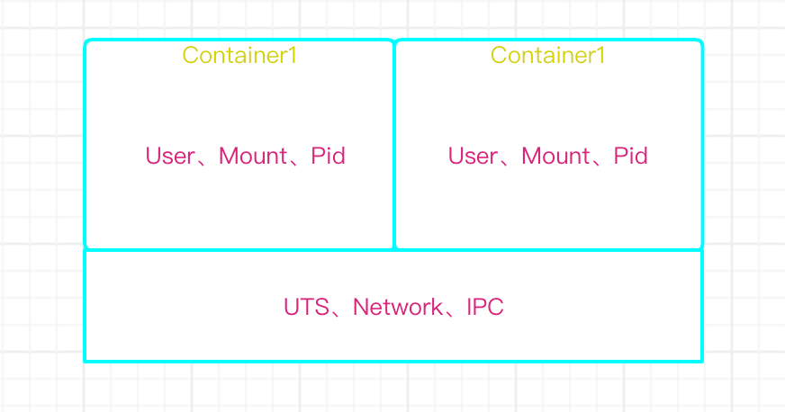

4）host

- 共享主机网络空间
#### docker四种网络模型

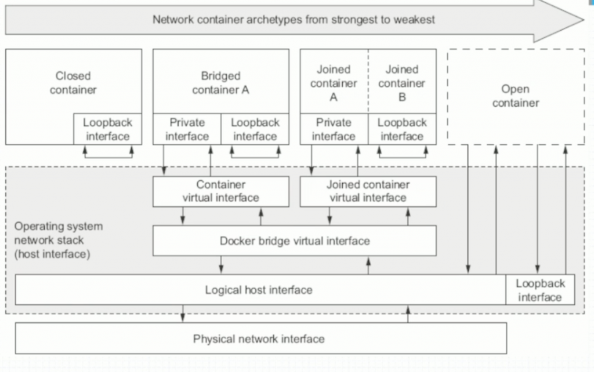

- docker之间互联使用的是SDN类型的通信

```
yum install bridge-util
brctl  show   #显示虚拟交换机上端口的连接情况

docker使用的是overlay network类型叠加网络 

如果两台docker位于两台不同的物理主机上 

C1到C2的报文发送顺序为：

1、C1发起tcp请求，源地址为C1,目标地址为C2

2、C1所在的物理主机上生成的DOCKER逻辑网桥 发现c2不在本物理主机上(ip list show 能看到本机的的设备)

3、C1所的逻辑网络会将次报文转发给物理主机的网卡(nat地址转换)，主机会进行二次三层封装，在原来报文基础上增加物理主机的包头 ，  源地址为H1主机，目标为H2主机

4、H2主机收到后会解开报文，发现目标地址为C2的报文，然后会转给C2的逻辑网桥，

5、C2所在的逻辑网桥会转发报文给C2的DOCKER  至此完成报文转发过程 

如果需要进一步共享的话，最多再共享 UTS NET IPC 三种资源。

# docker  network  ls
NETWORK ID          NAME                DRIVER              SCOPE
0865d189a638        bridge              bridge              local	# 普通的叠加网络效果
f8bd30438a48        host                host                local	# 直接管理宿主机网络，修改会影响宿主机		
68447dbf6019        none                null                local	#指定的docker不启用网络功能
默认的还有  macvlan\overlay 网络机制

常用命令:
docker inspect host_nginx  #最后会docker container名称  可以显示container的详细配置信息
link  show   #显示虚拟网卡情况
brctl  show   #显示虚拟交换机上端口的连接情况
```

## 四、docker网络名称空间的测试方法

- 使用ip命令可以测试设备在不同名称空间的移动效果 ，能确定不同的设备同一时刻只能从属于某一个名称空间
- 各种容器的创建方法 如果容器里有多个端口需要暴露的话可多次使用-p即可

```
docker run  --name t1  --rm  --network bridge  -it  busybox #bridge桥接方式
docker run  --name t1  --rm  --network host  -it  busybox   # 创建host方式网卡
docker run  --name t1  --rm  --network none   -it  busybox  #创建none无网卡主机 
docker run --name host_nginx  -p 81:80  --rm  -d nginx
docker port  host_nginx     #绑定指定端口，所有宿主机IP
80/tcp -> 0.0.0.0:81

docker run --name host_nginx  -p 192.168.72.129::80  --rm  -d nginx #    第三种是指定IP的
docker port  host_nginx 
80/tcp -> 192.168.72.129:32768

docker run --name host_nginx  -P  --rm  -d nginx  #大写的p 自动暴露容器中所有服务
```

### 创建带IP端口映射的容器

```
docker run --name host_nginx  --rm -p 80  -d nginx  #随机端口映射
docker port host_nginx    #查看某一个容器的具体映涉信息 
80/tcp -> 0.0.0.0:32769
```

### 创建 joiner Container 联合容器 第二个容器使用第一个容器的网络

- 网桥host是一种特殊的joiner模式

```
docker run --name host1 --rm  -itd nginx
docker run --name host2  --network container:host1  --rm  -d nginx
```

### 修改docker bridge 的IP地址
```
默认bridge的网段为172.16.0.0 网段
修改方法为修改/etc/docker/deamon.json 文件，添加如下内容:
  "bip":"10.0.0.1/16" # 后面的IP和网段可以修改

默认docker命令只能管理运行在本机的docker容器和image 
如果需要将本机的docker分享出来让其他管理器访问并维护管理的话可以修改本机的deamon.json文件增加以下内容:
  "hosts":["tcp://192.168.1.2:2375","unix///var/run/docker.sock "]
```
```
远程服务器调用时 使用 docker -H 192.16.1.2:2375 ps 命令等

自定义网桥(软交换机) 并配置使用

docker network create  -d bridge  --subnet "172.26.0.0/16" --gateway "172.26.0.1" mybr0
docker run  --name host2  -it  --network mybr0   busybox
```

- 同一主机上不同网段的docker是不能通信的

## 五、docker与k8s
###k8s的容器标准
~~~bash
OCI (Open Container Initiative)
- 镜像标准
- 容器运行标准

CRI (Container Runtime Interface)
一组 gRPC 接口:
- 一套针对容器操作的接口，包括创建，启停容器等等
- 一套针对镜像操作的接口，包括拉取镜像删除镜像等
- 一套针对 PodSandbox（容器沙箱环境）的操作接口

~~~
### 容器运行时的发展
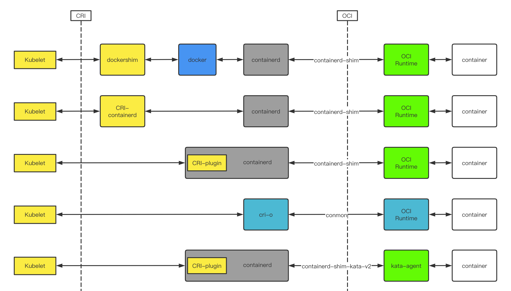

### 安全容器
AWS在它的官方博客中是这么描述多租户在k8s中时存在安全隐患的：

- 由于操作系统内核漏洞，Docker组件设计缺陷，以及不当的配置都会导致Docker容器发生逃逸，从而获取宿主机权限。
- 由于频发的安全及逃逸漏洞，在公有云环境容器应用不得不也运行在虚拟机中，从而满足多租户安全隔离要求。
- 而分配、管理、运维这些传统虚拟机与容器轻量、灵活、弹性的初衷背道而驰，同时在资源利用率、运行效率上也存浪费。

多租户问题不仅仅在公有云上存在，在公司内部的私有云上同样存在，不同部门、团队的应用，理应进行强隔离，以免一个业务出现问题影响整个公司。但过去，大家应用容器的势头很强，装作看不到这个问题罢了。

#### 面向云原生的虚拟化
Kata Containers的前身是Hyper runV和Intel Clear Container，这两者都试图用虚拟化的技术来解决容器安全问题。
两者都是2015年5月布的，后来发现彼此技术路径差不多，两边的创始人聚到一起一合计，要不合并吧，于是Kata Containers就诞生了。

最初存在的问题：

- 让Kubernetes管理虚拟机是一个比较另类的做法。
- 底层采用了上面提到的QEMU作为对接系统接口层，而QEMU是一个包含数百万行代码、数万个文件的项目，性能太差。

现在：

- Kubernetes开始接受安全容器了，在Kubernetes里运行Kata不再需要做额外处理。
- 支持Firecracker作为部分适用场景的VMM，以及研发自己的rust-VMM cloud-hypervisor，又将沙箱agent替换为轻量的rust-agent，让内存占用从十多MB降低到1.1MB，提升肉眼可见。

安全问题的唯一正解在于允许那些（导致安全问题的）Bug发生，但通过额外的隔离层来阻挡住它们。

—— LinuxCon NA 2015, Linus Torvalds
