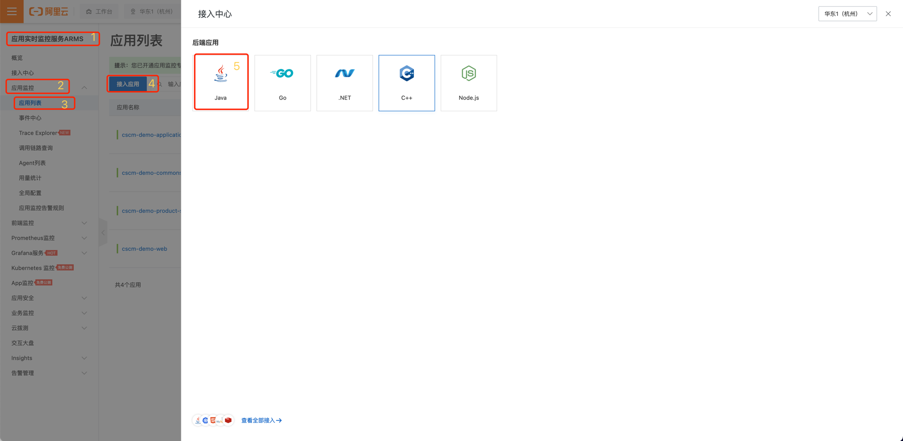
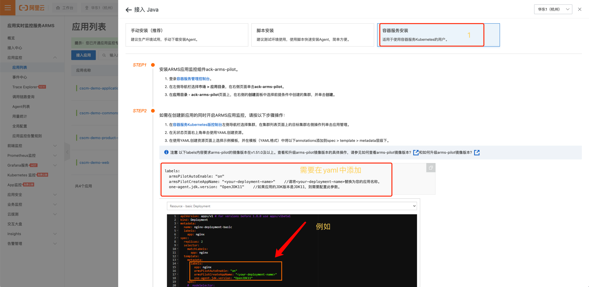
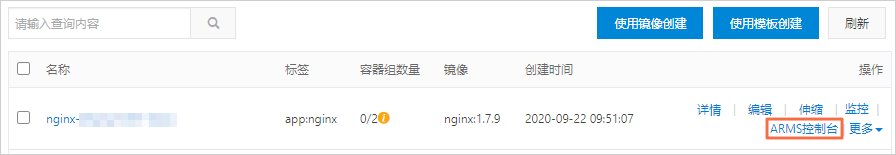
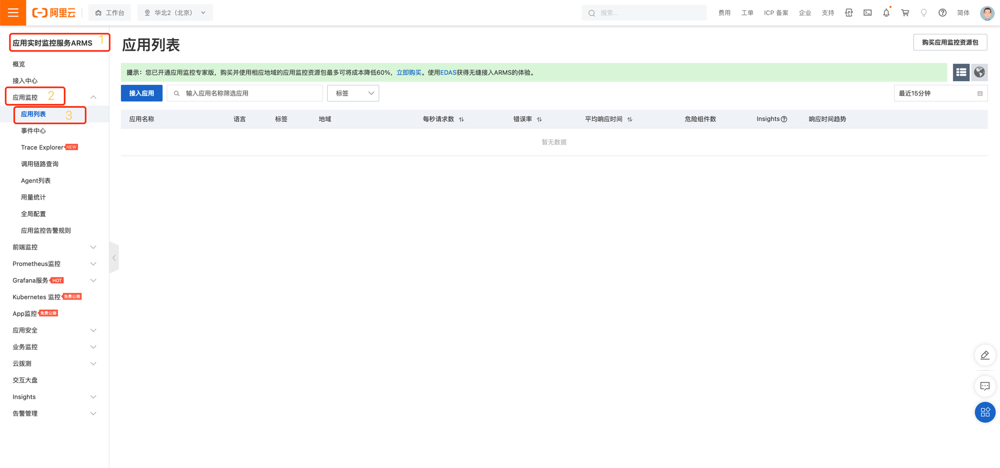

# 应用实时监控服务ARMS

- 在阿里云中为 kubernetes 中部署的应用提供 APM 监控，需要使用 *应用实时监控服务ARMS*

## 相关文档
- [为容器服务Kubernetes版Java应用安装探针](https://help.aliyun.com/document_detail/103106.html)
- [常见问题](https://help.aliyun.com/document_detail/162776.htm?spm=a2c4g.11186623.0.0.56fa1980fxDA8P#section-afm-h0a-srn)

## 操作步骤

### 1）在 ACK 集群中安装 ARMS 应用监控组件

- 登录容器服务管理控制台。
- 在左侧导航栏选择市场 > 应用市场，在右侧应用目录页签通过关键字搜索 *ack-onepilot*，然后单击目标卡片。
- 在 *ack-onepilot* 页面上，单击右上角的一键部署。
- 在创建面板中选择安装组件的集群、命名空间，并输入组件发布名称，然后单击下一步。
- 单击确定。


### 2）安装 java 探针


- 支持版本

```bash

    JDK 1.7.0+
    JDK 1.8.0_25+
    说明
        Kubernetes集群应用部署建议：JDK 1.8.0_191+。
        如果JDK版本为1.8.0_25或者1.8.0_31，可能会出现无法安装探针的情况，请升级至1.8.X最新版本。
    JDK 11.0.8+
    说明 
        JDK 1.8及以下版本和JDK 11版本对应的探针安装包不同，请根据不同的JDK版本下载对应的探针安装包或调整应用监控组件ack-onepilot的配置。
```




```yaml
# 在需要监控的服务中添加如下标签
labels:
  armsPilotAutoEnable: "on"
  armsPilotCreateAppName: "<your-deployment-name>"    #请将<your-deployment-name>替换为您的应用名称。
  one-agent.jdk.version: "OpenJDK11"    #如果应用的JDK版本是JDK 11，则需要配置此参数。 
```

- 执行结果
  - 在无状态页面上，目标应用的操作列将出现ARMS控制台按钮



### 3）展示

- 打开 ARMS 页面，查看接入的应用

