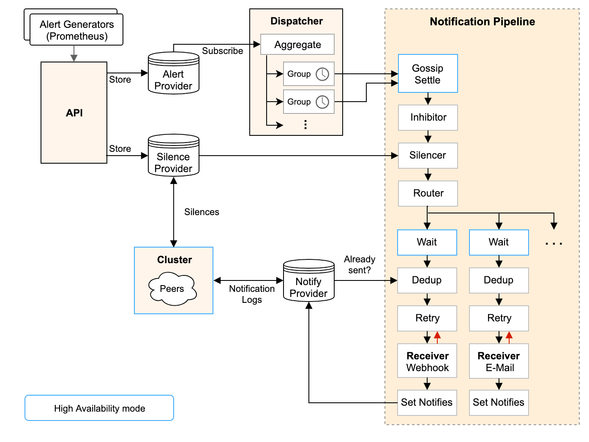

1. 从左上开始，Prometheus 发送的警报到 Alertmanager; 
2. 警报会被存储到 AlertProvider 中，Alertmanager 的内置实现就是包了一个 map，也就是存放在本机内存中，这里可以很容易地扩展其它 Provider; 
3. Dispatcher 是一个单独的 goroutine，它会不断到 AlertProvider 拉新的警报，并且根据 YAML 配置的 Routing Tree 将警报路由到一个分组中; 
4. 分组会定时进行 flush (间隔为配置参数中的 group_interval), flush 后这组警报会走一个 Notification Pipeline 链式处理; 
5. Notification Pipeline 为这组警报确定发送目标，并执行抑制逻辑，静默逻辑，去重逻辑，发送与重试逻辑，实现警报的最终投递;


下面就分开讲一讲核心的两块：

1. Dispatcher 中的 Routing Tree 的实现与设计意图 
2. Notification Pipeline 的实现与设计意图

### Routing Tree

Routing Tree 的是一颗多叉树，节点的数据结构定义如下：

```golang
// 节点包含警报的路由逻辑
type Route struct {
    // 父节点
    parent *Route
    // 节点的配置，下文详解
    RouteOpts RouteOpts
    // Matchers 是一组匹配规则，用于判断 Alert 与当前节点是否匹配
    Matchers types.Matchers
    // 假如为 true, 那么 Alert 在匹配到一个节点后，还会继续往下匹配
    Continue bool
    // 子节点
    Routes []*Route
}
```

- 具体的处理代码很简单，深度优先搜索：警报从 root 开始匹配（root 默认匹配所有警报），然后根据节点中定义的 Matchers 检测警报与节点是否匹配，匹配则继续往下搜索，默认情况下第一个”最深”的 match (也就是 DFS 回溯之前的最后一个节点)会被返回。特殊情况就是节点配置了 Continue=true，这时假如这个节点匹配上了，那不会立即返回，而是继续搜索，用于支持警报发送给多方这种场景（比如”抄送”)

```golang
// 深度优先搜索
func (r *Route) Match(lset model.LabelSet) []*Route {
    if !r.Matchers.Match(lset) {
    return nil
    }

    var all []*Route
    for _, cr := range r.Routes {
        // 递归调用子节点的 Match 方法
        matches := cr.Match(lset)

        all = append(all, matches...)

        if matches != nil && !cr.Continue {
          break
        }
    }

    // 假如没有任何节点匹配上，那就匹配根节点
    if len(all) ==0 {
        all = append(all, r)
    }
    return all
}
```

- 为什么要设计一个复杂的 Routing Tree 逻辑呢？我们看看 Prometheus 官方的配置例子： 为了简化编写，Alertmanager 的设计是根节点的所有参数都会被子节点继承（除非子节点重写了这个参数）

```yaml
# 全局配置
global:
  # dns解析超时时间，未更新告警地址的情况下解析告警地址的时间
  resolve_timeout: 1m
  # 邮件服务器配置
  smtp_smarthost: 'smtpdm.aliyun.com:25'
  smtp_from: 'system@tech.rsjia.com'
  smtp_auth_username: 'xxx@tech.rsjia.com'
  smtp_auth_password: 'mmm'
# 告警模板配置
templates:
   - '/etc/alertmanager/*.tmpl'

# 根路由不能有任何匹配规则，否则会导致所有警报都被路由到该路由器，不会再匹配子路由。它需要配置一个接收器，以便将不匹配任何子路由的警报发送到该接收器。
# 根路由组设置会被子路由继承或覆盖
route:
  # 主接收者，没被子路由匹配到的告警都将发送到此接收者
  receiver: 'wechat'
  # 组等待时间，当告警被创建后，等待相同告警信息聚合的时间
  group_wait: 1m
  # 组间隔时间，当一组告警发送后，等待下一组告警发送的时间
  group_interval: 1m
  # 重复间隔时间，当告警状态为firing时，重复发送告警的时间
  repeat_interval: 1h
  # 分组依据，根据标签进行分组
  group_by: [alertname]
  # 子路由规则，根据标签匹配规则，匹配到的告警发送到对应的接收者
  routes:
    - receiver: 'critical'
      group_by: [alertname]
      continue: false
      match_re:
        severity: 'critical'
      group_wait: 10s
      match:
        # 匹配标签
        team: node

# 抑制规则配置，当匹配到的告警满足抑制规则时，将不会发送到接收者
inhibit_rules:
    # 源告警通常产生于监控系统的数据源，例如：Prometheus，Zabbix等。源告警由数据源生成，通常包含告警触发的条件、触发的时间、告警级别等信息。源告警通常用于描述实际的告警事件。
  - source_match:
      # 匹配源告警的严重程度为 critical
      severity: 'critical'
    # 目标告警是在告警管理系统中，基于源告警经过一定的处理、过滤、聚合后产生的告警。
    # 目标告警通常包含处理后的告警信息，以及告警需要处理的目标。这些目标可能是通知渠道（例如：邮件、短信、电话等），或是其他告警处理系统。
    target_match:
      # 匹配目标告警的严重程度为 warning
      severity: 'warning'
    # 需要匹配的标签名列表，只有在这些标签的值相同时，才会触发抑制规则
    equal: ['alertname', 'dev', 'instance']

# 接收者配置，接收者可以是邮件、钉钉、微信等
receivers:
- name: 'webhook' # 钉钉群
  webhook_configs:
  - url: http://dingtalk-webhook:8060/dingtalk/webhook/send
    send_resolved: true
- name: 'wechat' # 微信群
  webhook_configs:
  - url: 'http://webhook-adapter/adapter/wx'
    send_resolved: true
- name: 'critical' # 灾难告警
  email_configs:
    - to: 'kangpeiwen@rsjia.com'
    - to: 'yangyi@rsjia.com'
    - to: 'yangyanchao@rsjia.com'
    - to: 'lishuming@rsjia.com'
```

总结一下，Routing Tree 的设计意图是让用户能够非常自由地给警报归类，然后根据归类后的类别来配置要发送给谁以及怎么发送：

- 发送给谁？上面已经做了很好的示例，’数据库警报’和’前端警报’都有特定的接收组，都没有匹配上那么就是’默认警报’, 发送给默认接收组

- 怎么发送？对于一类警报，有个多个字段来配置发送行为： 
  - group_by：决定了警报怎么分组，每个 group 只会定时产生一次通知，这就达到了降噪的效果，而不同的警报类别分组方式显然是不一样的，举个例子： 
    - 配置中的 ‘数据库警报’ 是按 ‘集群’ 和 ‘规则名’ 分组的，这表明对于数据库警报，我们关心的是“哪个集群的哪个规则出问题了”，比如一个时间段内，’华东’集群产生了10条 ‘API响应时间过长’ 警报，这些警报就会聚合在一个通知里发出来；
    - 配置中的 ‘前端警报’ 是按 ‘产品’ 和 ‘环境’ 分组的， 这表明对于前端警报，我们关心的是“哪个产品的哪个环境出问题了”
  - group_interval 和 group_wait: 控制分组的细节，不细谈，其中 group_interval 控制了这个分组最快多久执行一次 Notification Pipeline
  - repeat_interval: 假如一个相同的警报一直 FIRING，Alertmanager 并不会一直发送警报，而会等待一段时间，这个等待时间就是 repeat_interval，显然，不同类型警报的发送频率也是不一样的

group_interval 和 repeat_interval 的区别会在下文中详述

### Notification Pipeline

由 Routing Tree 分组后的警报会触发 Notification Pipeline:

- 当一个 AlertGroup 新建后，它会等待一段时间（group_wait 参数)，再触发第一次 Notification Pipeline
- 假如这个 AlertGroup 持续存在，那么之后每隔一段时间（group_interval 参数)，都会触发一次 Notification Pipeline

每次触发 Notification Pipeline，AlertGroup 都会将组内所有的 Alert 作为一个列表传进 Pipeline, Notification Pipeline 本身是一个按照责任链模式设计的接口，MultiStage 这个实现会链式执行所有的 Stage：

```golang
// A Stage processes alerts under the constraints of the given context.
type Stage interface {
    Exec(ctx context.Context, l log.Logger, alerts …*types.Alert) (context.Context, []*types.Alert, error)
}

// A MultiStage executes a series of stages sequencially.
type MultiStage []Stage

// Exec implements the Stage interface.
func (ms MultiStage) Exec(ctx context.Context, l log.Logger, alerts …*types.Alert) (context.Context, []*types.Alert, error) {
    var err error
    for _, s := range ms {
        if len(alerts) ==0{
            return ctx, nil, nil
        }

        ctx, alerts, err = s.Exec(ctx, l, alerts…)
        if err != nil {
            return ctx, nil, err
        }
    }
    return ctx, alerts, nil
}
```

MultiStage 里塞的就是开头架构图里画的 InhibitStage、SilenceStage…这么一条链式处理的流程，这里要提一下，官方的架构图画错了，RoutingStage 其实处在整个 Pipeline 的首位，不过这个顺序并不影响逻辑。 要重点说的是DedupStage和NotifySetStage它俩协同负责去重工作，具体做法是：

- NotifySetStage 会为发送成功的警报记录一条发送通知，key 是’接收组名字’+’GroupKey 的 key 值’，value 是当前 Stage 收到的 []Alert (这个列表和最开始进入 Notification Pipeline 的警报列表有可能是不同的，因为其中有些 Alert 可能在前置 Stage 中已经被过滤掉了)
- DedupStage 中会以’接收组名字’+’GroupKey 的 key 值’为 key 查询通知记录，假如：
  - 查询无结果，那么这条通知没发过，为这组警报发送一条通知；
  - 查询有结果，那么查询得到已经发送过的一组警报 S，判断当前的这组警报 A 是否为 S 的子集：
    - 假如 A 是 S 的子集，那么表明 A 和 S 重复，这时候要根据 repeat_interval 来决定是否再次发送：
      - 距离 S 的发送时间已经过去了足够久（repeat_interval)，那么我们要再发送一遍；
      - 距离 S 的发送时间还没有达到 repeat_interval，那么为了降低警报频率，触发去重逻辑，这次我们就不发了；
    - 假如 A 不是 S 的子集，那么 A 和 S 不重复，需要再发送一次； 上面的表述可能有些抽象，最后表现出来的结果是：
    - 假如一个 AlertGroup 里的警报一直发生变化，那么虽然每次都是新警报，不会被去重，但是由于 group_interval （假设是5分钟）存在，这个 AlertGroup 最多 5 分钟触发一次 Notification Pipeline，因此最多也只会 5 分钟发送一条通知；
    - 假如一个 AlertGroup 里的警报一直不变化，就是那么几条一直 FIRING 着，那么虽然每个 group_interval 都会触发 Notification Pipeline，但是由于 repeate_interval（假设是1小时）存在，因此最多也只会每 1 小时为这个重复的警报发送一条通知； 再说一下 Silence 和 Inhibit，两者都是基于用户主动定义的规则的：
- Silence Rule：静默规则用来关闭掉部分警报的通知，比如某个性能问题已经修复了，但需要排期上线，那么在上线前就可以把对应的警报静默掉来减少噪音；
- Inhibit Rule：抑制规则用于在某类警报发生时，抑制掉另一类警报，比如某个机房宕机了，那么会影响所有上层服务，产生级联的警报洪流，反而会掩盖掉根本原因，这时候抑制规则就有用了； 因此 Notification Pipeline 的设计意图就很明确了：通过一系列逻辑（如抑制、静默、去重）来获得更高的警报质量，由于警报质量的维度很多（剔除重复、类似的警报，静默暂时无用的警报，抑制级联警报），因此 Notification Pipeline 设计成了责任链模式，以便于随时添加新的环节来优化警报质量


