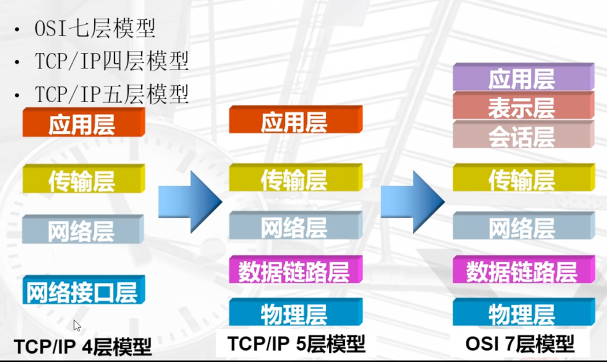

osi七层模型

物理层
1.如何使用物理信号来表示数据1和0
2.数据传输是否可同时在两个方向上进行
3.通信双方如何建立和中止连接
4.物理接口特性
数据链路层
1.以太网协议
	ethernet规定：
	1）必须要有一块网卡，这块网卡要有一个独一无二的地址（mac地址）
	2）一组电信号，构成一组数据包，叫做"帧"（数据包就是由一组010101二进制数组成）
	3）每一个数据帧，被分为报头"head"，数据"data"（请求头又可以叫做，请求报文）
		-1 head包含：(固定18个字节)
			发送者／源地址，6个字节 接收者／目标地址，6个字节 数据类型，6个字节
		-2 data包含：(最短46字节，最长1500字节)
			数据包的具体内容 head长度＋data长度＝最短64字节，最长1518字节，超过最大限制就分片发送
2.mac地址
	# 每块网卡出厂时都被烧制上一个世界唯一的mac地址，长度为48位2进制，通常由12位16进制数表示（前六位是厂商编号，后六位是流水线号）
	head中包含的源和目标地址由来：ethernet规定接入internet的设备都必须具备网卡，发送端和接收端的地址便是指
网卡的地址，即mac地址
	
3.广播风暴
	# 由于计算机通信基本靠吼（广播），当网段内的计算机和请求达到一定量级时遍会产生广播风暴
	解决方法便是把整个网络切割成一个一个小网段（避免过量），此时mac地址便在`局域网通信`中发挥作用
网络层
1.网络层由来
	有了ethernet、mac地址、广播的发送方式，世界上的计算机就可以彼此通信了，但是如果每台计算机都直接吼，不仅影响效率，还会是一场灾难（广播风暴），于是乎，网络层站出来：兄弟们不要害怕，我来解决广播风暴的问题，通过局域网的方式，隔离开所有的计算机，从而广播只能在局域网之间通讯。
	
 
2.IPaddr
	是由4段，十进制的数字组成，每一段的范围是0~255。点分十进制，每一个点中都是由8位二进制数组成
	主机唯一的标识，保证主机间正常通信，一种网络编码，用来确定网络中一个节点，IP地址由32位二二进制(32bit) 组成
	# head：长度为20到60字节 data：最长为65,515字节。
	
	IP地址止的分类
        IP地址分为A、B、C、D、E五类，每一-类有不同的划分规则，由网络号的第一组数字来表示
        A类地址的第一组数字为1~ 126
        B类地址的第一组数字为128~191
        C类地址的第一组数字为192~223
        D类地址的第一组数字为224~ 239
        E类地址的第一组数字为240~255
 
	
3.netmask（prefix）
	子网掩码：子网掩码，和IP可以计算出网段
	
4.数制的计算
5.AND运算
	# 按位与运算：&
		1&1=1; 真&&真=真;
		1&0=0; 真&&假=假;
		0&1=0; 假&&真=假;
		0&0=0; 假&&假=假;		
	# 例
	ipaddress：11000000.10101000.00000001.00001100
	netmask：  11111111.11111111.11111111.00000000
	计算结果：  11000000.10101000.00000001.00000000
传输层
1.传输层的由来：
	网络层的ip帮我们区分子网，以太网层的mac帮我们找到主机，然后大家使用的都是应用程序，你的电脑上可能同时开启qq，暴风影音，等多个应用程序，那么我们通过ip和mac找到了一台特定的主机，如何标识这台主机上的应用程序，答案就是端口，端口即应用程序与网卡关联的编号。
 
2.传输层功能：
	# 建立端口到端口的通信，端口范围0-65535，0-1023为系统占用端口
	
3.tcp协议：
	可靠传输（需要建立连接），TCP数据包没有长度限制，理论上可以无限长，但是为了保证网络的效率，通常TCP数据包的长度不会超过IP数据包的长度，以确保单个TCP数据包不必再分割。
	
4.udp协议：
	不可靠传输（不需要建立连接），”报头”部分一共只有8个字节，总长度不超过65,535字节，正好放进一个IP数据包。
    tcp连接过程
# 三次握手
第一次握手：建立连接时，客户端发送syn包（seq=j）到服务器，并进入SYN_SENT状态，等待服务器确认；SYN：同步序列编号（Synchronize Sequence Numbers）。
第二次第二次握手：服务器收到syn包，必须确认客户的SYN（ack=j+1），同时自己也发送一个SYN包（seq=k），即SYN+ACK包，此时服务器进入SYN_RECV状态。`这里是两次操作，只是优化后合并到一起成为了一次`
第三次握手：客户端收到服务器的SYN+ACK包，向服务器发送确认包ACK(ack=k+1），此包发送完毕，客户端和服务器进入ESTABLISHED（TCP连接成功）状态，完成三次握手。
完成三次握手，客户端与服务器开始传送数据
# 数据传输
# 四次挥手
由于TCP连接是全双工的，因此每个方向都必须单独进行关闭。这原则是当一方完成它的数据发送任务后就能发送一个FIN来终止这个方向的连接。收到一个 FIN只意味着这一方向上没有数据流动，一个TCP连接在收到一个FIN后仍能发送数据。首先进行关闭的一方将执行主动关闭，而另一方执行被动关闭。
（1） TCP客户端发送一个FIN，用来关闭客户到服务器的数据传送。
（2） 服务器收到这个FIN，它发回一个ACK，确认序号为收到的序号加1。和SYN一样，一个FIN将占用一个序号。
（3） 服务器关闭客户端的连接，发送一个FIN给客户端。
（4） 客户端发回ACK报文确认，并将确认序号设置为收到序号加1。
# TCP协议的11种状态
三次握手中： 1.SYN_SENT 2.LISTEN 3.SYN_REVD（syn洪水攻击）半连接池 4.ESTABLISHED
四次挥手中： 1.FIN_WAIT_1 2.CLOSE_WAIT 3.FIN_WAIT_2 4.LAST_ACK 5.TIME_WAIT（TIME_WAIT多，证明服务器
上有大并发）
关闭状态： 1.CLOSED（被动关闭端在接收到ack包后，进入CLOSED状态关闭TCP连接） 2.CLOSING（客户端和服务
端同时发起断开连接）
会话层
# 会话层主要三大功能：
1.建立会话：A、B两台网络设备之间要通信，要建立一条会话供他们使用，在建立会话的过程中也会有身份验证，权
限鉴定等环节；
2.保持会话：通信会话建立后，通信双方开始传递数据，当数据传递完成后，OSI会话层不一定会立刻将两者这条通
信会话断开，它会根据应用程序和应用层的设置对该会话进行维护，在会话维持期间两者可以随时使用这条会话传输
局；
3.断开会话：当应用程序或应用层规定的超时时间到期后，OSI会话层才会释放这条会话。或者A、B重启、关机、手
动执行断开连接的操作时，OSI会话层也会将A、B之间的会话断开。
表示层
表示层主要三大功能：
1.内码转换 
2.压缩与解压缩 
3.加密与解密。
应用层
应用层由来：用户使用的都是应用程序，均工作于应用层，互联网是开发的，大家都可以开发自己的应用程序，数据
多种多样，必须规定好数据的组织形式
应用层功能：规定应用程序的数据格式。
例：TCP协议可以为各种各样的程序传递数据，比如Email、WWW、FTP等等。那么，必须有不同协议规定电子邮
件、网页、FTP数据的格式，这些应用程序协议就构成了”应用层”。
TCP/IP五层模型详解
         应用层 --> 传输控制层 --> 网络层 --> 链路层 --> 物理层
           | 	   |---------------------------｜
        开发人员                  内核
分解请求百度
exec 3<> /dev/tcp/www.baidu.com/80
echo -e "GET / HTTP/1.0\n" >& 3
cat <& 3
 
# 与百度建立连接
exec 3<> /dev/tcp/www.baidu.com/80
    - 在linux中一切皆为文件，即使是tcp连接也不例外，这里是使用文件描述符3来与百度80端口建立输入输出<>连接
    - 用exec将文件描述符3的io 重定向到socket连接/dev/tcp/www.baidu.com/80
 
# 请求报文 
echo -e "GET / HTTP/1.0\n" >& 3
    - 以HTTP协议的格式来书写请求头并通过文件描述符重定向到百度
 
# 将返回的请求重定向到屏幕
cat <& 3
传输控制层(TCP/UDP)
TCP:
面向连接的
可靠的传输协议
 
什么是连接？
	三次握手:建立连接
	客户端请求建立连接	   SYN
	服务端回复并提出确认 SYN+ACK
	客户端返回确认	   ACK
一旦三次握手成功就会建立连接，会在内存开辟空间存放`接收队列`和`发送队列`
 
SOCKET:
四元组
IP+PORT  IP+PORT
client   server
一定是唯一的。最多只可能出现三个值相同。
 
当建立连接后会生成一个socket文件，里面记录的是通信双方的ip和端口，这四个值的组合一定是唯一的。
# socket即套接字文件，表示通信双方建立连接，其中记录者通信双方的iP及端口
 
四次挥手:断开连接
	客户端提出断开请求		FIN
	服务端响应表示收到       FIN+ACK
	服务端确认可以断开		FIN
	客户端基于礼貌返回		ACK
 
 
# 示例:
 
1.监听80端口
tcpdump -nn -i eth0 port 80
 
2.与百度建立连接
nc www.baidu.com
curl www.baidu.com
 
3.获得过程
#三次握手
S:SYN  .:ACK
08:43:46.195093 IP 10.0.0.84.58066 > 61.135.169.121.80: Flags [S], seq 2856074205, win 64240, options [mss 1460,sackOK,TS val 1914821052 ecr 0,nop,wscale 7], length 0
08:43:46.221082 IP 61.135.169.121.80 > 10.0.0.84.58066: Flags [S.], seq 441876264, ack 2856074206, win 64240, options [mss 1460], length 0
08:43:46.221462 IP 10.0.0.84.58066 > 61.135.169.121.80: Flags [.], ack 1, win 64240, length 0
#数据传输
curl给百度发出请求 P：不走缓存立刻返回结果  77个字节
08:43:46.221868 IP 10.0.0.84.58066 > 61.135.169.121.80: Flags [P.], seq 1:78, ack 1, win 64240, length 77: HTTP: GET / HTTP/1.1
 
百度收到后返回ACK表示收到 0字节 仅作确认
08:43:46.221874 IP 61.135.169.121.80 > 10.0.0.84.58066: Flags [.], ack 78, win 64240, length 0
 
百度返回请求的页面 2781字节
08:43:46.251561 IP 61.135.169.121.80 > 10.0.0.84.58066: Flags [P.], seq 1:2782, ack 78, win 64240, length 2781: HTTP: HTTP/1.1 200 OK
 
客户端收到后返回ACK 0字节 仅作确认
08:43:46.251835 IP 10.0.0.84.58066 > 61.135.169.121.80: Flags [.], ack 2782, win 62780, length 0
#四次挥手
F:FIN
08:43:46.252885 IP 10.0.0.84.58066 > 61.135.169.121.80: Flags [F.], seq 78, ack 2782, win 62780, length 0
08:43:46.252892 IP 61.135.169.121.80 > 10.0.0.84.58066: Flags [.], ack 79, win 64239, length 0
08:43:46.278408 IP 61.135.169.121.80 > 10.0.0.84.58066: Flags [FP.], seq 2782, ack 79, win 64239, length 0
08:43:46.278691 IP 10.0.0.84.58066 > 61.135.169.121.80: Flags [.], ack 2783, win 62780, length 0
 
#即使在连接建立以后 数据传输也是建立在ACK的基础上 发送后只要收到则必有回复 这也是为什么叫`可靠传输协议`的原因
网络层(IP)
本机`路由表`中的两条`路由条目`由网卡配置文件中的`IPADDR+PREFIX(按位与运算)`以及`GATEWAY(默认网关)`得到
 
1.ping www.baidu.com时，首先从DNS服务器获得对于的IP地址
2.根据获得的IP(61.135.169.121)与路由表中的网络掩码进行按位与运算后，与目的地进行匹配
3.如果匹配失败，则继续往下匹配，如果匹配成功，则将数据包交给网关，也就是`下一跳`
 
# 互联网由无数个下一跳组成
数据链路层
ARP表:显示IP与MAC之间的对应关系 由局域网广播生成
 
1.在数据包交给网关的过程中，要让网关对其进行处理，才能将数据包发出去
2.此时数据包写着目标的IP和网关IP不同，这样网关肯定无法进行识别，于是在交给网关之前，需要在数据包之前封装一层，即目标网关的MAC地址
3.网关收到数据包后拆开MAC封装，发现IP不是自己，他会根据自己的路由表解析，将下一层网关的MAC封装上，交给下一跳
4.以上过程不断重复，直到IP和MAC都匹配上，数据包才到达了目的地
    顾名思义，数据链路层就是一条链路，是客户端与服务端之间沟通的桥梁。
物理层
    真实的硬件，物理连接，一切的基础。
总结
1.监控80端口或arp请求
tcpdump -nn -i eth0 port 80 or arp
2.查找默认网关arp
arp -n
2.删除默认网关arp表并请求百度
arp -d 10.0.0.2 && curl www.baidu.com
[root@k8s-master-1 ~]# tcpdump -nn -i eth0 port 80 or arp
tcpdump: verbose output suppressed, use -v or -vv for full protocol decode
listening on eth0, link-type EN10MB (Ethernet), capture size 262144 bytes
 
# 在局域网内发送一个广播，谁是10.0.0.2请回复给10.0.0.84
10:45:33.327733 ARP, Request who-has 10.0.0.2 tell 10.0.0.84, length 46
# 10.0.0.2回复 并附带MAC地址
10:45:33.327764 ARP, Reply 10.0.0.2 is-at 00:50:56:fd:5b:76, length 46
 
#开始三次握手 传输数据 四次挥手
10:45:33.357131 IP 10.0.0.84.39564 > 61.135.185.32.80: Flags [S], seq 1352964133, win 64240, options [mss 1460,sackOK,TS val 1039151949 ecr 0,nop,wscale 7], length 0
10:45:33.385189 IP 61.135.185.32.80 > 10.0.0.84.39564: Flags [S.], seq 1654681100, ack 1352964134, win 64240, options [mss 1460], length 0
10:45:33.385867 IP 10.0.0.84.39564 > 61.135.185.32.80: Flags [.], ack 1, win 64240, length 0
10:45:33.385881 IP 10.0.0.84.39564 > 61.135.185.32.80: Flags [P.], seq 1:78, ack 1, win 64240, length 77: HTTP: GET / HTTP/1.1
10:45:33.386359 IP 61.135.185.32.80 > 10.0.0.84.39564: Flags [.], ack 78, win 64240, length 0
10:45:33.415982 IP 61.135.185.32.80 > 10.0.0.84.39564: Flags [P.], seq 1:2782, ack 78, win 64240, length 2781: HTTP: HTTP/1.1 200 OK
10:45:33.416068 IP 10.0.0.84.39564 > 61.135.185.32.80: Flags [.], ack 2782, win 62780, length 0
10:45:33.416972 IP 10.0.0.84.39564 > 61.135.185.32.80: Flags [F.], seq 78, ack 2782, win 62780, length 0
10:45:33.417023 IP 61.135.185.32.80 > 10.0.0.84.39564: Flags [.], ack 79, win 64239, length 0
10:45:33.444972 IP 61.135.185.32.80 > 10.0.0.84.39564: Flags [FP.], seq 2782, ack 79, win 64239, length 0
10:45:33.445033 IP 10.0.0.84.39564 > 61.135.185.32.80: Flags [.], ack 2783, win 62780, length 0