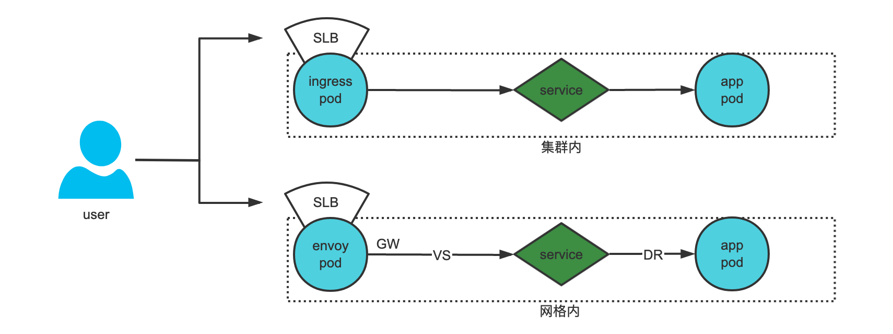

# Config

目录
=================

* [Config](#config)
      * [一、先决条件](#一先决条件)
      * [二、sidecar注入方式](#二sidecar注入方式)
      * [三、流量对比](#三流量对比)
      * [四、配置](#四配置)

### 一、先决条件

~~~bash
1.命名的服务端口: Service 的端口必须命名。端口名键值对必须按以下格式：name: <protocol>[-<suffix>]。更多说明请参看协议选择。

2.Service 关联: 每个 Pod 必须至少属于一个 Kubernetes Service，不管这个 Pod 是否对外暴露端口。如果一个 Pod 同时属于多个 Kubernetes Service， 那么这些 Service 不能同时在一个端口号上使用不同的协议（比如：HTTP 和 TCP）。

3.带有 app 和 version 标签（label）的 Deployment: 我们建议显式地给 Deployment 加上 app 和 version 标签。给使用 Kubernetes Deployment 部署的 Pod 部署配置中增加这些标签，可以给 Istio 收集的指标和遥测信息中增加上下文信息。
    app 标签：每个部署配置应该有一个不同的 app 标签并且该标签的值应该有一定意义。app label 用于在分布式追踪中添加上下文信息。
    version 标签：这个标签用于在特定方式部署的应用中表示版本。

4.应用 UID: 确保你的 Pod 不会以用户 ID（UID）为 1337 的用户运行应用。

5.NET_ADMIN 功能: 如果你的集群执行 Pod 安全策略，必须给 Pod 配置 NET_ADMIN 功能。如果你使用 Istio CNI 插件 可以不配置。要了解更多 NET_ADMIN 功能的知识，请查看所需的 Pod 功能。
~~~

### 二、sidecar注入方式

- [官方文档](https://istio.io/latest/docs/setup/additional-setup/sidecar-injection/)

~~~bash
1.自动注入
kubectl label namespace default istio-injection=enabled

2.手动注入
istioctl kube-inject -f test.yaml | kubectl apply -f -
~~~

### 三、流量对比

- 由于服务网格对网络的管理有更加细粒度的配置，所以服务网格能够实现的功能也更加多样

### 四、配置

~~~bash
1.虚拟网关
- 虚拟网关用于配置网关pod接受到的流量，哪部分需要导入服务网格
apiVersion: networking.istio.io/v1alpha3
kind: Gateway
metadata:
  name: dnet-int-gateway
spec:
  selector: # 通过标签选择 gateway pod
    istio: ingressgateway
  servers: # 定义导入网格的流量
  - port:
      number: 80
      name: http
      protocol: HTTP
    hosts:
    - "*.qianfan123.com"
  - port:
      number: 443
      name: https
      protocol: HTTPS
    hosts:
    - "*.qianfan123.com"
    tls: # 配置证书
      mode: SIMPLE
      credentialName: "qianfan123" # 使用 k8s secret

2.虚拟服务
- 虚拟服务管理虚拟网关导入的流量，将流量路由至service
apiVersion: networking.istio.io/v1alpha3
kind: VirtualService
metadata:
  name: cmdb-test--cmdb-rs
spec:
  hosts: # 管理使用这些域名的流量
  - cmdb-test.qianfan123.com
  - plat-dnet-integration-cmdb-rs
  gateways:
  - dnet-int-gatewaiy # 管理从这个虚拟网管进来的流量
  http:
  - match: # 匹配规则
    - uri:
        prefix: /cmdb-rs # url为cmdb-rs开头的
    route: # 路由规则
    - destination: # 目标
        host: plat-dnet-integration-cmdb-rs # 到这个service
        subset: v1 # 此处的配置为下方DR的 spec.subsets.name
        port:
          number: 8080 # 此处为容器接受流量的端口

3.目标规则
- 目标规则用于配置service收到的流量，并将其分配至后段的pod
apiVersion: networking.istio.io/v1alpha3
kind: DestinationRule
metadata:
  name: cmdb-rs
spec:
  host: plat-dnet-integration-cmdb-rs # 管理从此service进来的流量
  subsets: # 配置子集
  - name: v1 # 子集名称
    labels: # 根据标签匹配pod 为当前子集的pod 是最终vs使用当前subset路由到的pod
      app: cmdb-rs
      version: v1
~~~
