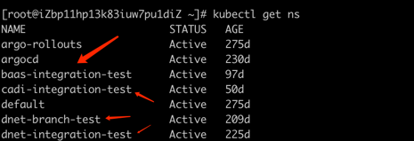

目录
=================


   * [概述](#概述)
   * [技术架构](#技术架构)
   * [部署流程图](#部署流程图)
   * [一、创建 apollo](#一创建-apollo)
   * [二、git相关](#二git相关)
      * [1）git的地址](#1git的地址)
      * [2）前期信息的准备](#2前期信息的准备)
        * [应用相关](#应用相关)
          * [1.应用名称（镜像名）](#1应用名称镜像名)
          * [2.环境](#2环境)
          * [3.stackid](#3stackid)
          * [4.镜像全称](#4镜像全称)
        * [apollo相关](#apollo相关)
          * [1.apollo服务名称](#1apollo服务名称)
          * [2.apollo环境](#2apollo环境)
          * [3.apollo token](#3apollo-token)
        * [argocd相关](#argocd相关)
          * [1.argocd URL后缀](#1argocd-url后缀)
          * [2.k8s 名称空间](#2k8s-名称空间)
        * [将信息写入 git](#将信息写入-git)
          * [1.将相关信息写入 init.txt](#1将相关信息写入-inittxt)
          * [2.配置分离](#2配置分离)
      * [3）git 中 k8s yaml 配置生成](#3git-中-k8s-yaml-配置生成)
        * [1.生成](#1生成)
        * [2.检查](#2检查)
        * [3.提交](#3提交)
   * [三、部署](#三部署)
      * [1）应用部署](#1应用部署)
        * [1.在argocd中创建应用](#1在argocd中创建应用)
        * [2.将应用部署至k8s](#2将应用部署至k8s)
      * [2）应用升级](#2应用升级)
        * [1.修改版本号](#1修改版本号)
        * [2.升级数据库版本](#2升级数据库版本)
        * [3.升级应用](#3升级应用)


## 概述
本文描述如何将新产品部署到k8s内的全过程，阅读者无需太多概念理解即可完成适配操作。其中涉及到的技术产品包含：git、apollo、argocd、jenkins、cmdb概念等。

## 技术架构
#### 1）git： 存放描述容器的 k8s yaml 代码
#### 2）argocd： 将 git 中的 yaml 部署至 k8s 集群
#### 3）jenkins：控制 argocd 中容器的创建、部署
#### 4）apollo：存放开发管理的配置

## 部署流程图


- 在整个部署过程中分为三个大块：
  - 1）根据接入的服务，创建工单请求创建创建 apollo 项目
  - 2）生成 git 中的 yaml，这个是部署的基础，这个部分我们只需收集信息并存放至指定位置，运行生成脚本便可以自动生成
  - 3）使用 jenkins job 在 argocd 中创建服务并同步，当服务运行起来就完成了

## 一、创建 apollo

向相关人员提交工单，并提供以下信息：

~~~bash
客户id：
项目简称：
产品Image：
~~~

## 二、git相关

### 1）git的地址
```bash
# 所有项目的 k8s yaml 均在对应的 toolset 项目中的对应分支中

例如：海鼎千帆 heading dnet
- heading 对应的 toolset 地址为 http://gitlab.app.hd123.cn:10080/qianfanops/toolset
- 所有 k8s 相关的分支均以 k8s_ 开头，故 dnet 分支为 k8s_dnet
```
- 向相关人员申请git的修改权限
- 拉取分支到 linux 环境
```bash
mkdir toolset
cd toolset
git init
git pull http://gitlab.app.hd123.cn:10080/qianfanops/toolset.git k8s_<项目简称>
git checkout -b k8s_<项目简称>
```

### 2）前期信息的准备

### 应用相关
##### 1.应用名称（镜像名）
```bash
- 例如镜像为 harbor.qianfan123.com/baas/fms-service:1.25.0-SNAPSHOT
- 则应用名称为 fms-service
- 可以在 harbor.qianfan123.com 中找到对应项目复制 pull 命令即可找到
```
##### 2.环境
```bash
- 用 pycharm 打开 http://gitlab.app.hd123.cn:10080/qianfanops/toolset.git 的 develop 分支
- 双击 Shift 搜索 setting-<项目简称>.yaml
```

```bash
- 这里以nf 为例，打开 setting-nf.yaml，查看对应环境是否存在，如 integration_test 环境，如果新加环境则需要创建
- 这里的环境以开头的为准，如 integration_test，而不是 stack_environment: integration_test
```


##### 3.stackid
```bash
- 用 pycharm 打开 http://gitlab.app.hd123.cn:10080/qianfanops/toolset.git 的 develop 分支
- 找到 init_json 目录中的 <项目简称> 目录中的 cmdb.json， 例如 init_json/nf/cmdb.json
```

```bash
- 拿到数据库连接信息后连接上 cmdb 数据库，找到 <项目简称> cmdb 中的 stack 表，即可找到对应得 stackid
```


##### 4.镜像全称
```bash
- 镜像名称包括仓库名称，如 harbor.qianfan123.com/baas/fms-service:1.25.0-SNAPSHOT
```

### apollo相关

 apollo相关信息为 apollo创建项目后工单备注的信息

##### 1.apollo服务名称
```bash
- 例如 9999.fms-service.baas
```

##### 2.apollo环境
```bash
- apollo的环境只有 INT BRA UAT PRD 四种
- 根据对应的服务基础信息填写
```

##### 3.apollo token
```bash
- 见工单备注
```

### argocd相关


##### 1.argocd URL后缀
```bash
- 通常为 产品代码-环境  如 dnet-int dnet-prd
- 具体信息以部署集群为准 上述只做参考，部署至哪个集群则为哪个集群的后缀
```


##### 2.k8s 名称空间
```bash
- 此信息为部署到集群后服务所在名称空间
- 通常为 产品代码-环境全称 如 dnet-integration-test，具体以部署目的为指向，可将多个产品部署至同一名称空间
```


### 将信息写入 git

##### 1.将相关信息写入 init.txt
```bash
- 进入初始化目录
- 打开 init.txt 文件
- 将前面准备的信息以双引号为分组写入文件
- 保存

# 这里的每一行为一个服务的一个环境，如果同一个服务要生成三个环境的，则需要三行
```
```bash
# 例如
"应用名称 环境 stackid image" "apollo服务名称 apollo环境 apollo token" "argocdURL后缀 k8s名称空间"
# 注意引号
cat >> init.txt <<'EOF'
"fms-service daojia_int daojia_int harbor.qianfan123.com/baas/fms-service:1.25.0-SNAPSHOT" "9999.fms-service.baas INT bc5f1869b70391bba94866e04c18b62483be25d3" "dnet-int baas-integration-test"
EOF
```


##### 2.配置分离
```bash
# 开发配置
- 开发关心或修改的配置
- 存放在 apollo 中对应的项目里的对应环境

# 运维配置
- 主要以账号密码类配置为主，以及一些开发不关心的配置
- 存放在 git 中
```
```bash
# 将开发配置写入 apollo
# 将运维配置写入 git 中的对应文件

将运维配置放入./config/应用名称_环境名.env
- 例如 ./config/fms-service_daojia_int.env
```


### 3）git 中 k8s yaml 配置生成

##### 1.生成
```bash
# 当准备完上述信息后，执行脚本即可生成，幂等，后续可以添加新服务执行，已有不会修改

./start.sh
```

##### 2.检查

- 输出不符合下列信息则创建失败

```bash
# 当新建项目时，如下输出则成功：
  <应用名称>/base 创建成功
  <应用名称>/overlays/<环境>/<stackid> 创建成功
- 例如：
  fms-service/base 创建成功
  fms-service/overlays/daojia_int/daojia_int 创建成功

# 在应用中添加新环境时，如下输出则成功：
  <应用名称>/overlays/<环境>/<stackid> 创建成功
- 例如：
  fms-service/overlays/daojia_int/daojia_int 创建成功
```

##### 3.提交

```bash
# 将修改提交至 git 仓库
cd ..
git add --all
git commit -m "add apps"
git push http://gitlab.app.hd123.cn:10080/qianfanops/toolset.git k8s_<项目简称>
```

## 三、部署

### 1）应用部署
##### 1.在argocd中创建应用
- 打开对应环境的 jenkins，例如海鼎非生产 http://47.97.75.60:18080/ ，点击对应的 <项目简称>，例如 baas


- 找到后缀含有 k8s 的目录打开


- 打开 argocd_create_app job


- 输入 <应用名称> 并 build，等待 job 构建完成
- 在 [argocd web 页面](https://argocd.hd123.com/dnet-int/applications) 上查看，出现类似 test 的项目即为成功


##### 2.将应用部署至k8s

- 返回 argocd_create_app job 的上级目录，打开 deploy job


- 输入 <应用名称> 并 build，等待 job 构建完成
- 在 [argocd web 页面](https://argocd.hd123.com/dnet-int/applications) 上查看，刚创建的应用进入 Progressing 状态则 job 执行成功
- 等到应用变为 health 则部署成功

### 2）应用升级

##### 1.修改版本号
- 打开对应环境的 jenkins，例如海鼎非生产 http://47.97.75.60:18080/ ，点击对应的 <项目简称>，例如 baas


- 找到后缀含有 k8s 的目录打开


- 打开 modify_version 的 job


- 点击参数构建，填入 版本:iamge 开始构建，多个以 ';' 作为分隔，执行完成则构建成功
- 修改镜像版本实质上是修改 git 中的 k8s 配置


- 在修改 k8s 配置的镜像版本时会触发 job 同步修改 toolset 里的版本信息，如果是生产环境则需要将 release merge 到 develop,为下一步的数据库升级做准备
```bash
- 用 pycharm 打开 http://gitlab.app.hd123.cn:10080/qianfanops/toolset.git 的 develop 分支
- 双击 Shift 搜索 setting-<项目简称>-patch.yaml
- 找到对应的环境，即可检查应用版本是否更新完成
```


##### 2.升级数据库版本

- 返回 modify_version job 的上级目录，打开 deploy_rdb job


- 输入 <应用名称> 并 build，等待 job 构建完成
- 查看 dbinit_log 中的日志信息，是否更新为新版本


- Target Version 为之前修改的版本且执行完成，则更新成功


##### 3.升级应用

- 返回 argocd_create_app job 的上级目录，打开 deploy job


- 输入 <应用名称> 并 build，等待 job 构建完成
- 在 [argocd web 页面](https://argocd.hd123.com/dnet-int/applications) 上查看，刚更新的应用进入 Progressing 状态则 job 执行成功
- 等到应用变为 health 则部署成功
