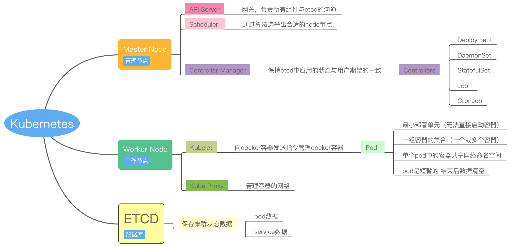
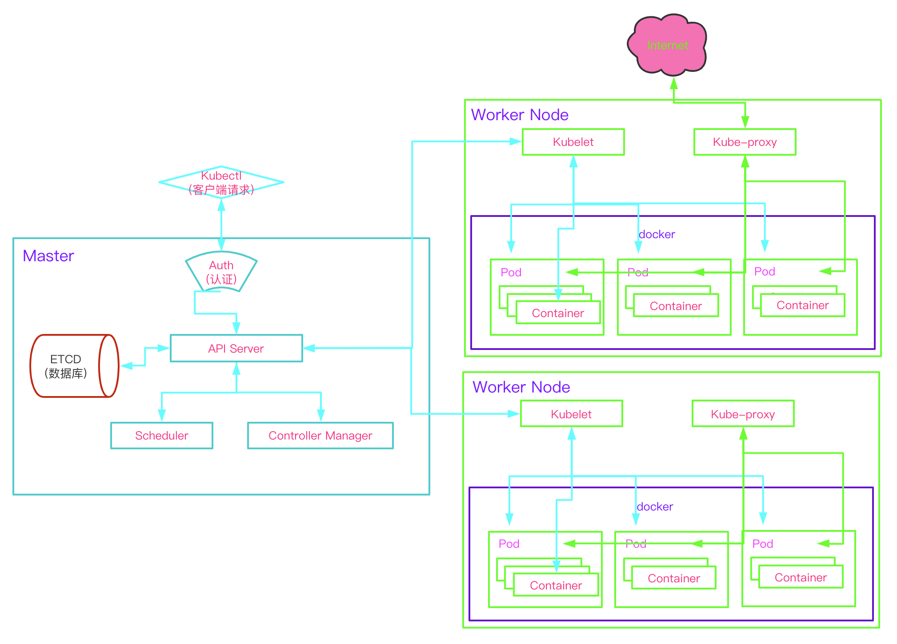
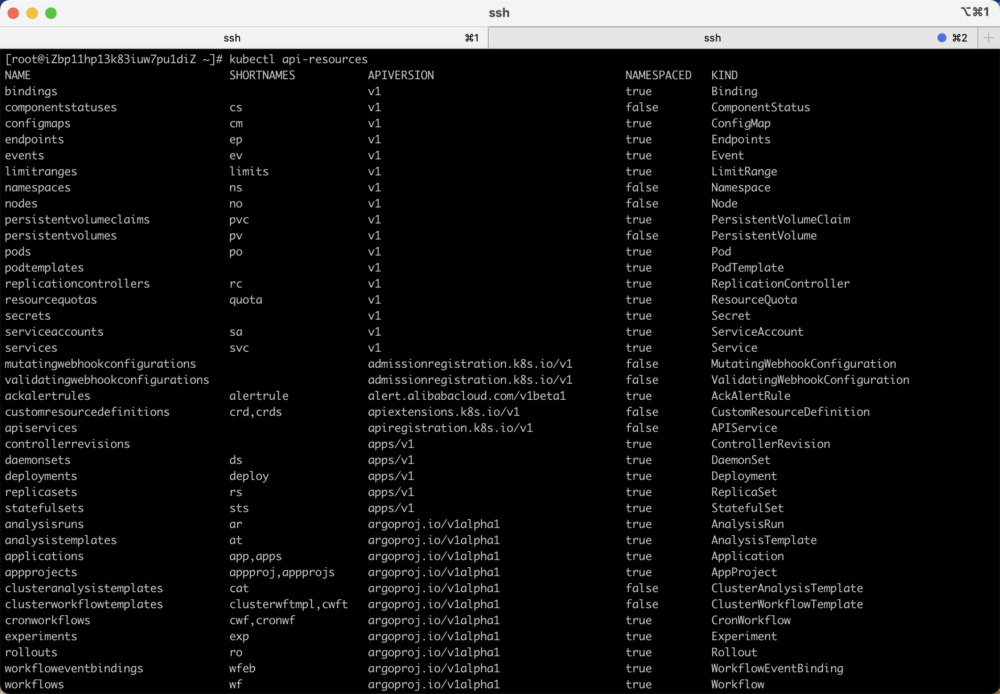
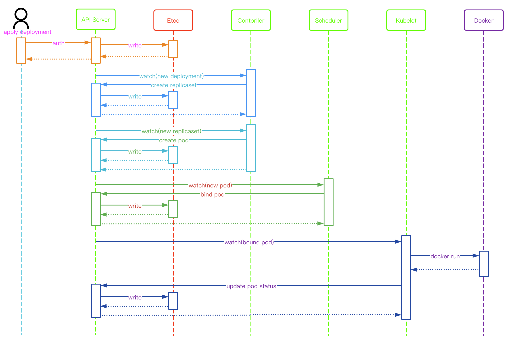
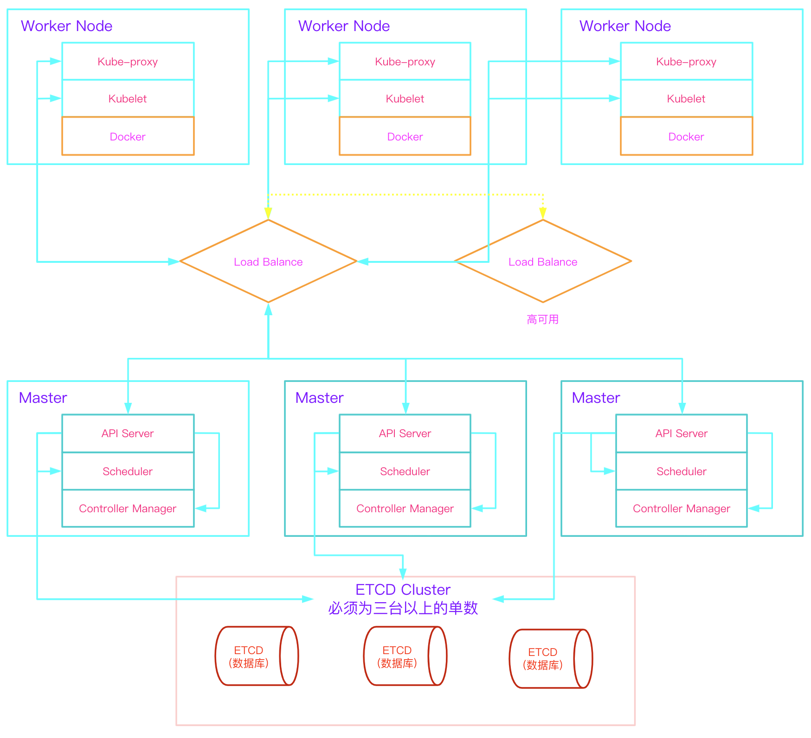
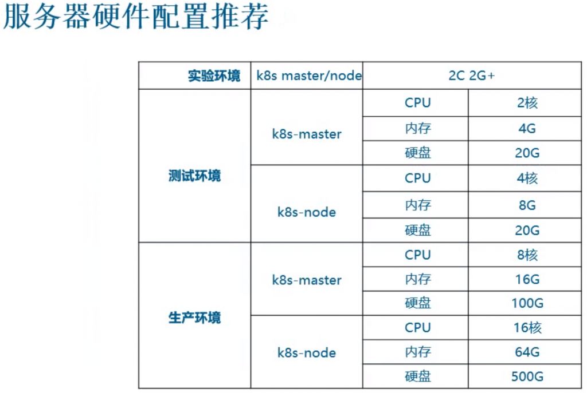

# K8s 概述

## 一、k8s的发展

### 故事的开始
2014年

- 云计算的大潮和 AWS 的成功让google意识到云计算的时代已经到来
- AWS 的先发优势 以及自有的PaaS 和 IaaS 产品之间的矛盾让google决定打造一套容器编排管理系统
- 这套系统内部代号"Project Seven of Nine"，后来更名为kubernertes，k8s站在 borg 和 omega 的肩膀上
- 2014年6月 在 GitHub 上合并了第一个 GitHub commit

### 奠定胜局
2015年

- 2015年7月 k8s的第一个商用版本1.0正式发布 而后成为CNCF成立后的第一个项目
- Kubernetes、Docker Swarm 和Apache Mesos已成三足鼎立之势

2016年

- 以 Mirantis 为首的 OpenStack 厂商积极推动与 Kubernetes 的整合
- CNCF 与 Linux Foundation 联手，正式推出 Kubernetes 认证服务
- Windows Server 和 Windows 容器可以正式支持 Kubernetes
- Kubernetes 的 GitHub 活跃度已经超过了 99.99% 的项目

### 尘埃落定
2017年

- 2017年9月，Mesosphere 宣布支持 Kubernetes
- 2017年10月，欧洲的 DockerCon 大会上宣布，Docker 的下个版本将支持 Kubernetes

### 未来趋势

应用开发方向:

- 传统应用：针对系统api开发
- cloud native apps  云原生应用程序（针对于云平台api开发）

serverless 无服务器应用逻辑

无服务器应用逻辑：类似函数，例如nginx提供web服务，在有访问时才运行nginx，没有访问
则释放，不占用资源，传统型无论是否有访问都必须让服务持续运行。

FaaS 函数即服务  功能即服务。将单个功能集成到单个函数中 用户请求则调用对应函数执行
 得到结果后返回给用户  达到服务函数化 此时功能可能有成千上万个 那么成千上万个函数会
存放在多个不同的服务器中 在用户无感知的情况下通过协议调用

## 二、k8s的构成
### k8s是什么

- Kubernetes，也称为 K8s，是一个开源系统，用于 跨多个主机管理容器化应用程序。它提供了部署、维护和扩展应用程序的基本机制。

- Kubernetes 建立在 Google 使用名为Borg的系统大规模运行生产工作负载的十五年经验之上，并结合了来自社区的最佳创意和实践。

- Kubernetes 由云原生计算基金会 ( CNCF )托管。如果您的公司希望帮助塑造容器封装、动态调度和面向微服务的技术的发展，请考虑加入 CNCF。有关谁参与以及 Kubernetes 如何发挥作用的详细信息，请阅读 CNCF公告。

### k8s做了什么

- Docker通过使用同一语法的“镜像”打包，解决了镜像打包语法需要根据语言去调整的历史，大大简化了容器使用的难度，它推动了容器技术的快速普及生产落地

- 容器本身仅提供了托管运行应用的底层逻辑，容器编排(Orchestration) 才是真正产生价值的位置所在

~~~bash
简单来说，容器编排是指容器应用的自动布局、协同及管理，它主要负责完成以下具体任务:
- 服务发现和负载均衡
    Kubernetes 可以使用 DNS 名称或自己的 IP 地址公开容器，如果进入容器的流量很大， Kubernetes 可以负载均衡并分配网络流量，从而使部署稳定。

- 存储编排
    Kubernetes 允许你自动挂载你选择的存储系统，例如本地存储、公共云提供商等。

- 自动部署和回滚
    你可以使用 Kubernetes 描述已部署容器的所需状态，它可以以受控的速率将实际状态 更改为期望状态。例如，你可以自动化 Kubernetes 来为你的部署创建新容器， 删除现有容器并将它们的所有资源用于新容器。

- 自动完成装箱计算
    Kubernetes 允许你指定每个容器所需 CPU 和内存（RAM）。 当容器指定了资源请求时，Kubernetes 可以做出更好的决策来管理容器的资源。

- 自我修复
    Kubernetes 重新启动失败的容器、替换容器、杀死不响应用户定义的 运行状况检查的容器，并且在准备好服务之前不将其通告给客户端。

- 密钥与配置管理
    Kubernetes 允许你存储和管理敏感信息，例如密码、OAuth 令牌和 ssh 密钥。 你可以在不重建容器镜像的情况下部署和更新密钥和应用程序配置，也无需在堆栈配置中暴露密钥
~~~

### 基本组件

### 组件工作流程图

- k8s 本身就是一套微服务架构 

~~~bash
陈述式 说明具体实现步骤 一步一步的走到结果
 # 声明式 说明所需结果 不在意过程
 
 ## Kubernetes是声明式
 
 1.用户通过Kubectl向API Server发送一个POST请求（创建一个pod）# 声明所需结果
 
 2.API Server从ETCD中调取信息对用户身份进行核验，通过后核验用户指令是否合乎语法，
符合后存入etcd
 
 3.此时Scheduler通过长链接watch到资源发生变化 取到相应的请求并选举出合适的节点发
给API server后存入etcd
 
 4.此时对应Node节点上的Kubelet通过长链接watch到资源发生变化（API server也会给
其发送请求）会执行下发的请求 创建pod
 
 5.创建完成后 controller-manager开始接管 通过对比pod的状态`status`与etcd数据
中用户期望的状态`spec`是否相符 是则继续通过`control loop`监控 否则运行合适的操作
让其无限接近用户期望的状态
~~~

## 三、k8s核心概念
~~~bash
# 对象式编程语言：
	以数据为中心，代码服务于数据
		- 数据：对象
		- 代码：方法
	class：类
		- 属性
		- 方法
		
REST：表征状态转移（英文：Representational State Transfer，简称REST）是一种Web服务的软件架构风格。
表征状态转移 API：将API中所有可以操作的事物抽象抽象成为`类`,但在这里称为`资源(resources)` # Docker、ES等

# k8s API：RESTful （REST API）(依赖http/https进行传输)  # 自签证书
	- resource --> object （实例化 给抽象的概念`resource`的属性赋值的过程）
		在k8s API中将资源赋值后得到对象
	- method： GET,PUT,POST,DELETE,PATCH... （增删改查）
		所有对象只能通过有限的方法来管理
		
实例化的结果：对象(object)

例如：
	pod 就是一个抽象的概念 也就是这里的`资源`
	当我们指定了pod中运行什么容器时（实例化 赋值的过程） 他才成为了对象

~~~
### version

- k8s version
~~~bash
Kubernetes 版本的格式为 x.y.z
  X: 主版本号：当你做了不兼容的 API 修改，
  Y: 次版本号：当你做了向下兼容的功能性新增，
  Z: 修订号：当你做了向下兼容的问题修正。

Kubernetes 项目只维护最新的三个次版本，每个版本都会放到不同的发布分支中维护。上游版本发现的严重缺陷以及安全修复等都会移植到这些发布分支中，这些分支由 patch release manager 来维护。
# 次版本一般是每三个月发布一次，所以每个发布分支一般会维护 9 个月。
https://kubernetes.io/releases/version-skew-policy/
~~~

- api version

~~~bash
Kubernetes是一个组件众多、贡献者人数众多的大系统。Kubernetes API实际上是一个API集合，其中每个成员称作“API组（API Group”，并且每个 API 组都是独立管理版本的。API版本会有三类:
  v1	   正式发布（Generally available，GA，稳定版本）
  v1beta1  Beta （预发布）
  v1alpha1 Alpha （试验性）

版本化是在 API 级别而不是在资源或字段级别进行的，目的是为了确保 API 为系统资源和行为提供清晰、一致的视图，并能够控制对已废止的和/或实验性 API 的访问。
~~~

### 控制器
- 基础资源: `Pod` `Service` `Namespace` `Volume` `Configmap` `Secret` `Endpoints` `Ingress`

- 控制器资源：`ReplicaSet` `Deployment` `DaemonSet` `StatefulSet` `Job` `CronJob`

- 自定义资源 (version >= v1.16)

- 自定义控制器 (version >= v1.16)
	
~~~bash
基础资源：一类事物的抽象 一类事物在k8s中的定义
控制器：一类操作的抽象 一类操作在k8s中的定义

Pod: 豆荚
ReplicaSet: 副本集控制器
Deployment: 无状态应用部署控制器
~~~

### 当执我们使用deployment控制器时发生了什么

## 四、配置规划

### 生产架构
- 1.Worker Node越多越好，具体看需求量
- 2.Master一对多服务，不跑业务但是负责所有节点的调度，为避免单点故障必须为多master，两台到三台
- 3.多Master则需要用到Load Balance，避免Load Balance的单点故障，需要为其做高可用，两台
- 4.ETCD为数据存储服务，数据为重中之重，必须为三台以上奇数节点，涉及到主节点选举

推荐配置 可增可减

## 五、安装
1.Minikube
官方提供的工具 用于安装单点Kubernetes  仅用于尝试 无法用于生成

2.Kubeadm
官方提供的工具 用于快速部署Kubernetes集群 可用于生产环境  自由度较小
	#所有组件以容器方式运行(除kubelet和kubeadm)

3.二进制
从官方下载发行版二进制包 手动部署所有组件 组成Kubernetes集群  可自由定制  操作复杂
	#所有组件以守护进程方式运行

4.第三方
rancher、kubesphere等
  适合开发人员使用，部署简单 图形化完善

