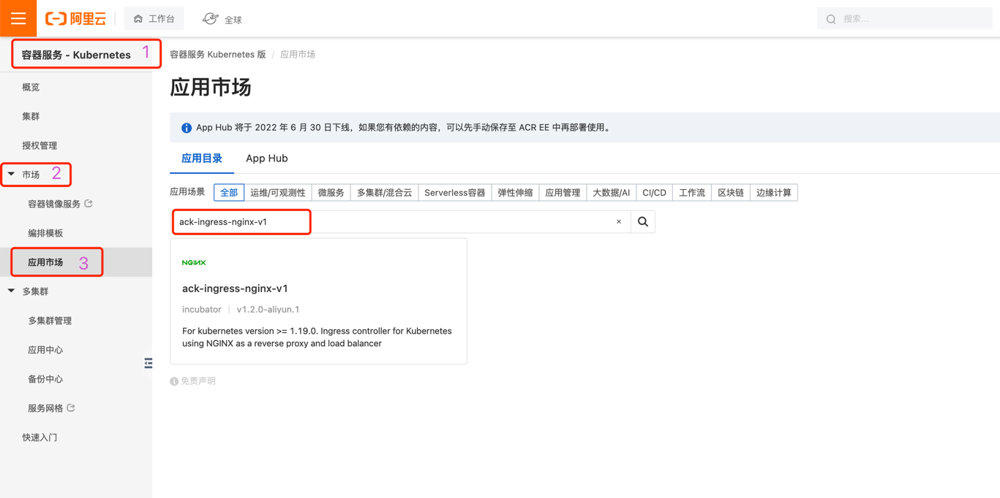
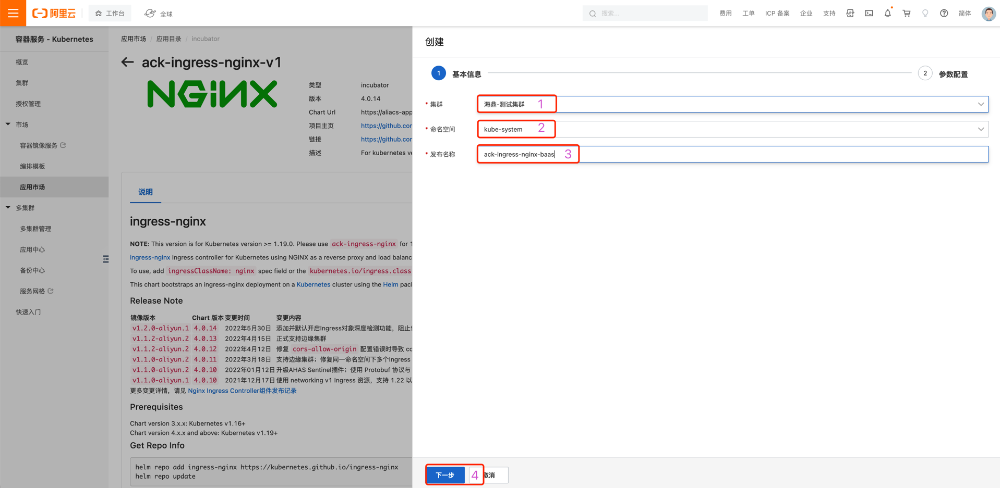
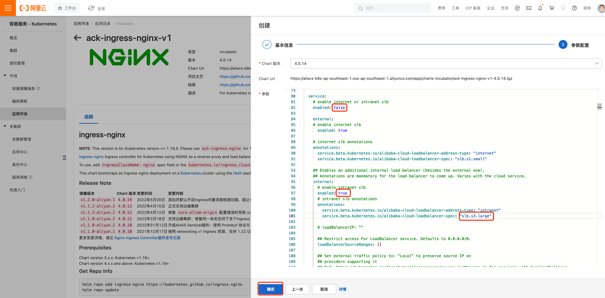

## 一.创建ingress

### 1）查找
~~~bash
容器服务 --> 市场 --> 应用市场 --> ack-ingress-nginx-v1
~~~

### 2）选择部署信息
~~~bash
- 一件部署
- 选择之前创建集群
- 选择kube-system命名空间
- 修改名称为 ack-ingress-nginx-产品代码
- 下一步
~~~

### 3）修改参数
~~~bash
-- 修改value
controller.config.proxy-body-size: 50m # nginx最大上传

controller.service.enabled: false # 关闭公网IP
controller.service.internal.enabled: true # 创建内网IP
controller.service.internal.annotations."service.beta.kubernetes.io/alibaba-cloud-loadbalancer-spec": "slb.s3.large" # 使用最高规格的SLB

controller.kind: DaemonSet # 使用守护进程类型的控制器部署ingress控制器

-- 添加
controller.config.ssl-ciphers: "ECDHE-ECDSA-AES128-GCM-SHA256:ECDHE-RSA-AES128-GCM-SHA256:ECDHE-ECDSA-AES256-GCM-SHA384:ECDHE-RSA-AES256-GCM-SHA384:ECDHE-ECDSA-CHACHA20-POLY1305:ECDHE-RSA-CHACHA20-POLY1305:DHE-RSA-AES128-GCM-SHA256:DHE-RSA-AES256-GCM-SHA384:DHE-RSA-CHACHA20-POLY1305:ECDHE-ECDSA-AES128-SHA256:ECDHE-RSA-AES128-SHA256:ECDHE-ECDSA-AES128-SHA:ECDHE-RSA-AES128-SHA:ECDHE-ECDSA-AES256-SHA384:ECDHE-RSA-AES256-SHA384:ECDHE-ECDSA-AES256-SHA:ECDHE-RSA-AES256-SHA:DHE-RSA-AES128-SHA256:DHE-RSA-AES256-SHA256:AES128-GCM-SHA256:AES256-GCM-SHA384:AES128-SHA256:AES256-SHA256:AES128-SHA:AES256-SHA:DES-CBC3-SHA"
controller.config.ssl-protocols: "TLSv1 TLSv1.1 TLSv1.2 TLSv1.3"
~~~

### 4）部署
~~~bash
确定
~~~
### 5）创建EIP并将其绑定在创建出来的SLB上