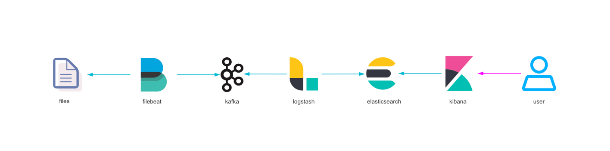

# Elk日志收集

- 收集链路

- 容量：Tb/day
- 核心点：kafka和es

## filebeat

### 主机部署

*主机部署时，如果 filebeat 配置很多，可以使用`pipeline`来层级化管理配置，配置内容与普通一致。*

### 容器部署

*对于 k8s 中采集日志时时，通常采用`sidecar`模式与主容器绑定在一起，但存在日志收集容器状态会影响主容器的弊端。在支持容器注入的新版集群中，可采用容器注入的方式来简化管理成本。*

## kafka

## logstash

## elasticsearch

## kibana

