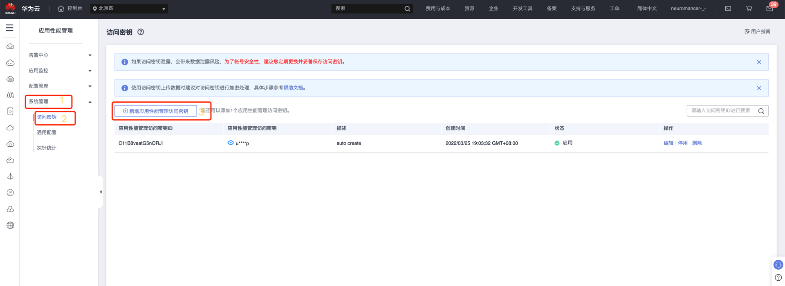
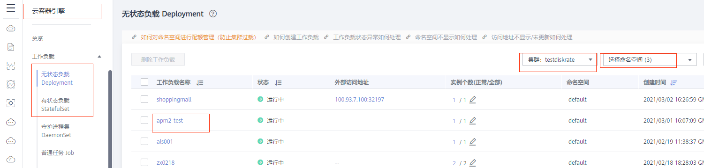
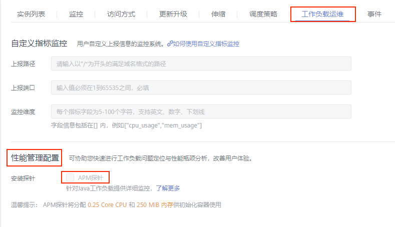
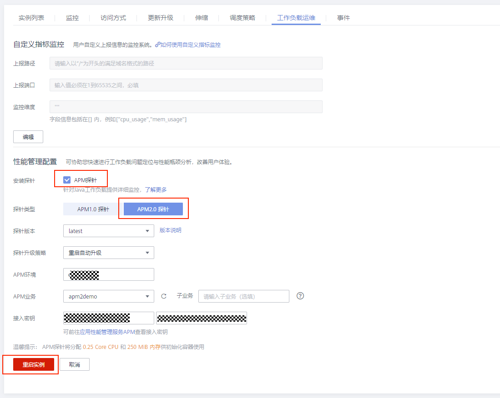
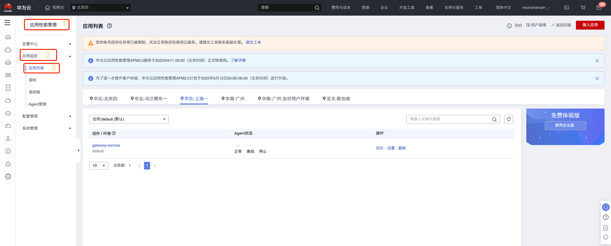

# 应用性能管理

- 在华为云中为 kubernetes 中部署的应用提供 APM 监控，需要使用 *应用性能管理*

## 相关文档
- [为部署在CCE容器中的JAVA应用安装Agent](https://support.huaweicloud.com/qs-apm2/apm_02_0005.html)


### 1) 创建访问密钥

```yaml
APM2.0通过AK/SK进行签名验证，通过授权的帐户才能上报数据。

    登录APM2.0服务控制台。
    单击左侧导航栏“系统管理 > 访问密钥”，进入访问密钥页面。
    在访问密钥页面查看自动创建的访问密钥。
```


### 2) 在 CCE 的 deployment 中启用 APM 监控插件

- 点击进入需要开启 apm 探针的 deployment



- 点击工作负载运维，找到性能管理配置，勾选 APM探针



- 选择 APM2.0 探针，选择对应的 APM 环境以及创建的接入密钥



### 3) 查看接入应用


