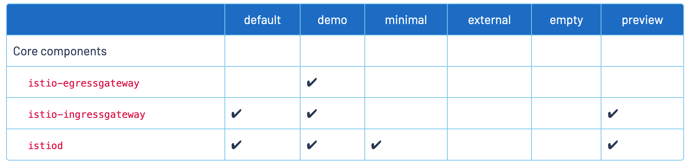

# Install

目录
=================

* [Install](#install)
   * [安装istio](#安装istio)
      * [一、下载istioctl命令行工具](#一下载istioctl命令行工具)
      * [二、选择合适的配置安装istio](#二选择合适的配置安装istio)
      * [三、可视化及监控组件安装](#三可视化及监控组件安装)
      * [四、就绪检查及可视化服务](#四就绪检查及可视化服务)

## 安装istio

- 从1.5版本开始将Pilot、Citadel、Galley、Mixer整合成为了istiod，这也就意味着istio服务端由一个组件组成

### 一、下载istioctl命令行工具

~~~bash
1.打开官方github选择需要的版本
https://github.com/istio/istio/releases

2.下载压缩包
wget https://github.com/istio/istio/releases/download/1.12.0/istio-1.12.0-linux-amd64.tar.gz

3.解压并进入
tar xf istio-1.12.0-linux-amd64.tar.gz
cd istio-1.12.0

4.将istioctl放入/usr/local/bin/
cp bin/istioctl /usr/local/bin/
~~~

### 二、选择合适的配置安装istio

- istio安装时需要选择合适的配置 这些配置的区别在于关联组件的选择及istiod的配置

- 自定义安装参考：[官方文档](https://istio.io/latest/docs/setup/additional-setup/customize-installation/)

~~~bash
1.生成生产配置
istioctl manifest generate --set profile=default > generated-manifest.yaml

2.安装
kubectl apply -f generated-manifest.yaml
~~~

###  三、可视化及监控组件安装

- 安装链路监控及网格监控

~~~bash
kubectl apply -f samples/addons
~~~

### 四、就绪检查及可视化服务

~~~bash
1.检查组件是否成功运行
kubectl  get pod -n istio-system
NAME                                    READY   STATUS    RESTARTS   AGE
grafana-68cc7d6d78-94qrh                1/1     Running   0          17d
istio-ingressgateway-8577c57fb6-hdfnl   1/1     Running   0          17d
istiod-5847c59c69-krf9g                 1/1     Running   0          17d
jaeger-5d44bc5c5d-wpl62                 1/1     Running   0          17d
kiali-fd9f88575-tm2hq                   1/1     Running   0          17d
prometheus-77b49cb997-bfhxf             2/2     Running   0          17d

2.将 kiali、tracing svc 修改为 nodeport 类型，以便访问
 kubectl  get svc -n istio-system
NAME                   TYPE           CLUSTER-IP       EXTERNAL-IP   PORT(S)                                                                      AGE
grafana                ClusterIP      10.108.173.81    <none>        3000/TCP                                                                     17d
istio-ingressgateway   LoadBalancer   10.109.250.196   <pending>     15021:30170/TCP,80:31073/TCP,443:32132/TCP,31400:32021/TCP,15443:30985/TCP   17d
istiod                 ClusterIP      10.107.146.4     <none>        15010/TCP,15012/TCP,443/TCP,15014/TCP                                        17d
jaeger-collector       ClusterIP      10.104.118.82    <none>        14268/TCP,14250/TCP,9411/TCP                                                 17d
kiali                  NodePort       10.108.146.148   <none>        20001:30931/TCP,9090:31004/TCP                                               17d
prometheus             ClusterIP      10.108.89.80     <none>        9090/TCP                                                                     17d
tracing                NodePort       10.108.157.181   <none>        80:31082/TCP,16685:30468/TCP                                                 17d
zipkin                 ClusterIP      10.105.11.91     <none>        9411/TCP                                                                     17d
~~~

